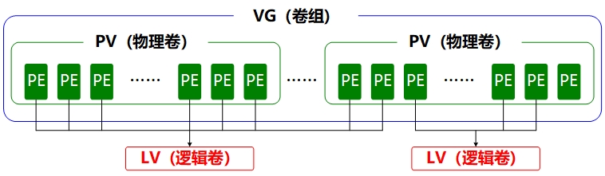
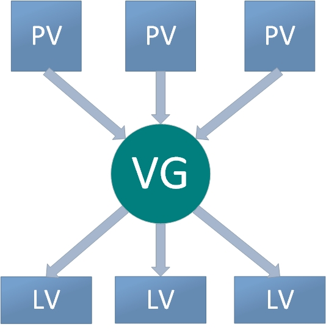
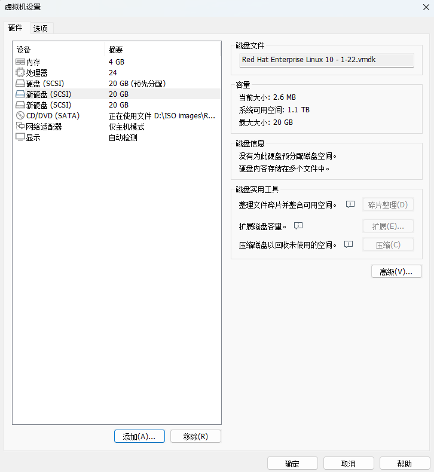

# LVM
前面学习的磁盘设备管理技术虽然能够有效地提高磁盘设备的 IO 速率以及数据的安全性，但是在磁盘分好区或者部署为 RAID 磁盘阵列之后，再想修改磁盘分区大小就不容易了。换句话说，当用户想要随着实际需求的变化调整磁盘分区的大小时，会受到磁盘“灵活性” 的限制。这时就需要用到另外一项非常普及的磁盘设备资源管理技术了—逻辑卷管理器（Logical Volume Manager，LVM）。LVM 允许用户对磁盘资源进行动态调整。

LVM 是Linux 系统用于对磁盘分区进行管理的一种机制，理论性较强，其创建初衷是解决磁盘设备在创建分区后不易修改分区大小的缺陷。尽管对传统的磁盘分区进行强制扩容或缩容从理论上来讲是可行的，但是却可能造成数据的丢失。而 LVM 技术是在磁盘分区和文件系统之间添加了一个逻辑层，它提供了一个抽象的卷组，可以把多块磁盘进行卷组合并。这样一来，用户不必关心物理磁盘设备的底层架构和布局，就能够实现对磁盘分区的动态调整。LVM 的技术架构如图 7-8 所示。


逻辑卷管理器的技术结构

为了帮助大家理解，我们来看一个“吃货”的例子。比如小明家想吃馒头，但是面粉不够了，于是妈妈从隔壁老王家、老李家、老张家分别借来一些面粉，准备蒸馒头吃。首先需要把这些面粉（物理卷[Physical Volume，PV]）揉成一个大面团（卷组[Volume Group]，VG），然后再把这个大面团分割成一个个小馒头（逻辑卷[Logical Volume，LV]），而且每个小馒头的重量必须是每勺面粉（基本单元[Physical Extent，PE]）的倍数。

在日常的使用中，如果卷组（VG）的剩余容量不足，可以随时将新的物理卷（PV）加入到里面，不断地扩容。由于担心同学们还是不理解，这里准备了一张逻辑卷管理器的使用流程示意图，如图 7-9 所示。


逻辑卷管理器使用流程图

物理卷处于 LVM 中的最底层，可以将其理解为物理磁盘、磁盘分区或者 RAID 磁盘阵列。卷组建立在物理卷之上，一个卷组能够包含多个物理卷，而且在卷组创建之后也可以继续向其中添加新的物理卷。逻辑卷是用卷组中空闲的资源建立的，并且逻辑卷在建立后能够动态地扩展或缩小空间。这就是 LVM 的核心理念。

## 部署逻辑卷
一般而言，在生产环境中，很难在初始阶段就能精确预估每个磁盘分区在后续的使用需求，因此经常会出现分区容量不够使用的情况。比如，伴随着业务量的增加，用于存放交易记录的数据库目录的体积也随之增加；因为分析并记录用户的行为从而导致日志目录的体积不断变大，这些都会导致原有的磁盘分区在使用上捉襟见肘。此外，还存在对较大的磁盘分区进行精简缩容的情况。

我们可以通过部署 LVM 来解决上述问题。在部署时，需要逐个配置物理卷、卷组和逻辑卷，常用的部署命令如表 7-3 所示。

**常用的 LVM 部署命令**
| 功能/命令 | 物理卷管理 | 卷组管理  | 逻辑卷管理 |
| :-------: | :--------: | :-------: | :--------: |
|   扫描    |   pvscan   |  vgscan   |   lvscan   |
|   建立    |  pvcreate  | vgcreate  |  lvcreate  |
|   显示    | pvdisplay  | vgdisplay | lvdisplay  |
|   删除    |  pvremove  | vgremove  |  lvremove  |
|   扩展    |            | vgextend  |  lvextend  |
|   缩小    |            | vgreduce  |  lvreduce  |

为了避免多个实验之间相互发生冲突，请大家自行将虚拟机还原到初始状态，并重新添加两块新磁盘设备，如图 7-10 所示。然后开机。


在虚拟机中添加两块新的硬盘设备

在虚拟机中添加两块新磁盘设备，是为了更好地演示 LVM 理念中用户无须关心底层物理磁盘设备的特性。我们先对这两块新磁盘进行创建物理卷的操作，可以将该操作简单理解为让磁盘设备支持 LVM 技术，或者理解为将磁盘设备加入 LVM 能够管理和使用的硬件资源池内，然后对这两块磁盘进行卷组合并，卷组的名称允许用户自定义。接下来，根据需求把合并后的卷组切割出一个约为 150MB 的逻辑卷设备，最后把这个逻辑卷设备格式化为 Ext4 文件系统后挂载使用。下文将对每一个步骤进行简单的描述。

第 1 步：让新添加的两块磁盘设备支持 LVM 技术。
```shell
root@linuxprobe:~# pvcreate /dev/sdb /dev/sdc
  Physical volume "/dev/sdb" successfully created.
  Physical volume "/dev/sdc" successfully created.
```
第 2 步：把两块磁盘设备加入 storage 卷组，然后查看卷组的状态。
```shell
root@linuxprobe:~# vgcreate storage /dev/sdb /dev/sdc
  Volume group "storage" successfully created
root@linuxprobe:~# vgdisplay
  --- Volume group ---
  VG Name               storage
  System ID             
  Format                lvm2
  Metadata Areas        2
  Metadata Sequence No  1
  VG Access             read/write
  VG Status             resizable
  MAX LV                0
  Cur LV                0
  Open LV               0
  Max PV                0
  Cur PV                2
  Act PV                2
  VG Size               39.99 GiB
  PE Size               4.00 MiB
  Total PE              10238
  Alloc PE / Size       0 / 0   
  Free  PE / Size       10238 / 39.99 GiB
  VG UUID               M9xB4b-sydm-G6tZ-K00e-RO45-iqL2-4bRlw1
………………省略部分输出信息………………
```
第 3 步：切割出一个约为 150MB 的逻辑卷设备。

这里需要注意切割单位的问题。在对逻辑卷进行切割时有两种计量单位。第一种是以容量为单位，使用的参数为-L。例如，使用-L 150M 生成一个大小为 150MB 的逻辑卷。另外一种是以基本单元的个数为单位，使用的参数为-l。每个基本单元的大小默认为 4MB。例如， 使用-l 37 可以生成一个大小为 37×4MB=148MB 的逻辑卷。
```shell
root@linuxprobe:~# lvcreate -n vo -l 37 storage
  Logical volume "vo" created.
root@linuxprobe:~# lvdisplay
  --- Logical volume ---
  LV Path                /dev/storage/vo
  LV Name                vo
  VG Name                storage
  LV UUID                9Tuv9a-FjmN-Cbye-CqC6-709V-zJMh-MQ9iIr
  LV Write Access        read/write
  LV Creation host, time linuxprobe.com, 2025-03-18 01:15:48 +0800
  LV Status              available
  # open                 0
  LV Size                148.00 MiB
  Current LE             37
  Segments               1
  Allocation             inherit
  Read ahead sectors     auto
  - currently set to     8192
  Block device           253:2
………………省略部分输出信息………………
```
第 4 步：把生成的逻辑卷进行格式化，然后挂载使用。

Linux 系统会把 LVM 中的逻辑卷设备存放在/dev 设备目录中（实际上就是个快捷方式），同时会以卷组的名称来建立一个目录，其中保存了逻辑卷的设备映射文件（即/dev/卷组名称/逻辑卷名称）。
```shell
root@linuxprobe:~# mkfs.ext4 /dev/storage/vo 
mke2fs 1.47.1 (20-May-2024)
Creating filesystem with 151552 1k blocks and 37848 inodes
Filesystem UUID: c5b6efaf-0b25-4ad2-81ac-afb8bc0c99a9
Superblock backups stored on blocks: 
	8193, 24577, 40961, 57345, 73729

Allocating group tables: done                            
Writing inode tables: done                            
Creating journal (4096 blocks): done
Writing superblocks and filesystem accounting information: done 

root@linuxprobe:~# mkdir /linuxprobe
root@linuxprobe:~# mount /dev/storage/vo /linuxprobe
```
对了，如果使用了逻辑卷管理器，则不建议使用 XFS 文件系统，因为 XFS 文件系统自身就可以使用 xfs_growfs 命令进行磁盘扩容。这虽然没有 LVM 灵活，但起码也够用。我们在实测阶段发现，在有一些服务器上，XFS 与 LVM 的兼容性并不好。

第 5 步：查看挂载状态，并写入配置文件，使其永久生效。
```shell
root@linuxprobe:~# df -h
Filesystem              Size  Used Avail Use% Mounted on
/dev/mapper/rhel-root    17G  3.7G   13G  23% /
devtmpfs                4.0M     0  4.0M   0% /dev
tmpfs                   1.9G   84K  1.9G   1% /dev/shm
efivarfs                256K   56K  196K  23% /sys/firmware/efi/efivars
tmpfs                   776M  9.7M  767M   2% /run
tmpfs                   1.0M     0  1.0M   0% /run/credentials/systemd-journald.service
/dev/sda2               960M  272M  689M  29% /boot
/dev/sr0                6.5G  6.5G     0 100% /media/cdrom
/dev/sda1               599M  8.3M  591M   2% /boot/efi
tmpfs                   388M  124K  388M   1% /run/user/0
/dev/mapper/storage-vo  134M   14K  123M   1% /linuxprobe
root@linuxprobe:~# echo "/dev/storage/vo /linuxprobe ext4 defaults 0 0" >> /etc/fstab
root@linuxprobe:~# cat /etc/fstab
#
# /etc/fstab
# Created by anaconda on Wed Mar 12 19:35:26 2025
#
# Accessible filesystems, by reference, are maintained under '/dev/disk/'.
# See man pages fstab(5), findfs(8), mount(8) and/or blkid(8) for more info.
#
# After editing this file, run 'systemctl daemon-reload' to update systemd
# units generated from this file.
#
UUID=408f4a3d-a4d3-4a44-bb23-6988cdbd10bf /                       xfs     defaults        0 0
UUID=4cf8ecae-bcb6-4b1e-8001-968b33643a8a /boot                   xfs     defaults        0 0
UUID=1FB8-9199          /boot/efi                      vfat    umask=0077,shortname=winnt 0 2
UUID=d936c726-45a7-4ca2-8932-c54f84a3d787 none                    swap    defaults        0 0
/dev/cdrom 								  /media/cdrom 			iso9660   defaults		  0 0
/dev/storage/vo 						  /linuxprobe 			  ext4    defaults 		  0 0
```
Tips ：
细心的同学应该又发现了一个小问题：刚才明明写的是148MB，怎么这里只有140MB 了呢？ 这是因为硬件厂商在标识容量时，采用的换算标准是 1GB=1000MB、1MB＝1000KB、1KB＝ 1000B；而计算机系统在识别和计算存储容量时，遵循的是二进制算法，即 1GB= 1024MB、
1MB＝1024KB、1KB＝1024B，因此有 3%左右的“缩水”是正常情况。