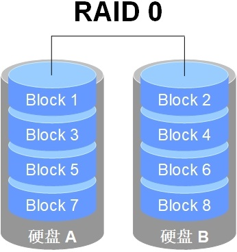
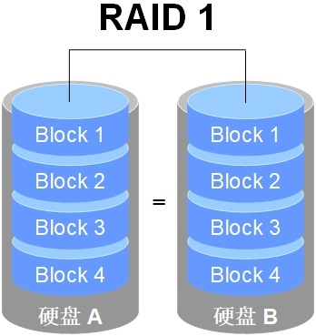
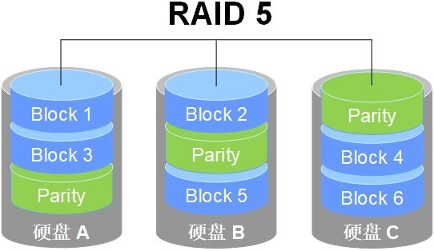
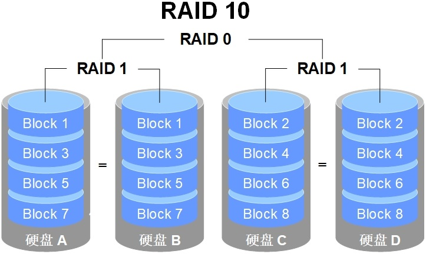
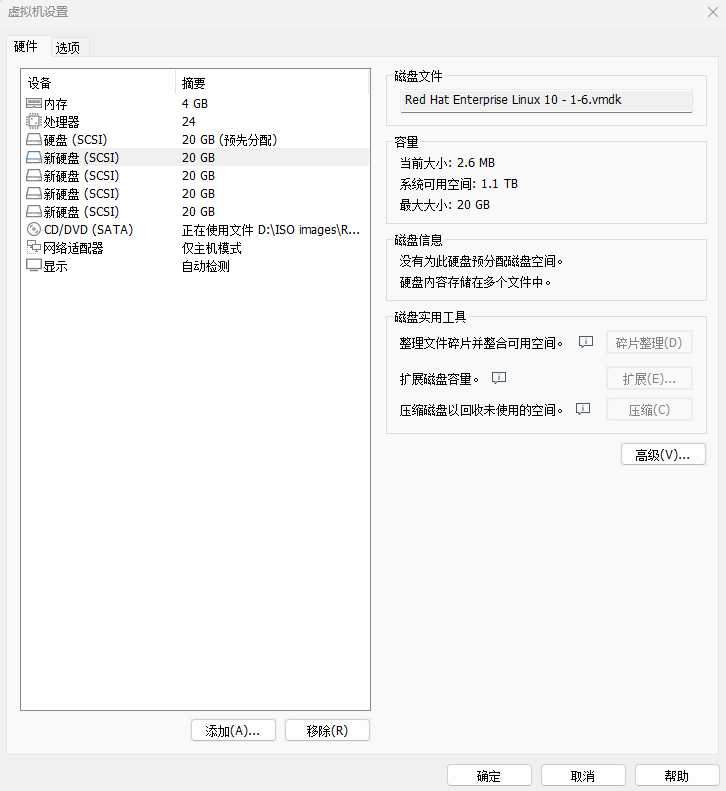

# RAID
在过去较长的一段时间，CPU 的处理性能保持着高速增长。2024 年，Intel 公司发布了酷睿 i9-14900KS 处理器芯片，让家用电脑达到了 24 核心 32 线程，大核频率最高可达 6.2GHz。而更早些时候，AMD 公司也推出了 Threadripper（线程撕裂者）处理器 7980X，家用电脑自此也可以轻松驾驭 64 核心 128 线程的处理器小怪兽了。但与此同时，磁盘设备的性能提升却不是很大，逐渐成为当代计算机整体性能的瓶颈。而且，由于磁盘设备需要进行持续、频繁、大量的 IO 操作，相较于其他设备，其损坏概率也大幅增加，重要数据丢失的概率也随之加大。

磁盘设备是计算机中较容易出现故障的元器件之一，加之其需要存储数据的特殊性质， 不能像 CPU、内存、电源甚至主板那样在出现故障后更换新的就好，因此在生产环境中一定要未雨绸缪，提前做好数据的冗余及异地备份等工作。

1988 年，美国加州大学伯克利分校首次提出并定义了 RAID 技术的概念。RAID 技术通过把多个磁盘设备组合成一个容量更大、安全性更好的磁盘阵列，并将数据切割成多个区段后分别存放在各个不同的物理磁盘设备上，然后利用分散读写技术来提升磁盘阵列整体的性能，同时通过不同的冗余策略，将重要数据以不同方式分布在多个物理磁盘设备上，从而实现数据冗余备份效果。

任何事物都有它的两面性。RAID 技术确实具有非常好的数据冗余备份功能，但是它也相应地提高了成本支出。就像原本我们只有一个电话本，但为了避免遗失，我们把联系人号码信息写成了两份，自然要为此多买一个电话本，这也就相应地增大了成本支出。RAID 技术诞生旨在提升数据可靠性、可用性和存储性能，而与数据本身的价值相比，现代企业更看重的是RAID 技术所具备的冗余备份机制以及带来的磁盘吞吐量的提升。也就是说，RAID 不仅降低了磁盘设备损坏后丢失数据的概率，还提升了磁盘设备的读写速率，因此在绝大多数运营商或大中型企业中得到了广泛部署和应用。

出于成本和技术方面的考虑，需要针对不同的需求在数据可靠性及读写性能上作出权衡， 制定出满足各自需求的不同方案。目前已有的 RAID 磁盘阵列的方案至少有十几种，而刘遄老师接下来会详细讲解 RAID 0、RAID 1、RAID 5 与 RAID 10 这 4 种最常见的方案。表 7-1 对这 4 种方案进行了比较，其中 n 代表磁盘总数。

**RAID 0、1、5、10 方案技术对比**

| RAID级别 | 最少磁盘 | 可用容量 | 读写性能 | 安全性 |                                                       特点                                                        |
| :------: | :------: | :------: | :------: | :----: | :---------------------------------------------------------------------------------------------------------------: |
|    0     |    2     |    n     |    n     |   低   |                               追求最大容量和速率，任何一块磁盘损 坏，数据将全部异常                               |
|    1     |    2     |   n/2    |    n     |   高   |                            追求最大安全性，只要阵列组中有一块 磁盘可用，数据就不受影响                            |
|    5     |    3     |   n-1    |   n-1    |   中   |             在控制成本的前提下，追求磁盘的最大容量、速率及安全性，允许有一块磁盘 异常，且数据不受影响             |
|    10    |    4     |   n/2    |   n/2    |   高   | 综合 RAID 1 和 RAID 0 的优点，追求磁盘的速率和安全性，允许有一半磁盘异常（不可发生在同一阵列中），且数 据不受影响 |

1、RAID 0

RAID 0 技术把多块物理磁盘设备（至少两块）通过硬件或软件方式串联在一起，组成一个大的卷组，并将数据依次写入各个物理磁盘中。这样一来，在最理想的状态下，磁盘设备的读写性能会提升数倍，但是若任意一块磁盘发生故障，将导致整个系统的数据都受到破坏。通俗来说，RAID 0 技术能够有效地提升磁盘数据的吞吐速率，但是不具备数据备份和错误修复能力。如图 7-1 所示，数据被分别写入到不同的磁盘设备中，即磁盘 A 和磁盘 B 设备会分别保存数据资料，最终实现提升读取、写入速率的效果。


RAID 0技术示意图

2、RAID 1

尽管RAID 0 技术提升了磁盘设备的读写速率，但它是将数据依次写入各个物理磁盘中。也就是说，它的数据是分开存放的，其中任何一块磁盘发生故障都会损坏整个系统的数据。因此，如果生产环境对磁盘设备的读写速率没有要求，而是希望增加数据的安全性时，就需要用到 RAID 1 技术了。

在图 7-2 所示的 RAID 1 技术示意图中可以看出，它是把两块以上的磁盘设备进行绑定， 在写入数据时，是将数据同时写入到多块磁盘设备上（可以将其视为数据的镜像或备份）。当其中某一块磁盘发生故障后，会立即自动以“冗余镜像数据自动接替”的方式来恢复数据的正常使用。

考虑到在进行写入操作时因磁盘切换带来的开销，因此 RAID 1 的速率会比 RAID 0 有微弱的降低。但在读取数据的时候，操作系统能够分别从两块磁盘中读取信息，因此理论读取速率的峰值是磁盘数量的倍数。另外，平时只要保证有一块磁盘稳定运行，数据就不会出现损坏的情况，可靠性较高。


RAID 1技术示意图


RAID 1 技术虽然十分注重数据的安全性，但是因为是在多块磁盘设备中写入了相同的数据，因此磁盘设备的利用率得以下降。从理论上来说，图 7-2 所示的磁盘空间的真实可用率只有 50%，由 3 块磁盘设备组成的 RAID 1 磁盘阵列的可用率只有 33%左右；以此类推。而且，由于需要把数据同时写入两块以上的磁盘设备，这无疑也在一定程度上增大了系统计算功能的负载。

那么，有没有一种 RAID 方案既考虑到了磁盘设备的读写速率和数据安全性，还兼顾了成本问题呢？实际上，单从数据安全和成本问题上来讲，就不可能在保持原有磁盘设备的利用率且还不增加新设备的情况下，能大幅提升数据的安全性。刘遄老师也没有必要忽悠各位读者，下面将要讲解的 RAID 5 技术虽然在理论上兼顾了三者（读写速率、数据安全性、成本），但实际上更像是对这三者的“相互妥协”。

3、RAID 5

如图 7-3 所示，RAID 5 技术是把磁盘设备的数据奇偶校验信息保存到其他磁盘设备中。在 RAID 5 磁盘阵列中，数据的奇偶校验信息不是单独保存到某一块磁盘中，而是存储到除自身以外的其他每一块磁盘设备上。这样的好处是，其中任何一块设备损坏后不至于出现致命缺陷。图 7-3 中Parity 部分存放的就是数据的奇偶校验信息。换句话说，就是RAID 5 技术实际上没有备份磁盘中的真实数据，而是当磁盘设备出现问题后通过奇偶校验信息来尝试重建损坏的数据。RAID 这样的技术特性“妥协”地兼顾了磁盘设备的读写速率、数据安全性与存储成本问题。


RAID5技术示意图


RAID 5 最少由 3 块磁盘组成，使用的是磁盘条带化（Disk Striping）技术。相较于RAID 1 技术，好处就在于保存的是奇偶校验信息而不是完全一样的文件内容，所以当重复写入某个文件时，RAID 5 级别的磁盘阵列组只需要对应一个奇偶校验信息就可以，因此效率更高，存储成本也会随之降低。

4、RAID 10

RAID 5 技术是出于磁盘设备的成本问题对读写速率和数据的安全性有了一定的妥协，但是大部分企业更在乎的是数据本身的价值而非磁盘价格，因此在生产环境中主要使用 RAID 10 技术。

顾名思义，RAID 10 技术是 RAID 1+RAID 0 技术的一个“组合体”。如图 7-4 所示，RAID 10技术需要至少 4 块磁盘来组建，其中先分别两两制作成 RAID 1 磁盘阵列，以保证数据的安全性；然后再对两个 RAID 1 磁盘阵列实施 RAID 0 技术，进一步提高磁盘设备的读写速率。从理论上来讲，只要损坏的不是同一阵列中的所有磁盘，那么最多可以损坏 50%的磁盘设备而不丢失数据。由于 RAID 10 技术继承了 RAID 0 的高读写速率和 RAID 1 的数据安全性，在不考虑成本的情况下 RAID 10 的性能也超过了 RAID 5，因此当前成为广泛使用的一种存储技术。


RAID 10技术示意图

Tips ：
由于RAID 10 是由 RAID 1 和RAID 0 组成的，因此正确的叫法是“RAID 一零”，而不是“RAID 十”。

仔细查看图 7-4 可以发现，RAID 10 是先对信息进行分割，然后再两两一组制作镜像。也就是先将 RAID 1 作为最低级别的组合，然后再使用RAID 0 技术将 RAID 1 磁盘阵列组合到一起，将它们视为“一整块”磁盘。而RAID 01 则相反，它是先将磁盘分为两组，然后使用 RAID 0 作为最低级别的组合，再将这两组 RAID 0 磁盘通过 RAID 1 技术组合到一起。

RAID 10 技术和RAID 01 技术的区别非常明显。在 RAID 10 中，任何一块磁盘损坏都不会影响到数据安全性，其余磁盘均会正常运作。但在 RAID 01 中，只要有任何一块磁盘损坏， 最低级别的RAID 0 磁盘阵列马上会停止运作，这可能造成严重隐患。所以 RAID 10 远比 RAID 01 常见，很多主板甚至不支持 RAID 01。

## 部署磁盘阵列
在具备了第 6 章的磁盘设备管理基础之后，再来部署 RAID 和 LVM 就变得十分轻松了。首先，需要在虚拟机中添加 4 块磁盘设备来制作一个 RAID 10 磁盘阵列，如图 7-5 所示。这里不再详述添加磁盘的步骤，大家自己操作就行。记得要用 SCSI 或 SATA 接口类型的磁盘， 大小默认 20GB 就可以。

这几块磁盘设备是模拟出来的，不需要特意去买几块真实的物理磁盘插到电脑上。需要注意的是，一定要记得在关闭系统之后，再在虚拟机中添加磁盘设备，否则可能会因为计算机架构的不同而导致虚拟机系统无法识别新添加的磁盘设备。


添加四块硬盘设备

在当前的生产环境中，服务器一般都配备 RAID 阵列卡。尽管服务器的价格越来越便宜， 但是我们没有必要为了做一个实验而单独购买一台服务器，而是学会使用 mdadm 命令在Linux 系统中创建和管理软件 RAID 磁盘阵列，而且它涉及的理论知识和操作过程与生产环境中的完全一致。

mdadm命令用于创建、调整、监控和管理RAID设备，英文全称为“multiple devices admin”，语法格式为“mdadm 参数 硬盘名称”。

mdadm 命令的常用参数及作用如表 7-2 所示。

**mdadm 命令的常用参数及作用**

| 参数  |         作用         |
| :---: | :------------------: |
|  -a   |   自动检测设备名称   |
|  -n   |     指定设备数量     |
|  -l   |    指定 RAID 级别    |
|  -C   |  创建新的 RAID 阵列  |
|  -v   | 显示详细创建过程信息 |
|  -f   |     模拟设备损坏     |
|  -r   |       移除设备       |
|  -Q   |     查看摘要信息     |
|  -D   |     查看详细信息     |
|  -S   |  停止 RAID 磁盘阵列  |

接下来，使用 mdadm 命令创建RAID 10，名称为/dev/md0。

第 6 章讲到，udev 是 Linux 系统内核中用来给硬件命名的服务，其命名规则也非常简单。通过命名规则可以猜测到第二个 SCSI 存储设备的名称会是/dev/sdb，然后依此类推。使用磁盘设备来部署 RAID 磁盘阵列很像将几位同学组成一个班级，但总不能将班级命名为/dev/sdbcde 吧。尽管这样可以一眼看出它是由哪些元素组成的，但不利于记忆和阅读。更何况如果使用 10、50、100 个磁盘来部署 RAID 磁盘阵列呢？

在VMware Workstation 17 中，虚拟机重启后系统盘可能会被错误识别，导致磁盘名称混乱。请务必确认/dev/sdb、/dev/sdc、/dev/sdd 和/dev/sde 为新添加的磁盘（可使用下面的命令进行确认），方可顺利完成实验。如果/dev/sda 不是首系统盘，请重启虚拟机系统。
```shell
root@linuxprobe:~# ls -l /dev/sd*
brw-rw----. 1 root disk 8,  0 Mar 17 21:15 /dev/sda
brw-rw----. 1 root disk 8,  1 Mar 17 21:15 /dev/sda1
brw-rw----. 1 root disk 8,  2 Mar 17 21:15 /dev/sda2
brw-rw----. 1 root disk 8,  3 Mar 17 21:15 /dev/sda3
brw-rw----. 1 root disk 8, 16 Mar 17 21:15 /dev/sdb
brw-rw----. 1 root disk 8, 32 Mar 17 21:15 /dev/sdc
brw-rw----. 1 root disk 8, 48 Mar 17 21:15 /dev/sdd
brw-rw----. 1 root disk 8, 64 Mar 17 21:15 /dev/sde
```
此时，就需要使用 mdadm 中的参数了。其中，-C 参数表示创建一个RAID 阵列；-v 参数显示创建的过程，同时在后面追加一个设备名称/dev/md0，这样/dev/md0 就是创建后的 RAID 磁盘阵列的名称；-n 4 参数表示使用 4 块磁盘来部署这个RAID 磁盘阵列；而-l 10 参数则表示 RAID 10 方案；最后再加上 4 块磁盘设备的名称就搞定了。
```shell
root@linuxprobe:~# mdadm -Cv /dev/md0 -n 4 -l 10 /dev/sdb /dev/sdc /dev/sdd /dev/sde
mdadm: layout defaults to n2
mdadm: layout defaults to n2
mdadm: chunk size defaults to 512K
mdadm: size set to 20954112K
mdadm: Defaulting to version 1.2 metadata
mdadm: array /dev/md0 started.
```
初始化过程大约需要 1min，其间可以用-D 参数进行查看。也可以用-Q 参数查看简要信息：
```shell
root@linuxprobe:~# mdadm -Q /dev/md0
/dev/md0: 39.97GiB raid10 4 devices, 0 spares. Use mdadm --detail for more detail.
```
同学们可能会好奇，为什么 4 块 20GB 大小的磁盘组成的磁盘阵列组，可用空间只有39.97GB 呢？

这里不得不提到 RAID 10 技术的原理。它通过两两一组磁盘组成的 RAID 1 磁盘阵列保证了数据的可靠性，其中每一份数据都会被保存两次，因此导致磁盘存在 50%的使用率和 50%的冗余率。这样一来，80GB 的磁盘容量也就只有一半了。

等两三分钟后，把制作好的RAID 磁盘阵列格式化为 Ext4 格式：
```shell
root@linuxprobe:~# mkfs.ext4 /dev/md0
mke2fs 1.47.1 (20-May-2024)
Creating filesystem with 10477056 4k blocks and 2621440 inodes
Filesystem UUID: 3bec5133-ecb1-4102-a10e-5c22208a76a1
Superblock backups stored on blocks: 
	32768, 98304, 163840, 229376, 294912, 819200, 884736, 1605632, 2654208, 
	4096000, 7962624

Allocating group tables: done                            
Writing inode tables: done                            
Creating journal (65536 blocks): done
Writing superblocks and filesystem accounting information: done   
```
随后，创建挂载点，将磁盘设备进行挂载操作：
```shell
root@linuxprobe:~# mkdir /RAID
root@linuxprobe:~# mount /dev/md0 /RAID
root@linuxprobe:~# df -h
Filesystem             Size  Used Avail Use% Mounted on
/dev/mapper/rhel-root   17G  3.7G   13G  23% /
devtmpfs               4.0M     0  4.0M   0% /dev
tmpfs                  1.9G   84K  1.9G   1% /dev/shm
efivarfs               256K   56K  196K  23% /sys/firmware/efi/efivars
tmpfs                  776M  9.7M  767M   2% /run
tmpfs                  1.0M     0  1.0M   0% /run/credentials/systemd-journald.service
/dev/sr0               6.5G  6.5G     0 100% /media/cdrom
/dev/sda2              960M  272M  689M  29% /boot
/dev/sda1              599M  8.3M  591M   2% /boot/efi
tmpfs                  388M  128K  388M   1% /run/user/0
/dev/md0                40G   24K   38G   1% /RAID
```
再来查看/dev/md0 磁盘阵列设备的详细信息，确认RAID 级别（Raid Level）、阵列大小（Array Size）和总磁盘数（Total Devices）都是否正确：
```shell
root@linuxprobe:~# mdadm -D /dev/md0
/dev/md0:
           Version : 1.2
     Creation Time : Mon Mar 17 21:56:00 2025
        Raid Level : raid10
        Array Size : 41908224 (39.97 GiB 42.91 GB)
     Used Dev Size : 20954112 (19.98 GiB 21.46 GB)
      Raid Devices : 4
     Total Devices : 4
       Persistence : Superblock is persistent

       Update Time : Mon Mar 17 22:02:18 2025
             State : clean 
    Active Devices : 4
   Working Devices : 4
    Failed Devices : 0
     Spare Devices : 0

            Layout : near=2
        Chunk Size : 512K

Consistency Policy : resync

              Name : linuxprobe.com:0  (local to host linuxprobe.com)
              UUID : 568d1322:33f4dd42:78d1f692:5ded8f34
            Events : 17

    Number   Major   Minor   RaidDevice State
       0       8       16        0      active sync set-A   /dev/sdb
       1       8       32        1      active sync set-B   /dev/sdc
       2       8       48        2      active sync set-A   /dev/sdd
       3       8       64        3      active sync set-B   /dev/sde
```
如果想让创建好的 RAID 磁盘阵列能够一直提供服务，不会因每次的重启操作而取消， 那么一定要记得将信息添加到/etc/fstab 文件中，这样可以确保在每次重启后 RAID 磁盘阵列都是有效的。
```shell
root@linuxprobe:~# echo "/dev/md0 /RAID ext4 defaults 0 0" >> /etc/fstab
root@linuxprobe:~# cat /etc/fstab
#
# /etc/fstab
# Created by anaconda on Wed Mar 12 19:35:26 2025
#
# Accessible filesystems, by reference, are maintained under '/dev/disk/'.
# See man pages fstab(5), findfs(8), mount(8) and/or blkid(8) for more info.
#
# After editing this file, run 'systemctl daemon-reload' to update systemd
# units generated from this file.
#
UUID=408f4a3d-a4d3-4a44-bb23-6988cdbd10bf /                       xfs     defaults        0 0
UUID=4cf8ecae-bcb6-4b1e-8001-968b33643a8a /boot                   xfs     defaults        0 0
UUID=1FB8-9199         			 		  /boot/efi               vfat    umask=0077,shortname=winnt 0 2
UUID=d936c726-45a7-4ca2-8932-c54f84a3d787 none                    swap    defaults        0 0
/dev/cdrom 								  /media/cdrom 			  iso9660 defaults 		  0 0
/dev/md0 								  /RAID 				  ext4 	  defaults 		  0 0
```
##  损坏磁盘阵列及修复
之所以在生产环境中部署 RAID 10 磁盘阵列，就是为了提高存储设备的 IO 速率及数据的安全性，但因为我们的磁盘设备是在虚拟机中模拟出来的，所以对于 IO 速率的改善可能并不直观。下面决定给同学们讲解一下 RAID 磁盘阵列损坏后的处理方法，以确保大家在步入运维岗位后不会因为磁盘阵列损坏而手忙脚乱。

在确认有一块物理磁盘设备出现损坏而不能再继续正常使用后，应该使用 mdadm 命令将其移除，然后查看 RAID 磁盘阵列的状态。可以发现状态已经改变：
```shell
root@linuxprobe:~# mdadm /dev/md0 -f /dev/sdb
mdadm: set /dev/sdb faulty in /dev/md0
root@linuxprobe:~# mdadm -D /dev/md0
/dev/md0:
           Version : 1.2
     Creation Time : Mon Mar 17 21:56:00 2025
        Raid Level : raid10
        Array Size : 41908224 (39.97 GiB 42.91 GB)
     Used Dev Size : 20954112 (19.98 GiB 21.46 GB)
      Raid Devices : 4
     Total Devices : 4
       Persistence : Superblock is persistent

       Update Time : Mon Mar 17 22:15:25 2025
             State : clean, degraded 
    Active Devices : 3
   Working Devices : 3
    Failed Devices : 1
     Spare Devices : 0

            Layout : near=2
        Chunk Size : 512K

Consistency Policy : resync

              Name : linuxprobe.com:0  (local to host linuxprobe.com)
              UUID : 568d1322:33f4dd42:78d1f692:5ded8f34
            Events : 19

    Number   Major   Minor   RaidDevice State
       -       0        0        0      removed
       1       8       32        1      active sync set-B   /dev/sdc
       2       8       48        2      active sync set-A   /dev/sdd
       3       8       64        3      active sync set-B   /dev/sde

       0       8       16        -      faulty   /dev/sdb
```
刚刚使用的-f 参数是让磁盘模拟损坏的效果。为了能够彻底地将故障盘移除，还要再执行一步操作：
```shell
root@linuxprobe:~# mdadm /dev/md0 -r /dev/sdb
mdadm: hot removed /dev/sdb from /dev/md0
```
在RAID 10 级别的磁盘阵列中，当 RAID 1 磁盘阵列中存在一个故障盘时并不影响 RAID 10 磁盘阵列的使用。当购买了新的磁盘设备后再使用 mdadm 命令予以替换即可，在此期间可以在/RAID 目录中正常地创建或删除文件。由于我们是在虚拟机中模拟磁盘，所以先重启系统，然后再把新的磁盘添加到 RAID 磁盘阵列中。

更换磁盘后再次使用-a 参数进行添加操作，系统默认会自动开始数据的同步工作。使用-D 参数即可看到整个过程和进度（用百分比表示）：
```shell
root@linuxprobe:~# mdadm /dev/md0 -a /dev/sdb
mdadm: added /dev/sdb
root@linuxprobe:~# mdadm -D /dev/md0
/dev/md0:
           Version : 1.2
     Creation Time : Mon Mar 17 21:56:00 2025
        Raid Level : raid10
        Array Size : 41908224 (39.97 GiB 42.91 GB)
     Used Dev Size : 20954112 (19.98 GiB 21.46 GB)
      Raid Devices : 4
     Total Devices : 4
       Persistence : Superblock is persistent

       Update Time : Mon Mar 17 22:16:27 2025
             State : clean, degraded, recovering 
    Active Devices : 3
   Working Devices : 4
    Failed Devices : 0
     Spare Devices : 1

            Layout : near=2
        Chunk Size : 512K

Consistency Policy : resync

    Rebuild Status : 29% complete

              Name : linuxprobe.com:0  (local to host linuxprobe.com)
              UUID : 568d1322:33f4dd42:78d1f692:5ded8f34
            Events : 26

    Number   Major   Minor   RaidDevice State
       4       8       16        0      spare rebuilding   /dev/sdb
       1       8       32        1      active sync set-B   /dev/sdc
       2       8       48        2      active sync set-A   /dev/sdd
       3       8       64        3      active sync set-B   /dev/sde
```
这时可能会有同学举手提问了：“老师，我们公司机房的阵列卡上有 30 多块磁盘呢，就算知道/dev/sdb 磁盘发生了故障，我也不知道该替换哪一块啊，要是错拔了好设备那就麻烦了。”其实不用担心，因为一旦磁盘发生故障，服务器上相应的指示灯会变成红灯（或者变成一直闪烁的黄灯），如图 7-6 所示。
## 磁盘阵列+备份盘
RAID 10 磁盘阵列中最多允许 50%的磁盘设备发生故障，但是存在这样一种极端情况， 即同一 RAID 1 磁盘阵列中的磁盘设备若全部损坏，也会导致数据丢失。换句话说，在 RAID 10 磁盘阵列中，如果 RAID 1 中的某一块磁盘出现了故障，而我们在前往修复的路途中， 恰巧该 RAID 1 磁盘阵列中的另一块磁盘设备也出现故障，那么数据就彻底丢失了。刘遄老师可真不是乌鸦嘴，这种 RAID 1 磁盘阵列中的磁盘设备同时损坏的情况还真被我的学生遇到过。

在这样的情况下，该怎么办呢？其实，完全可以使用 RAID 备份盘技术来预防这类事故。该技术的核心理念就是准备一块足够大的磁盘，这块磁盘平时处于闲置状态，一旦 RAID 磁盘阵列中有磁盘出现故障，则会马上自动顶替上去。这样很棒吧！

为了避免多个实验之间相互发生冲突，我们需要保证每个实验的相对独立性，为此需要大家自行将虚拟机还原到最初始的状态。另外，由于刚才已经演示了 RAID 10 磁盘阵列的部署方法，现在来看一下RAID 5 的部署效果。部署RAID 5 磁盘阵列时，至少需要用到 3 块磁盘，还需要再加一块备份盘（也叫热备盘），所以总计需要在虚拟机中模拟 4 块磁盘设备，如图 7-7 所示。


重置虚拟机后，再添加四块硬盘设备

现在创建一个 RAID 5 磁盘阵列+备份盘。在下面的命令中，参数-n 3 表示创建这个 RAID 5 磁盘阵列所需的磁盘数，参数-l 5 表示 RAID 的级别，而参数-x 1 则表示有一块备份盘。当查看/dev/md0（即 RAID 5 磁盘阵列的名称）磁盘阵列时，就能看到有一块备份盘在等待中了。
```shell
root@linuxprobe:~# mdadm -Cv /dev/md0 -n 3 -l 5 -x 1 /dev/sdb /dev/sdc /dev/sdd /dev/sde
mdadm: layout defaults to left-symmetric
mdadm: chunk size defaults to 512K
mdadm: size set to 20954112K
mdadm: Defaulting to version 1.2 metadata
mdadm: array /dev/md0 started.
root@linuxprobe:~# mdadm -D /dev/md0
/dev/md0:
           Version : 1.2
     Creation Time : Mon Mar 17 22:22:57 2025
        Raid Level : raid5
        Array Size : 41908224 (39.97 GiB 42.91 GB)
     Used Dev Size : 20954112 (19.98 GiB 21.46 GB)
      Raid Devices : 3
     Total Devices : 4
       Persistence : Superblock is persistent

       Update Time : Mon Mar 17 22:24:43 2025
             State : clean 
    Active Devices : 3
   Working Devices : 4
    Failed Devices : 0
     Spare Devices : 1

            Layout : left-symmetric
        Chunk Size : 512K

Consistency Policy : resync

              Name : linuxprobe.com:0  (local to host linuxprobe.com)
              UUID : ae39f666:bae02cb8:45ba71d7:51223d5d
            Events : 18

    Number   Major   Minor   RaidDevice State
       0       8       16        0      active sync   /dev/sdb
       1       8       32        1      active sync   /dev/sdc
       4       8       48        2      active sync   /dev/sdd

       3       8       64        -      spare   /dev/sde
```
现在将部署好的 RAID 5 磁盘阵列格式化为Ext4 文件格式，然后挂载到目录上，之后就能使用了：
```shell
root@linuxprobe:~# mkfs.ext4 /dev/md0
mke2fs 1.47.1 (20-May-2024)
Creating filesystem with 10477056 4k blocks and 2621440 inodes
Filesystem UUID: 9c111651-c594-4458-96ec-364d27d28ec9
Superblock backups stored on blocks: 
	32768, 98304, 163840, 229376, 294912, 819200, 884736, 1605632, 2654208, 
	4096000, 7962624

Allocating group tables: done                            
Writing inode tables: done                            
Creating journal (65536 blocks): done
Writing superblocks and filesystem accounting information: done   
root@linuxprobe:~# mkdir /RAID
root@linuxprobe:~# echo "/dev/md0 /RAID ext4 defaults 0 0" >> /etc/fstab
```
RHEL 10 系统的/etc/fstab 文件修改后，不能直接使用 mount -a 命令进行自动挂载， 需要先同步给系统才行。
```shell
root@linuxprobe:~# systemctl daemon-reload
root@linuxprobe:~# mount -a
```
由 3 块容量均为 20GB 的磁盘组成的 RAID 5 磁盘阵列，其可用空间为(n - 1)× 个磁盘容量，即(3 - 1)×20GB = 40GB。热备盘的空间不计算进来，它平时就是在“睡觉”，只有在意外出现时才会开始工作。
```shell
root@linuxprobe:~# df -h
Filesystem             Size  Used Avail Use% Mounted on
/dev/mapper/rhel-root   17G  3.7G   13G  23% /
devtmpfs               4.0M     0  4.0M   0% /dev
tmpfs                  1.9G   84K  1.9G   1% /dev/shm
efivarfs               256K   56K  196K  23% /sys/firmware/efi/efivars
tmpfs                  776M  9.7M  767M   2% /run
tmpfs                  1.0M     0  1.0M   0% /run/credentials/systemd-journald.service
/dev/sda2              960M  272M  689M  29% /boot
/dev/sr0               6.5G  6.5G     0 100% /media/cdrom
/dev/sda1              599M  8.3M  591M   2% /boot/efi
tmpfs                  388M  124K  388M   1% /run/user/0
/dev/md0                40G   24K   38G   1% /RAID
```
最后是见证奇迹的时刻！我们再次把磁盘设备/dev/sdb 移出磁盘阵列，然后迅速查看

/dev/md0 磁盘阵列的状态，可以看到备份盘已经自动顶替上去并开始了数据同步。RAID 中的这种备份盘技术非常实用，可以在保证 RAID 磁盘阵列数据安全性的基础上进一步提高数据可靠性。所以，如果公司不差钱的话，还是买上一块备份盘以防万一吧。
```shell
root@linuxprobe:~# mdadm /dev/md0 -f /dev/sdb
mdadm: set /dev/sdb faulty in /dev/md0
root@linuxprobe:~# mdadm -D /dev/md0
/dev/md0:
           Version : 1.2
     Creation Time : Mon Mar 17 22:22:57 2025
        Raid Level : raid5
        Array Size : 41908224 (39.97 GiB 42.91 GB)
     Used Dev Size : 20954112 (19.98 GiB 21.46 GB)
      Raid Devices : 3
     Total Devices : 4
       Persistence : Superblock is persistent

       Update Time : Mon Mar 17 22:32:18 2025
             State : clean 
    Active Devices : 3
   Working Devices : 3
    Failed Devices : 1
     Spare Devices : 0

            Layout : left-symmetric
        Chunk Size : 512K

Consistency Policy : resync

              Name : linuxprobe.com:0  (local to host linuxprobe.com)
              UUID : ae39f666:bae02cb8:45ba71d7:51223d5d
            Events : 37

    Number   Major   Minor   RaidDevice State
       3       8       64        0      active sync   /dev/sde
       1       8       32        1      active sync   /dev/sdc
       4       8       48        2      active sync   /dev/sdd

       0       8       16        -      faulty   /dev/sdb
```
是不是感觉很有意思呢？考虑到篇幅限制，我们一直没有复制、粘贴/RAID 目录中文件的信息，有兴趣的同学可以自己动手试一下。里面的文件内容非常安全，不会出现丢失的情况。如果后面想再添加一块热备盘进来，使用-a 参数就可以了。

## 删除磁盘阵列
在生产环境中，RAID 磁盘阵列部署后一般不会被轻易停用。但万一赶上了，还是要知道怎么将磁盘阵列删除。前面那种 RAID 5+热备盘损坏的情况比较复杂，所以以这种情况为例进行讲解是再好不过了。

首先，将 RAID 磁盘阵列卸载并停止：
```shell
root@linuxprobe:~# umount /dev/md0
umount: /dev/md0: not mounted.
root@linuxprobe:~# mdadm -S /dev/md0
mdadm: stopped /dev/md0
```
由于各个成员盘中还保存有数据，如果有居心不良的黑客此时重新使用它们创建 RAID， 则就有可能将数据恢复出来。保险起见，先向这些原先的成员盘中填充全零的数据块，确保将残留数据全部覆盖掉：
```shell
root@linuxprobe:~# mdadm --zero-superblock /dev/sdb
root@linuxprobe:~# mdadm --zero-superblock /dev/sdc
root@linuxprobe:~# mdadm --zero-superblock /dev/sdd
root@linuxprobe:~# mdadm --zero-superblock /dev/sde
```
然后，就看不到任何跟/dev/md0 设备相关的信息了：
```shell
root@linuxprobe:~# mdadm -D /dev/md0
mdadm: cannot open /dev/md0: No such file or directory
root@linuxprobe:~# ls -l /dev/md0
ls: cannot access '/dev/md0': No such file or directory
```
最后，删除/etc/fstab 文件中的挂载信息，大功告成！
```shell
root@linuxprobe:~# cat /etc/fstab
#
# /etc/fstab
# Created by anaconda on Wed Mar 12 19:35:26 2025
#
# Accessible filesystems, by reference, are maintained under '/dev/disk/'.
# See man pages fstab(5), findfs(8), mount(8) and/or blkid(8) for more info.
#
# After editing this file, run 'systemctl daemon-reload' to update systemd
# units generated from this file.
#
UUID=408f4a3d-a4d3-4a44-bb23-6988cdbd10bf /                     xfs     defaults        0 0
UUID=4cf8ecae-bcb6-4b1e-8001-968b33643a8a /boot                 xfs     defaults        0 0
UUID=1FB8-9199         			 		  /boot/efi             vfat    umask=0077,shortname=winnt 0 2
UUID=d936c726-45a7-4ca2-8932-c54f84a3d787 none                  swap    defaults        0 0
/dev/cdrom 								  /media/cdrom 			iso9660 defaults 		  0 0
```