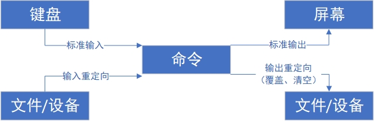

# 输入输出重定向
输入重定向是指将文件内容导入命令中，而输出重定向则是指将原本要输出到屏幕的数据写入指定文件中，数据流向如图 3-1 所示。在日常学习和工作中，相较于输入重定向， 输出重定向的使用频率更高，因此又将输出重定向分为标准输出重定向和错误输出重定向两种不同的技术，以及覆盖写入与追加写入两种模式。

标准输入重定向（STDIN，文件描述符为 0）：默认从键盘输入，也可从其他文件或命令中输入。
标准输出重定向（STDOUT，文件描述符为 1）：默认输出到屏幕。
错误输出重定向（STDERR，文件描述符为 2）：默认输出到屏幕。



输入输出重定向示意图

比如分别查看两个文件的属性信息，我们先创建出第一个文件，而第二个文件是不存在的。所以，虽然针对这两个文件的操作都会在屏幕上输出一些信息，但这两个操作的差异其实很大：
```shell
root@linuxprobe:~# touch linuxprobe
root@linuxprobe:~# ls -l linuxprobe 
-rw-r--r--. 1 root root 0 May 19 10:31 linuxprobe
root@linuxprobe:~# ls -l xxxxxx
ls: cannot access 'xxxxxx': No such file or directory
```
在上述示例中，名为 linuxprobe 的文件是真实存在的，输出信息是该文件的一些相关权限、所有者、所属组、文件大小及修改时间等信息，这也是该命令的标准输出信息。而名为 xxxxxx 的第二个文件是不存在的，因此在执行完 ls 命令之后显示的报错提示信息也是该命令的错误输出信息。那么，要想把原本输出到屏幕上的数据转而写入文件中，就要区别对待这两种输出信息。

对于输入重定向来讲，用到的符号及其作用如表 3-1 所示。

**输入重定向中用到的符号及其作用**
|          符号          |                         作用                          |
| :--------------------: | :---------------------------------------------------: |
|      命令 < 文件       |               将文件作为命令的标准输入                |
|     命令 << 分界符     |        从标准输入中读入，直到遇见分界符才停止         |
| 命令 < 文件 1 > 文件 2 | 将文件 1 作为命令的标准输入并将标准输出重定向到文件 2 |
对于输出重定向来讲，用到的符号及其作用如表 3-2 所示。

**输出重定向中用到的符号及其作用**
|                符号                |                            作用                            |
| :--------------------------------: | :--------------------------------------------------------: |
|            命令 > 文件             |     将标准输出重定向到一个文件中（清空原有文件的数据）     |
|            命令 2> 文件            |     将错误输出重定向到一个文件中（清空原有文件的数据）     |
|            命令 >> 文件            |    将标准输出重定向到一个文件中（追加到原有内容的后面）    |
|           命令 2>> 文件            |    将错误输出重定向到一个文件中（追加到原有内容的后面）    |
| 命令 >> 文件 2>&1 或 命令 &>> 文件 | 将标准输出与错误输出共同写入文件中（追加到原有内容的后面） |
对于重定向中的标准输出模式，可以省略文件描述符 1 不写，而错误输出模式的文件描述符 2 是必须要写的。先来小试牛刀。通过标准输出重定向将 man poweroff 命令原本要输出到屏幕的信息写入文件 readme.txt 中，然后显示 readme.txt 文件中的内容。具体命令如下：
```shell
root@linuxprobe:~# man poweroff > readme.txt
root@linuxprobe:~# cat readme.txt 
POWEROFF(8)                        poweroff                        POWEROFF(8)
NAME
       poweroff, reboot, halt - Power off, reboot, or halt the machine
SYNOPSIS
       poweroff [OPTIONS...]

       reboot [OPTIONS...]

       halt [OPTIONS...]
DESCRIPTION
       poweroff, reboot, and halt may be used to power off, reboot, or halt
       the machine. All three commands take the same options.
………………省略部分输出信息………………
```
有没有感觉到很方便呢？接下来，我们将探索输出重定向中的覆盖写入与追加写入两种模式，体验它们各自带来的不同效果。首先通过覆盖写入模式向 readme.txt 文件写入多行数据（该文件中已包含上一个实验的 man 命令信息）。需要注意的是，在通过覆盖写入模式向文件中写入数据时，每一次都会覆盖掉上一次写入的内容，所以最终文件中只有最后一次的写入结果：
```shell
root@linuxprobe:~# echo "Welcome to LinuxProbe.Com" > readme.txt
root@linuxprobe:~# echo "Welcome to LinuxProbe.Com" > readme.txt
root@linuxprobe:~# echo "Welcome to LinuxProbe.Com" > readme.txt
root@linuxprobe:~# echo "Welcome to LinuxProbe.Com" > readme.txt
root@linuxprobe:~# echo "Welcome to LinuxProbe.Com" > readme.txt
root@linuxprobe:~# cat readme.txt
Welcome to LinuxProbe.Com
```
再通过追加写入模式向 readme.txt 文件写入一次数据，然后在执行 cat 命令之后， 看到如下所示的文件内容：
```shell
root@linuxprobe:~# echo "Quality linux learning materials" >> readme.txt
root@linuxprobe:~# cat readme.txt
Welcome to LinuxProbe.Com
Quality linux learning materials
```
虽然都是输出重定向技术，但是命令的标准输出和错误输出还是有区别的。例如查看当前目录中某个文件的信息，这里以 linuxprobe 文件为例。由于这个文件是真实存在的，因此使用标准输出即可将原本要输出到屏幕的信息写入文件中，而错误的输出重定向则依然把信息输出到了屏幕上。
```shell
root@linuxprobe:~# ls -l linuxprobe > /root/stderr.txt 
root@linuxprobe:~# ls -l linuxprobe 2> /root/stderr.txt 
-rw-r--r--. 1 root root 0 May 19 10:48 linuxprobe
```
如果想把命令的报错信息写入文件，该怎么操作呢？当用户在执行一个自动化的 Shell 脚本时，这个操作会特别有用，而且特别实用，因为它可以把整个脚本执行过程中的报错信息都记录到文件中，便于之后的故障排查工作。

接下来以一个不存在的文件进行实验演示：
```shell
root@linuxprobe:~# ls -l xxxxxx > /root/stderr.txt
ls: cannot access 'xxxxxx': No such file or directory
root@linuxprobe:~# ls -l xxxxxx 2> /root/stderr.txt
root@linuxprobe:~# cat /root/stderr.txt 
ls: cannot access 'xxxxxx': No such file or directory
```
还有一种常见情况，就是我们不想区分标准输出和错误输出，只要命令有输出信息则全部追加写入文件中。这就要用到&>>操作符了：
```shell
root@linuxprobe:~# ls -l linuxprobe &>> result.txt
root@linuxprobe:~# ls -l xxxxxx &>> result.txt
root@linuxprobe:~# cat result.txt
-rw-r--r--. 1 root root 0 May 19 10:48 linuxprobe
ls: cannot access 'xxxxxx': No such file or directory
```
输入重定向相对来说有些冷门，在工作中遇到的概率会小一点。输入重定向的作用是把文件直接导入命令中。接下来使用输入重定向把 result.txt 文件导入 wc -l 命令，统计一下文件中的内容行数：
```shell
root@linuxprobe:~# wc -l < readme.txt
2
```
大家应该发现这次的输出结果与第 2 章讲的时候有所不同—没有了文件名称。
```shell
root@linuxprobe:~# wc -l /etc/passwd
38 /etc/passwd
```
这是因为此前使用的 wc –l /etc/passwd 是一种非常标准的“命令+参数+对象”的执行格式，而这次的 wc –l < result.txt 则是将 result.txt 文件中的内容通过操作符导入命令中，没有被当作命令对象执行，因此 wc 命令只能读到信息流数据，而没有文件名称的信息。这个小差异同学们可以慢慢琢磨下。