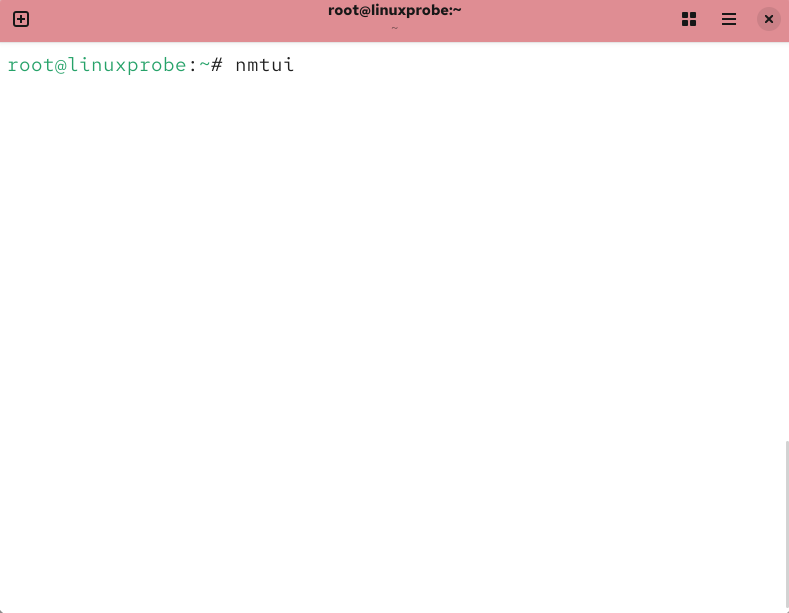
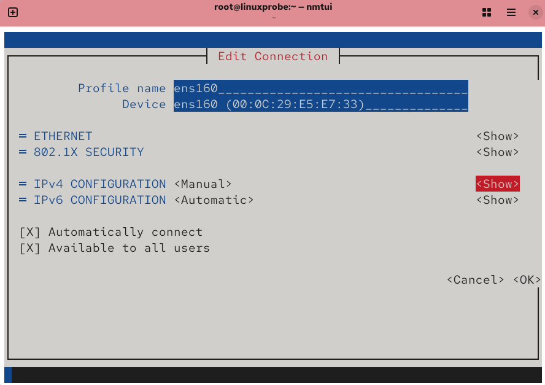
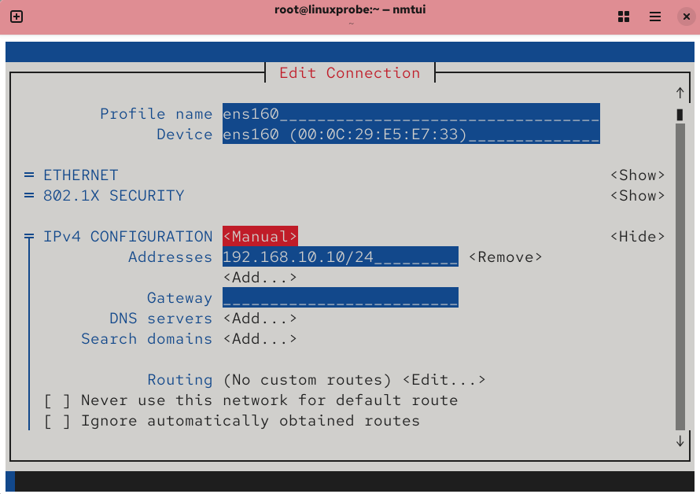
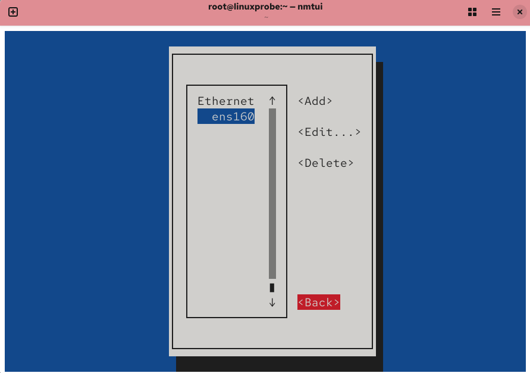
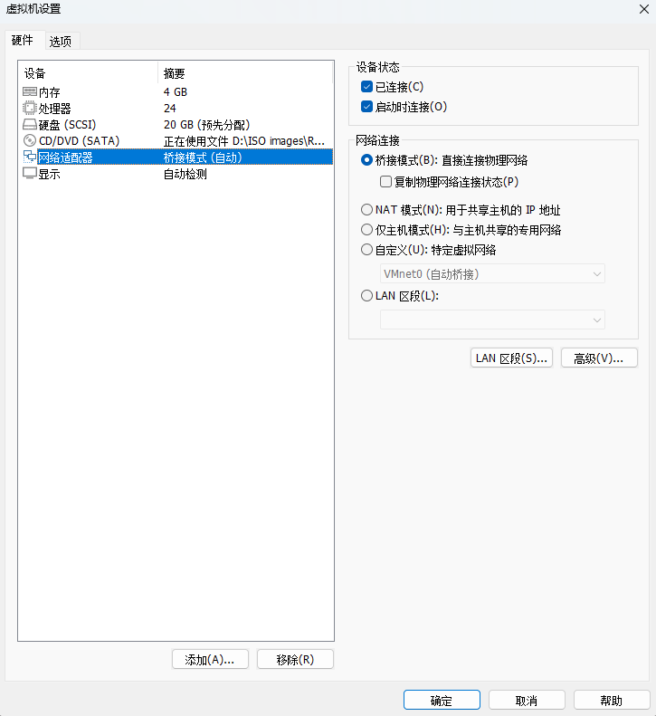

# 配置网卡服务
为了更好从零掌握 Linux 系统中网络的配置方法，我们会依次以基本配置网卡参数、创建网络会话和绑定两块网卡来进行实操，逐步提高代码量和难度，彻底学懂网络服务。

## 配置网卡参数
截至目前，大家已经能够利用当前所学的知识来管理 Linux 系统了。当然，大家的水平完全可以更进一步，当有朝一日登顶技术巅峰时，一定会感谢现在努力学习的自己。

我们接下来将学习如何在 Linux 系统上配置服务。但是在此之前，必须先保证主机之间能够顺畅地通信。如果网络不通，即便服务部署得再正确，用户也无法顺利访问。所以，配置网络并确保网络的连通性是学习部署 Linux 服务之前最后一个重要的知识点。

4.1.3 节讲解了如何使用 Vim 文本编辑器来配置网卡参数。其实，在 RHEL 10 系统中至少有 5 种配置网络的方法，刘遄老师尽量在本书中为大家逐一演示。这里教给大家的是使用nmtui 命令来配置网络，其具体的配置步骤如图 9-1 至图 9-8 所示。当遇到不容易理解的内容时，会额外进行解释说明。


执行nmtui命令运行网络配置工具


选中配置网卡按钮并按下回车键


选中要配置的网卡名称，然后按下编辑按钮

现在，在服务器主机的网络配置信息中填写 IP 地址 192.168.10.10/24。24 表示子网掩码中的前 24 位为网络号，后 8 位是主机号（与写成 255.255.255.0 的效果一样）。网关、DNS 等信息暂可不必填写，等用到时再补充。


把网卡IPv4的配置方式改成手动模式


按下显示详细信息按钮

Tips ：
再多提一句，咱们这本《Linux 就该这么学（第 3 版）》不仅学习门槛低、简单易懂， 而且还有一个潜在的优势—书中所有的服务器主机 IP 地址均为 192.168.10.10，而客户端主机均为 192.168.10.20 及 192.168.10.30。这样的好处就是，在后面部署Linux 服务的时候，不用每次都要考虑 IP 地址变化的问题，从而可以心无旁骛地关注配 置细节。


填写IP地址和子网掩码


单击OK按钮保存配置


单击Back按钮结束配置工作

至此，在 Linux 系统中配置网络的步骤就结束了。只要是 nmtui 命令配置过的网卡信息， 都会被自动写入到网卡配置文件中，不放心的话可以确认一下：
```shell
root@linuxprobe:~# cat /etc/NetworkManager/system-connections/ens160.nmconnection
[connection]
id=ens160
uuid=f75b55fd-2891-3f5d-ba2c-adadbcd7505c
type=ethernet
autoconnect-priority=-999
interface-name=ens160
timestamp=1741809963

[ethernet]

[ipv4]
address1=192.168.10.10/24
method=manual

[ipv6]
addr-gen-mode=eui64
method=auto
```
要想让服务程序获取最新的配置文件，需要手动重启相应的服务，之后就能看到网络畅通了：
```shell
root@linuxprobe:~# nmcli connection reload
root@linuxprobe:~# nmcli connection up ens160
Connection successfully activated (D-Bus active path: /org/freedesktop/NetworkManager/ActiveConnection/3)
root@linuxprobe:~# ping -c 4 192.168.10.10
PING 192.168.10.10 (192.168.10.10) 56(84) bytes of data.
64 bytes from 192.168.10.10: icmp_seq=1 ttl=64 time=0.110 ms
64 bytes from 192.168.10.10: icmp_seq=2 ttl=64 time=0.196 ms
64 bytes from 192.168.10.10: icmp_seq=3 ttl=64 time=0.086 ms
64 bytes from 192.168.10.10: icmp_seq=4 ttl=64 time=0.064 ms

--- 192.168.10.10 ping statistics ---
4 packets transmitted, 4 received, 0% packet loss, time 3069ms
rtt min/avg/max/mdev = 0.064/0.114/0.196/0.050 ms
```

## 创建网络会话
RHEL 和 CentOS 系统默认使用 NetworkManager 来提供网络服务，这是一种动态管理网络配置的守护进程，可以让网络设备保持连接状态。可以使用nmcli 命令来管理 NetworkManager 服务程序。nmcli 是一款基于命令行的网络配置工具，功能丰富，参数众多，能够轻松地查看网络信息或网络状态：
```shell
root@linuxprobe:~# nmcli connection show
NAME    UUID                                  TYPE      DEVICE 
ens160  f75b55fd-2891-3f5d-ba2c-adadbcd7505c  ethernet  ens160 
lo      1b2c44f7-af47-4291-9997-d8de6cf5fa3f  loopback  lo     
root@linuxprobe:~# nmcli connection show ens160 
connection.id:                          ens160
connection.uuid:                        f75b55fd-2891-3f5d-ba2c-adadbcd7505c
connection.stable-id:                   --
connection.type:                        802-3-ethernet
connection.interface-name:              ens160
connection.autoconnect:                 yes
………………省略部分输出信息………………
```
另外，RHEL 10 系统支持网络会话功能，允许用户在多个配置文件中快速切换（非常类似于firewalld 防火墙服务中的区域技术）。如果我们在公司网络中使用笔记本电脑时需要手动指定网络的 IP 地址，而回到家中则使用 DHCP 自动分配 IP 地址，这就需要频繁地修改IP 地址，但是使用了网络会话功能后一切就简单多了—只需在不同的使用环境中激活相应的网络会话，就可以实现网络配置信息的自动切换了。

使用 nmcli 命令并按照 connection add con-name type ifname 的格式来创建网络会话。假设将公司网络中的网络会话称为 company，将家庭网络中的网络会话称为house，现在依次创建各自的网络会话。

使用 con-name 参数指定公司使用的网络会话名称 company，然后依次用 ifname 参数指定本机的网卡名称（千万要以实际环境为准，不要照抄书上的 ens160 ），用 autoconnect no 参数将网络会话设置为默认不被自动激活，以及用 ip4 及 gw4 参数手动指定网络的 IP 地址。
```shell
root@linuxprobe:~# nmcli connection add con-name company ifname ens160 autoconnect no type ethernet ip4 192.168.10.88/24 gw4 192.168.10.1
Connection 'company' (2040b650-edf6-4709-a1a3-4956ee0ffc2e) successfully added.
```
使用 con-name 参数指定家庭使用的网络会话名称 house。因为要从外部 DHCP 服务器自动获得 IP 地址，所以这里不需要进行手动指定。
```shell
root@linuxprobe:~# nmcli connection add con-name house type ethernet ifname ens160
Connection 'house' (52b64b23-fb88-4248-af74-6b67f1237d60) successfully added.
```
在成功创建网络会话后，使用 nmcli 命令查看创建的所有网络会话。
```shell
root@linuxprobe:~# nmcli connection show
NAME     UUID                                  TYPE      DEVICE 
ens160   f75b55fd-2891-3f5d-ba2c-adadbcd7505c  ethernet  ens160 
lo       1b2c44f7-af47-4291-9997-d8de6cf5fa3f  loopback  lo     
company  2040b650-edf6-4709-a1a3-4956ee0ffc2e  ethernet  --     
house    52b64b23-fb88-4248-af74-6b67f1237d60  ethernet  --     
```
使用 nmcli 命令配置过的网络会话是永久生效的，这样当我们上班后，顺手启动 company 网络会话，网卡信息就自动配置好了：
```shell
root@linuxprobe:~# nmcli connection up company 
Connection successfully activated (D-Bus active path: /org/freedesktop/NetworkManager/ActiveConnection/3)
root@linuxprobe:~# ifconfig
ens160: flags=4163<UP,BROADCAST,RUNNING,MULTICAST>  mtu 1500
        inet 192.168.10.88  netmask 255.255.255.0  broadcast 192.168.10.255
        inet6 fe80::2936:b131:9ed3:3120  prefixlen 64  scopeid 0x20<link>
        ether 00:0c:29:e5:e7:33  txqueuelen 1000  (Ethernet)
        RX packets 57244  bytes 4969903 (4.7 MiB)
        RX errors 0  dropped 0  overruns 0  frame 0
        TX packets 88  bytes 9242 (9.0 KiB)
        TX errors 0  dropped 0 overruns 0  carrier 0  collisions 0
………………省略部分输出信息………………
```

如果大家使用的是虚拟机，请把虚拟机系统的网卡（网络适配器）切换成桥接模式，如图 9-9 所示。然后重启虚拟机系统即可。


设置虚拟机网卡的模式

这样操作过后就能使用家庭中的路由器设备了。启动 house 家庭会话，看一下效果：
```shell
root@linuxprobe:~# nmcli connection up house
Connection successfully activated (D-Bus active path: /org/freedesktop/NetworkManager/ActiveConnection/4)
root@linuxprobe:~# ifconfig
ens160: flags=4163<UP,BROADCAST,RUNNING,MULTICAST>  mtu 1500
        inet 192.168.31.191  netmask 255.255.255.0  broadcast 192.168.31.255
        inet6 fe80::a689:6ecd:767e:7571  prefixlen 64  scopeid 0x20<link>
        ether 00:0c:29:e5:e7:33  txqueuelen 1000  (Ethernet)
        RX packets 57592  bytes 5001809 (4.7 MiB)
        RX errors 0  dropped 0  overruns 0  frame 0
        TX packets 142  bytes 15284 (14.9 KiB)
        TX errors 0  dropped 0 overruns 0  carrier 0  collisions 0
………………省略部分输出信息………………
```
如果启用 company 会话成功，但启用 house 会话失败且不能获取到动态地址，则证明你的配置是正确的，问题出在了外部网络环境。有 3 种常见的情况：首先，你家中的设备没有连接路由器，而是通过拨号网络或共享 Wi-Fi 的方式上网；其次，还在上学或上班的读者在浏览网页前必须通过学校或公司的验证页面才能访问互联网；最后，检查物理机的防火墙设置，可暂时关闭后再重试。

后续不需要网络会话时，直接用 delete 命令就能删除，特别简单：
```shell
root@linuxprobe:~# nmcli connection delete house
Connection 'house' (52b64b23-fb88-4248-af74-6b67f1237d60) successfully deleted.
root@linuxprobe:~# nmcli connection delete company 
Connection 'company' (2040b650-edf6-4709-a1a3-4956ee0ffc2e) successfully deleted.
```
## 绑定两块网卡
一般来讲，生产环境必须提供 7×24 小时的网络传输服务。网卡绑定技术不仅能够提高网络传输速度，更重要的是，还可以确保在其中一块网卡出现故障时，依然能正常提供网络服务。假设我们对两块网卡实施了绑定技术，这样在正常工作中它们会共同传输数据，使得网络传输的速度变得更快；而且即使有一块网卡突然出现了故障，另外一块网卡也会立即自动顶替上去，保证数据传输不会中断。

下面看一下如何绑定网卡。

在虚拟机系统中再添加一块网卡设备，请确保两块网卡都处在同一种网络连接模式中， 如图 9-10 和图 9-11 所示。处于相同模式的网卡设备才能进行网卡绑定，否则这两块网卡无法互相传送数据。
