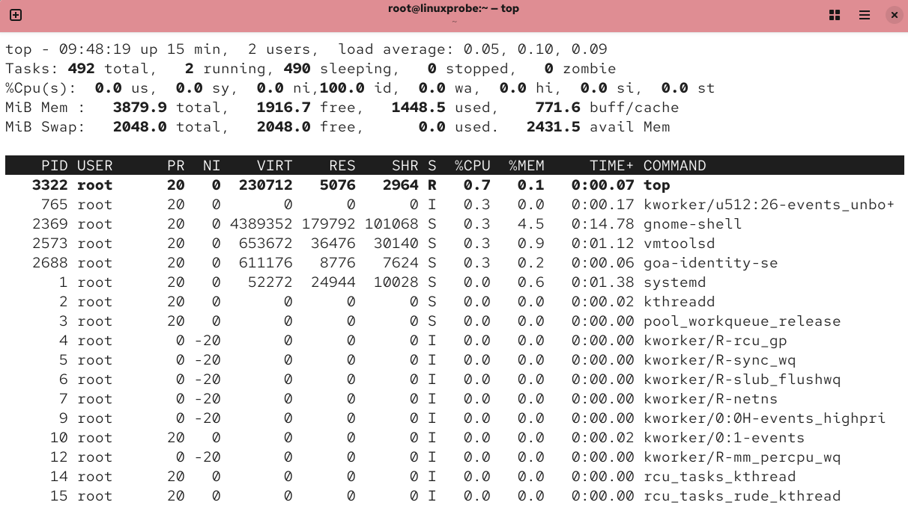

# top命令
top 命令用于动态地监视进程活动及系统负载等信息，输入该命令后按回车键执行即可。前面介绍的命令都是静态地查看系统状态，不能实时滚动最新数据，而 top 命令能够动态地查看系统状态，因此完全可以将它看作是 Linux 中“强化版的 Windows 任务管理器”。

top 是个相当好用的实时进程监控工具，该命令的运行界面如图所示。

图2-7 top命令的运行界面

在图 2-7 中，top 命令执行结果的前 5 行为系统整体的统计信息，所代表的含义如下。

第 1 行：系统时间、运行时间、登录终端数、系统负载（3 个数值分别为 1 分钟、5 分钟、15 分钟内的平均值，数值越小意味着负载越低）。
第 2 行：进程总数、运行中的进程数、睡眠中的进程数、停止的进程数、僵死的进程数。
第 3 行：用户占用资源百分比、系统内核占用资源百分比、已调整优先级的进程的资源占比、空闲资源百分比等。其中数据均为 CPU 数据并以百分比格式显示，例如“99.9 id”意味着有 99.9%的 CPU 资源处于空闲。
第 4 行：物理内存总量、空闲内存量、已使用内存量、用于内核缓存的内存量。
第 5 行：虚拟内存总量、空闲虚拟内存量、已使用虚拟内存量、预加载的内存量。