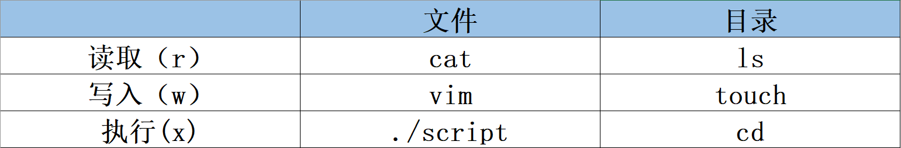
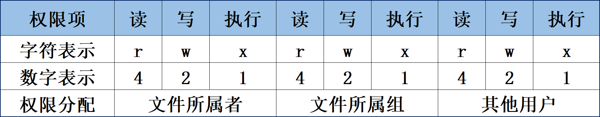
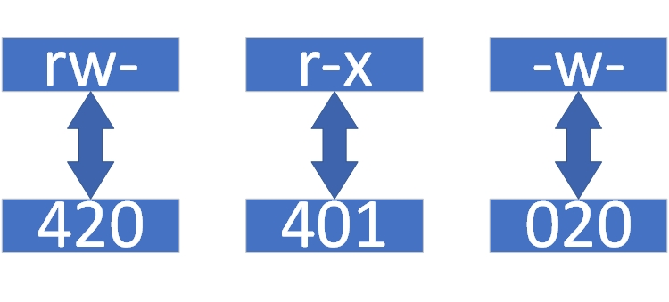
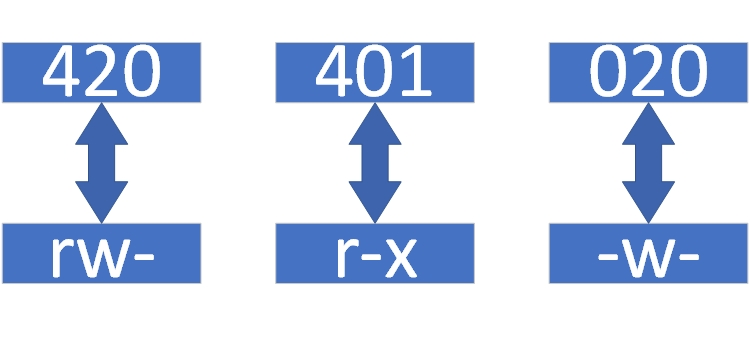
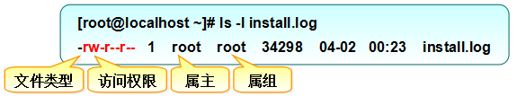

# 文件权限与归属
在 Linux 系统中，每个文件都有归属的所有者和所属组，并且规定了文件的所有者、所 属组以及其他人对文件所拥有的可读（read，简写为 r）、可写（write，简写为 w）、可执行（execute，简写为 x）等权限。对于一般文件来说，权限比较容易理解：“可读”表示能够读取文件的实际内容；“可写”表示能够编辑、新增、修改、删除文件的实际内容；“可执行”则表示能够运行一个脚本程序。然而，对于目录文件来说，理解其权限设置就不那么容易了。很多资深 Linux 用户其实也没有真正搞明白。对于目录文件来说，“可读”表示能够读取目录内的文件列表；“可写”表示能够在目录内新增、删除、重命名文件；而“可执行”则表示能够进入该目录。

可读、可写、可执行权限对应的命令在文件和目录上是有区别的，具体可参考表 5-5。

**可读、可写、可执行权限对应的命令在文件和目录上的区别**

文件的可读、可写、可执行权限也可分别用数字 4、2、1 来表示，文件所有者、文件所属组及其他用户权限之间无直接关联，

**文件权限的字符与数字表示**

文件权限的数字表示法基于字符（rwx）权限计算而来，其目的是简化权限的表示方式。例如，若某个文件的权限为 7，则代表可读、可写、可执行（4+2+1）；若权限为 6，则代表可读、可写（4+2）。我们来看一个例子。现在有这样一个文件，其所有者拥有可读、可写、可执行的权限，其文件所属组拥有可读、可写的权限；其他人只有可读的权限。那么，这个文件的权限就是 rwxrw-r--，数字法表示即为 764。不过大家千万别再将这 3 个数字相加， 计算出 7+6+4=17 的结果，这是小学的数学加减法，不是 Linux 系统的权限数字表示法，这 3 个权限之间没有互通关系。

下面以 rw-r-x-w-权限为例，介绍如何将字符权限转换为数字权限。首先，将每个字符替换为相应的数字，如图 5-1 所示。

字符与数字权限转换示意图

减号是占位符，代表这里没有权限，在数字表示法中用 0 表示。也就是说，rw-转换后是 420，r-x 转换后是 401，-w-转换后是 020。然后，将这 3 组数字之间的每组数字进行相加，得出 652，这便是转换后的数字权限。

将数字权限转换回字符权限的难度相对来说就大一些了，这里以652 权限为例进行讲解。

首先，数字 6 是由 4+2 得到的，不可能是 4+1+1（因为每个权限只会出现一次，不可能同时有两个可执行[x]权限）；数字 5 则是由 4+1 得到的；数字 2 是本身，没有权限即是空值 0。接下来按照表 5-6 所示的格式进行书写，得到 420401020 这样一串数字。有了这些信息，就可以把这串数字转换成字符了，如图 5-2 所示。

 数字与字符权限转换示意图

大家一定要心中牢记，文件的所有者、所属组和其他用户的权限之间无关联。不要写成rrwwx--- 的样子，一定要把 rwx 权限位对应到正确的位置，写成rw-r-x-w-。

Linux 系统的文件权限相当复杂，但是用途广泛，建议大家把它彻底搞清楚之后再学习下一节内容。现在来练习一下。请各位读者分别计算数字表示法权限 764、652、153、731 所对应的字符表示法权限，然后再把 rwxrw-r--、rw--w--wx、rw-r--r--转换成数字表示法。

我们利用上文讲解的知识，一起分析图 5-3 中所示的文件信息。

通过ls命令查看到的文件属性信息

图 5-3 中包含了文件类型、访问权限、所有者（属主）、所属组（属组）、占用的磁盘大小、最后修改时间和文件名称等信息。通过分析可知，该文件的类型为普通文件，所有者权限为可读、可写（rw-），所属组权限为可读（r--），除此以外的其他人只有可读权限（r--），文件的磁盘占用大小是 34298 字节，最近一次的修改时间为 4 月 2 日的 0:23，文件的名称为 install.log。

排在权限前面的减号（-）是文件类型（减号表示普通文件），新手经常会把它跟“无权限”混淆。尽管在 Linux 系统中一切都是文件，但是不同的文件由于作用不同，因此类型也不尽相同（有一点像 Windows 系统的后缀名）。常见的文件类型包括普通文件（-）、目录文件（d）、链接文件（l）、管道文件（p）、块设备文件（b）以及字符设备文件（c）。

普通文件的范围特别广泛，如纯文本信息、服务配置信息、日志信息以及 Shell 脚本等，都属于普通文件。几乎在每个目录下都能看到普通文件（-）和目录文件（d）的身影。块设备文件（b）和字符设备文件（c）一般是指硬件设备，比如鼠标、键盘、光驱、磁盘等，在/dev/目录中最为常见。应该很少有人会对鼠标、键盘进行硬件级别的管理吧。