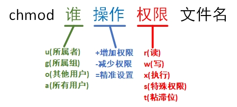

# 文件的特殊权限
在复杂多变的生产环境中，单纯设置文件的 rwx 权限无法满足对安全和灵活性的需求， 因此便有了 SUID、SGID 与SBIT 等特殊权限位。这是一种对文件权限进行设置的特殊功能，可以与一般权限同时使用，以弥补一般权限不能实现的功能。下面具体解释这 3 个特殊权限位的功能以及用法。

## SUID

SUID 是一种对二进制程序进行设置的特殊权限，能够让二进制程序的执行者临时拥有所有者的权限（仅对拥有执行权限的二进制程序有效）。例如，所有用户都可以执行 passwd 命令来修改自己的密码，并将新密码保存到/etc/shadow 文件中。仔细查看这个文件就会发现它的默认权限是 000，也就是说除了 root 管理员以外，所有用户都没有查看或编辑该文件的权限。但是，在使用 passwd 命令时如果加上 SUID 特殊权限位，就可以让普通用户临时获得程序所有者的身份，把变更的密码信息写入 shadow 文件中。这很像在古装剧中见到的手持尚方宝剑的钦差大臣，他手持的尚方宝剑代表的是皇上的权威，因此可以惩 戒贪官，但这并不意味着他可以永远成为皇上。因此这只是一种有条件的、临时的特殊权 限授权方法。

查看 passwd 命令属性时发现所有者的权限由 rwx 变成了 rws，其中 x 改变成 s 就意味着该文件被赋予了 SUID 权限。另外可能有读者会好奇，如果原本的权限是 rw-呢？如果原先权限位上没有 x 执行权限，那么被赋予特殊权限后将变成大写的S。
```shell
root@linuxprobe:~# ls -l /etc/shadow
----------. 1 root root 1048 Mar 13 13:11 /etc/shadow
root@linuxprobe:~# ls -l /bin/passwd 
-rwsr-xr-x. 1 root root 91616 Jun 24  2024 /bin/passwd
```
Tips ：
加粗显示的字体用来告诫用户一定要小心这个权限，因为一旦某个命令文件被设置了SUID 权限，就意味着凡是执行该命令文件的人都可以临时获取文件所有者所对应的最高 权限。因此，千万不要将 SUID 权限设置到 vim、cat、rm 等命令上面！！！

## SGID

SGID 特殊权限有两种应用场景：当对二进制程序进行设置时，能够让执行者临时获取文件所属组的权限；当对目录进行设置时，则是让目录内新创建的文件自动继承该目录原有用户组的名称。

SGID 的第一种功能是参考 SUID 而设计的，不同点在于执行程序的用户获取的不再是文件所有者的临时权限，而是获取到文件所属组的权限。举例来说，在早期的 Linux 系统中，/dev/kmem 是一个字符设备文件，用于存储内核程序要访问的数据，权限为：

cr--r----- 1 root system 2, 1 Feb 11 2024 kmem

大家看出问题了吗？除了 root 管理员或属于 system 组的成员外，所有用户都没有读取该文件的权限。由于平时需要查看系统的进程状态，为了能够获取进程的状态信息，可在用于查看系统进程状态的 ps 命令文件上增加 SGID 特殊权限位。下面查看ps 命令文件的属性信息：

-r-xr-sr-x 1 bin system 59346 Feb 11 2024 ps

这样一来，由于 ps 命令被增加了 SGID 特殊权限位，所以当用户执行该命令时，也就临时获取到了 system 用户组的权限，从而顺利地读取到了设备文件。

前文提到，每个文件都有其归属的所有者和所属组，当创建或传送一个文件后，这个文件就会自动归属于执行这个操作的用户（即该用户是文件的所有者）。如果现在需要在一个部门内设置共享目录，让部门内的所有人员都能够读取目录中的内容，那么就可以在创建部门共享目录后，在该目录上设置 SGID 特殊权限位。这样，部门内的任何人员在里面创建的任何文件都会归属于该目录的所属组，而不再是自己的基本用户组。此时，用到的就是 SGID 的第二个功能，即在某个目录中创建的文件自动继承该目录的用户组的名称（只可以对目录进行设置）。
```shell
root@linuxprobe:~# cd /tmp
root@linuxprobe:/tmp# mkdir testdir
root@linuxprobe:/tmp# ls -ald testdir
drwxr-xr-x. 2 root root 6 Mar 13 13:16 testdir
root@linuxprobe:/tmp# chmod -R 777 testdir
root@linuxprobe:/tmp# chmod -R g+s testdir
root@linuxprobe:/tmp# ls -ald testdir
drwxrwsrwx. 2 root root 6 Mar 13 13:16 testdir
```
在使用上述命令设置好目录的 777 权限（确保普通用户可以向其中写入文件），并为该目录设置了 SGID 特殊权限位后，马上切换至一个普通用户，尝试在该目录中创建文件，并查看新创建的文件是否会继承新创建的文件所在的目录的所属组名称：

```shell
root@linuxprobe:/tmp# su - linuxprobe
linuxprobe@linuxprobe:~$ cd /tmp/testdir
linuxprobe@linuxprobe:/tmp/testdir$ echo "linuxprobe.com" > test
linuxprobe@linuxprobe:/tmp/testdir$ ls -al test 
-rw-r--r--. 1 linuxprobe root 15 Mar 13 13:16 test
linuxprobe@linuxprobe:/tmp/testdir$ exit
```
除了上面提到的 SGID 的这两个功能，再介绍两个与本节内容相关的命令：chmod 和 chown。

chmod 命令用于设置文件的一般权限及特殊权限，英文全称为 change mode，语法格式为“chmod [参数] 文件名”。

这是一个与文件权限的日常设置强相关的命令。例如，要把一个文件的权限设置为其所有者可读可写可执行、所属组可读可写、其他人没有任何权限，则相应的字符表示为rwxrw ，其对应的数字表示为 760。该命令的使用方法如图 5-4 所示。


chmod命令使用示意图

```shell
root@linuxprobe:/tmp# cd ~
root@linuxprobe:~# ls -l anaconda-ks.cfg 
-rw-------. 1 root root 1064 Mar 13 03:41 anaconda-ks.cfg
root@linuxprobe:~# chmod 760 anaconda-ks.cfg 
root@linuxprobe:~# ls -l anaconda-ks.cfg 
-rwxrw----. 1 root root 1064 Mar 13 03:41 anaconda-ks.cfg
```
chown 命令用于更改文件的所有者和所属组，英文全称为 change owner，语法格式为“chown [所有者]:[所属组] 文件名”。

chmod 和 chown 命令是用于修改文件属性和权限的最常用命令，它们还有一个特别的共性，就是针对目录进行操作时需要加上-R 参数来表示递归操作，即对目录内所有的文件进行整体操作。

下面使用“所有者:所属组”的格式把前面那个文件的所属信息轻松修改一下，变更后的效果如下：
```shell
root@linuxprobe:~# chown linuxprobe:linuxprobe anaconda-ks.cfg 
root@linuxprobe:~# ls -l anaconda-ks.cfg 
-rwxrw----. 1 linuxprobe linuxprobe 1064 Mar 13 03:41 anaconda-ks.cfg
```