# Cockpit 驾驶舱管理工具
首先，Cockpit 是一个英文单词，即“（飞机、船或赛车的）驾驶舱、驾驶座”（见图 8-15），它用名字传达出了功能丰富的特性。其次，Cockpit 是一个基于 Web 的图形化服务管理工具，对用户相当友好，即便是新手也可以轻松上手。而且它天然具备很好的跨平台性，因此被广泛应用于服务器、容器、虚拟机等多种管理场景。最后，红帽公司对 Cockpit 也十分看重，直接将它默认安装到了 RHEL 10 和 CentOS Stream 系统中，当然由此衍生的 Fedora 也标配了 Cockpit。

驾驶舱示意图

Cockpit 在默认情况下就已经安装到系统中。下面执行 dnf 命令对此进行确认：

root@linuxprobe:~# dnf install cockpit
Updating Subscription Management repositories.
BaseOS                                          2.7 MB/s | 2.7 kB     00:00    
AppStream                                       2.7 MB/s | 2.8 kB     00:00    
Package cockpit-323-1.el10.x86_64 is already installed.
Dependencies resolved.
Nothing to do.
Complete!

但是Cockpit 服务程序没有自动运行，需要将它开启并加入开机启动项中：

root@linuxprobe:~# systemctl start cockpit
root@linuxprobe:~# systemctl enable cockpit.socket

随后，我们打开本地物理机的“网络和 Internet”→“高级网络设置”界面，找到 VMnet1 网卡，单击“编辑”按钮。配置一个与虚拟机系统相同的 IP 网段的地址，步骤如图 8-16 和图8-17 所示，这样物理机和虚拟机系统的网络就能通信啦：

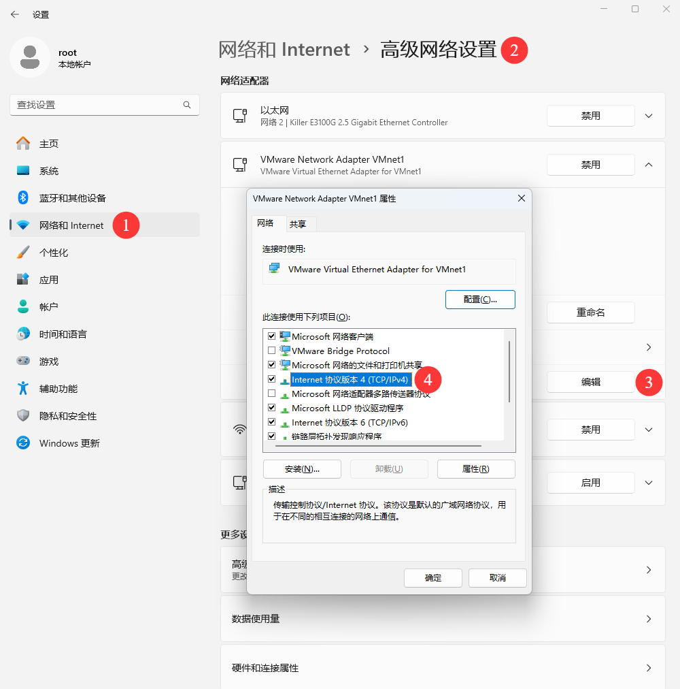
进入高级网络设置界面

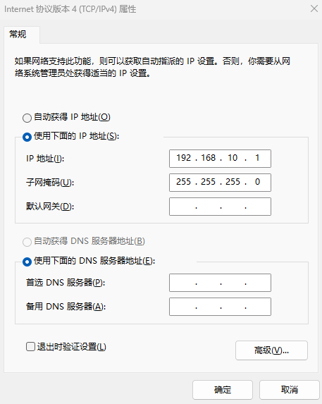
配置网卡IP地址信息

打开物理机的浏览器，在地址栏中输入“虚拟机 IP 地址:9090”即可访问 Cockpit。由于访问 Cockpit 的流量会使用 HTTPS 进行加密，而证书又是在本地签发的，因此需要信任证书后才能继续访问，如图 8-18 所示。

另外，如果你还没有按照第 4 章的方法配置好 Linux 系统的网卡IP 地址，不用担心，第9 章会讲图形化的配置方法，可以稍后再实操。

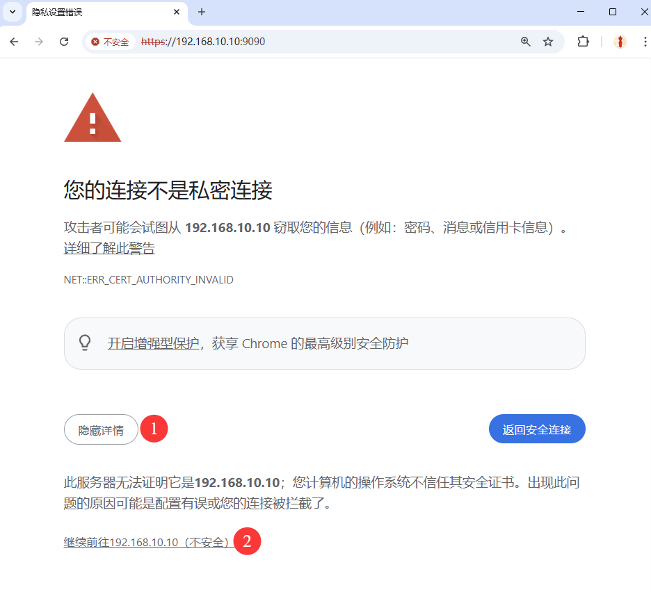
选择继续前往

进入 Cockpit 的登录界面后，输入 root 管理员的账户与密码，单击“登录”按钮，如图8-19 所示。
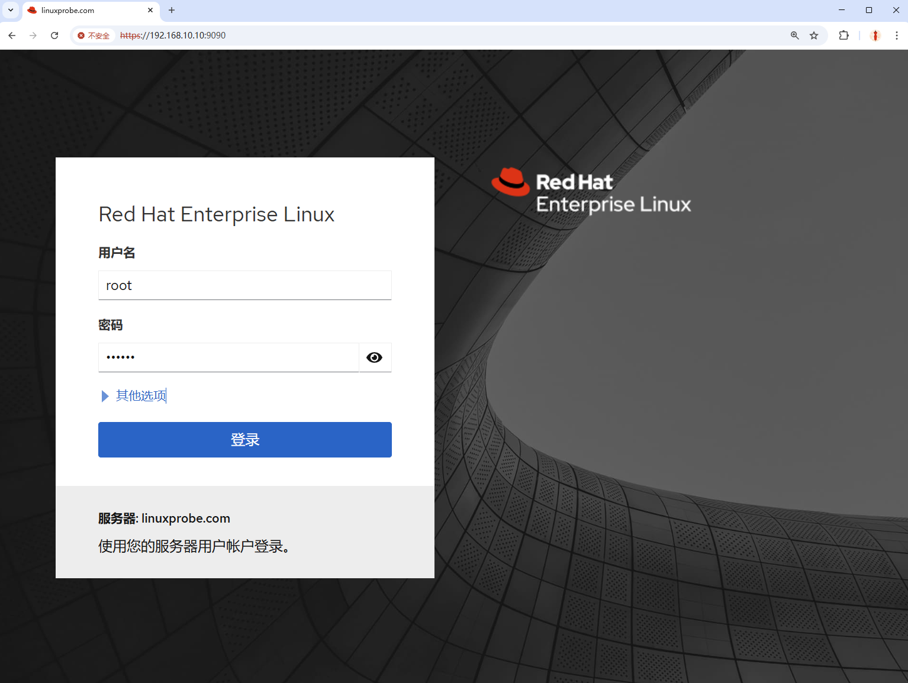

输入root管理员的账号与系统密码

如图 8-20 所示，如果出现了“权限被拒绝”的情况千万别着急，因为 RHEL 10 系统为了安全起见，默认不允许 root 用户进行远程登录，还记得第 1 章中手动允许 root 管理员使用SSH 协议吗（见图 1-40）？此处也需要手动放行一下才能访问，删除下面文件中 root 用户的名称：

root@linuxprobe:~# vim /etc/cockpit/disallowed-users
List of users which are not allowed to login to Cockpit
root

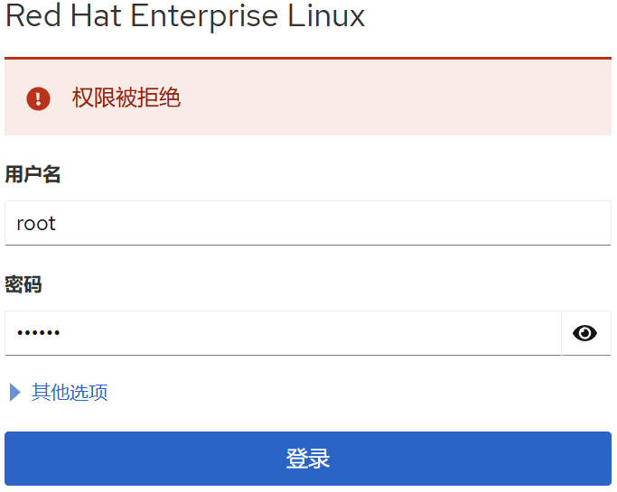
权限被拒绝

无须重启服务，再次单击“登录”按钮即可。

进入Cockpit 的 Web 界面，发现里面可谓“别有洞天”。Cockpit 总共分为 14 个功能模块： 概览、日志、存储、网络、Podman 容器、用户账户、服务、订阅、内核转储、软件更新、应用程序、诊断报告、终端、SELinux。下面逐一进行讲解。

1．概述

进入Cockpit 界面后默认显示的便是“概览”模块界面，在该界面中能够看到系统架构、版本、主机名与时间等信息，单击“查看指标和历史记录”按钮还能实时看到 CPU、内存、硬盘、网络的动态使用情况。该界面有点类似于 Web 版的“Windows 系统任务管理器”，属实好用，如图 8-21 所示。

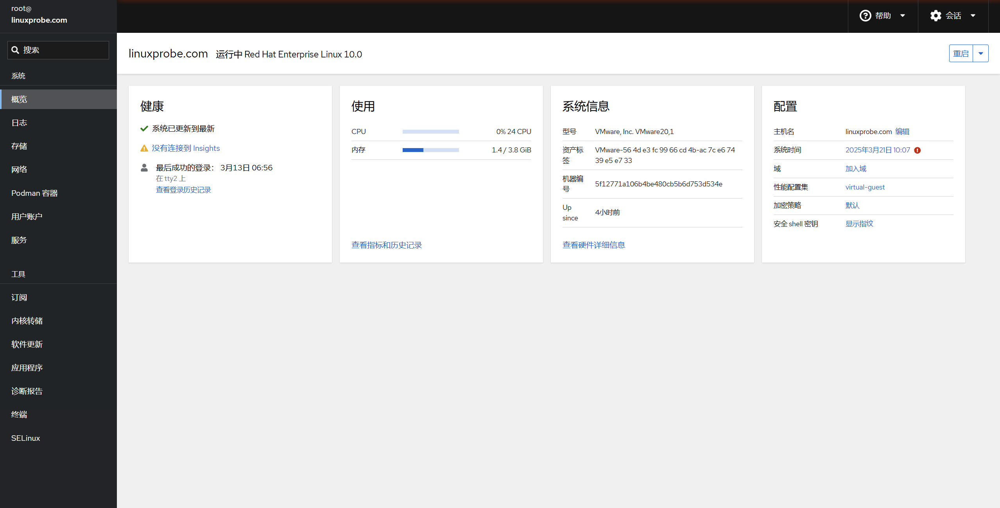
系统状态界面

2．日志

这个模块能够提供系统的全部日志，但是可能有读者会好奇，为什么内容这么少呢？原因出在图 8-22 中的两个选项中：时间和优先级。通过这两个选项，用户可以更快地找到所需信息，而不是像/var/log/message 文件那样一股脑儿地都抛到屏幕上。

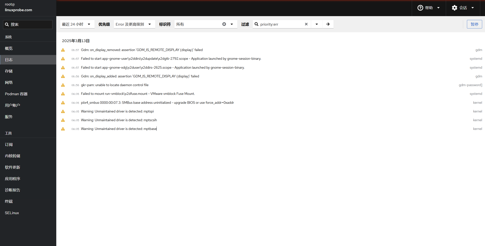
日志信息界面

3．存储

这个功能模块是同学们最喜欢的一个模块，原因不是这个模块显示了磁盘的 IO 负载情况，而是能够让用户通过该模块的界面，用鼠标创建出 RAID、LVM、VDO 和 iSCSI 等存储设备，如图 8-23 所示。是的，你没有看错，RAID 和 LVM 都可以用鼠标进行创建了，是不是很开心呢？

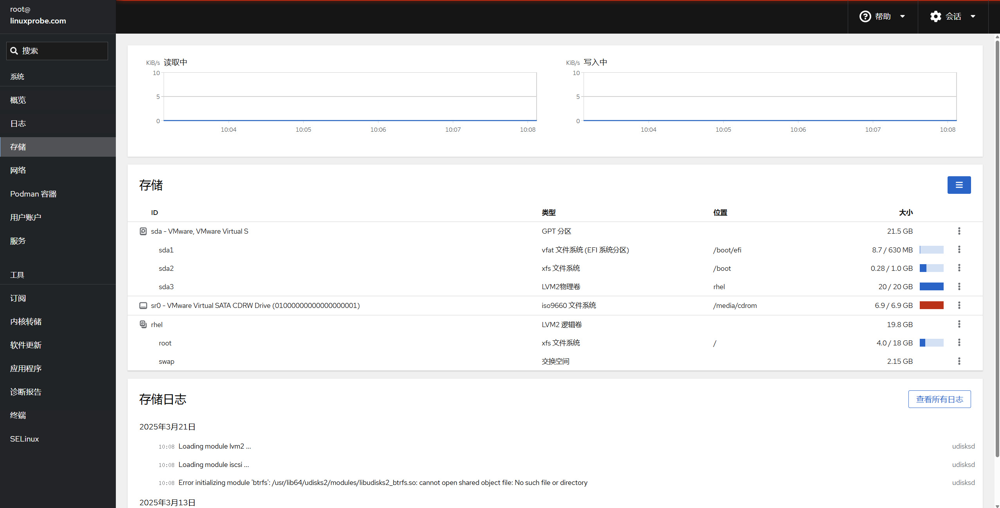
硬盘存储界面

4．网络

既然名为“网络”模块，那么动态查看网卡的输出和接收值肯定是这个模块的标配功能了。如图 8-24 所示，我们不仅可以在这里进行网卡的绑定（Bonding）和聚合（Team），还能够创建桥接网卡及添加 VLAN。图 8-24 的最下方会单独列出与网卡相关的日志信息。

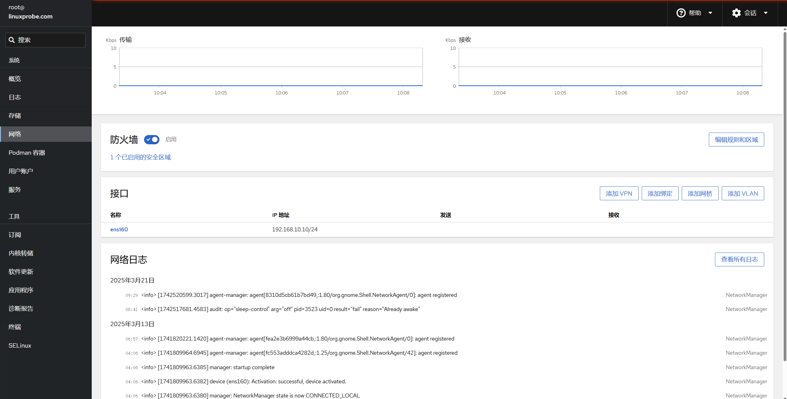
网卡网络界面

5．Podman容器

Podman 容器在 RHEL 10 系统中默认已安装，只不过还未启动，我们只需单击“启动podman”按钮即可运行服务。此外，创建和管理镜像与容器也不需要再敲命令行了，直接在图形化界面中即可操作，如图 8-25 和图 8-26 所示。

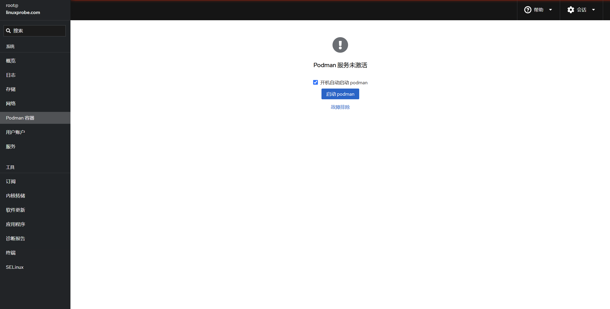
Podman容器服务界面

管理镜像和容器界面

6．用户账户

大家千万别小看“用户账户”模块，虽然它的功能界面有些简陋（见图 8-27），只有一个用于创建账户的按钮，但只要单击进入某个账户的管理界面，马上会发现“别有洞天”，如图 8-28 所示。这个界面中的功能非常丰富，我们在这里可以对账户进行重命名，设置账户的权限，还能够锁定、修改密码以及创建 SSH 密钥信息。

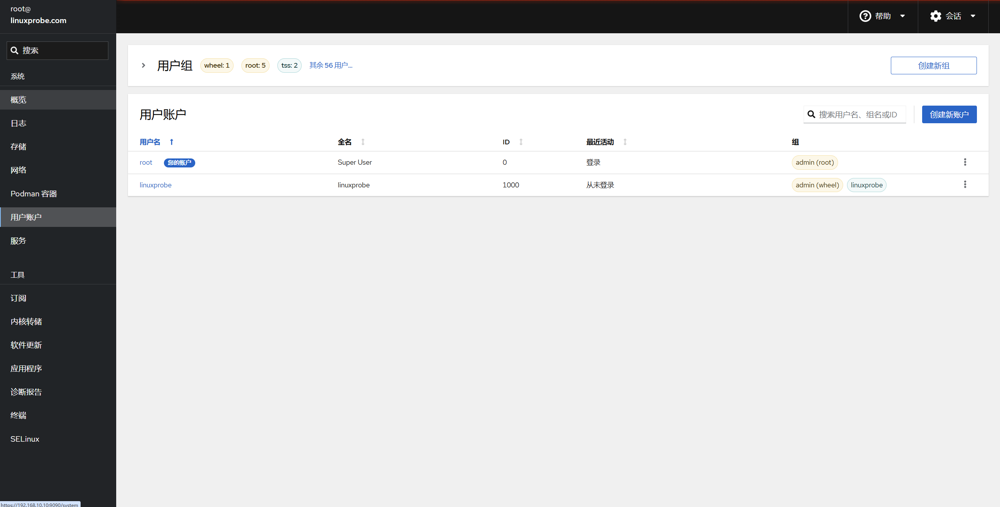
账户安全界面

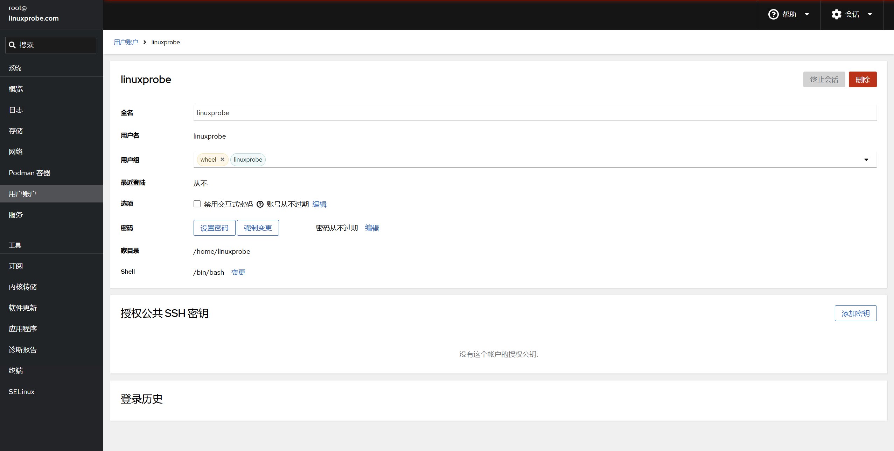
账户管理界面

7．服务

在“服务”功能模块的界面中（见图 8-29），能够查看系统中已有的服务列表和运行状态。单击某一服务，进入该服务的管理界面后（见图 8-30），可以对具体的服务进行开启、关闭操作。在“服务”功能模块中设置了服务并将其加入开机启动项后，在系统重启后也依然会为用户提供服务。

服务程序界面

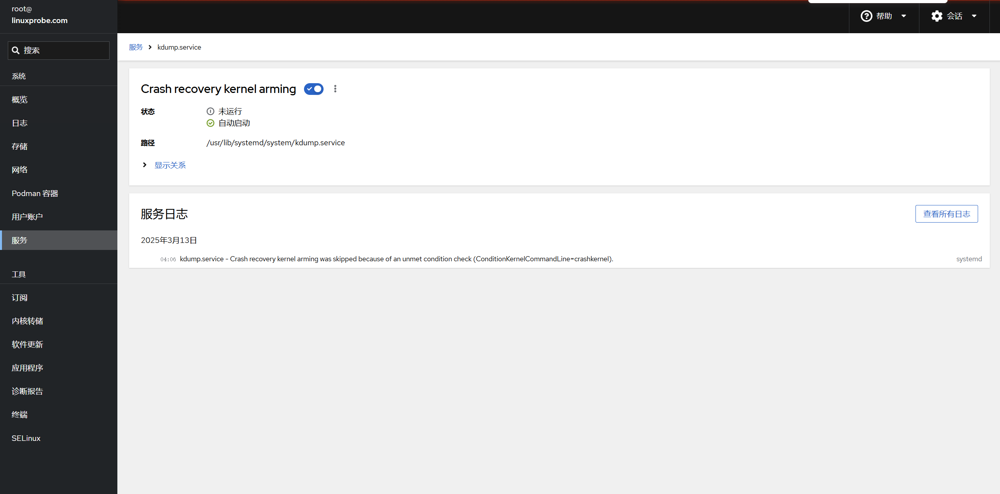
服务管理界面

8．订阅

“订阅”功能模块的界面如图 8-31 所示。这里依然是一则红帽公司的“小广告”—如果想成为尊贵的红帽服务用户，要付费购买订阅服务。个人用户无须购买，而且这对我们的后续实验没有任何影响。

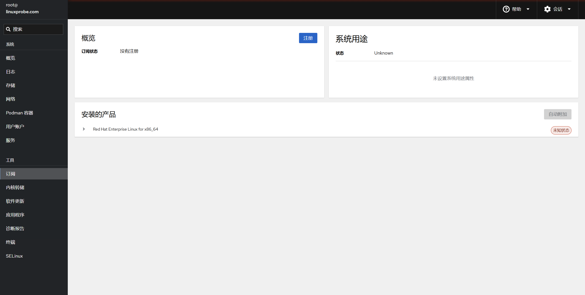
订阅服务界面

9．内核崩溃转储

内核崩溃转储（Kernel Dump）是在系统崩溃、死锁或死机时用来收集内核参数的一个服务。举例来说，如果有一天系统崩溃了，这时 KDUMP 服务就会开始工作，将系统的运行状态和内核数据收集到一个名为 dump core 的文件中，以便后续让运维人员分析并找出问题所在。由于我们在安装系统时没有启动该服务，所以可以等到后续使用时再在该模块界面中启用该服务（见图 8-32）。

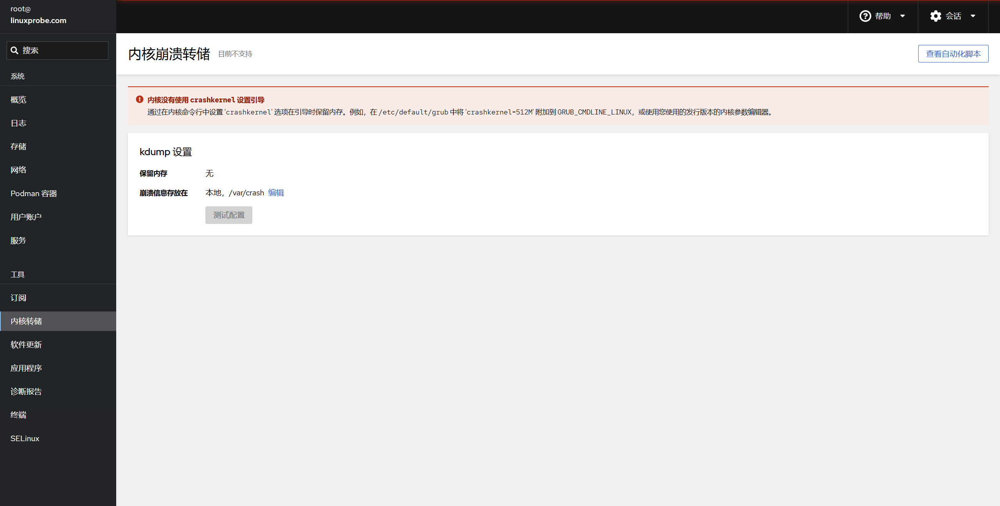
内核排错界面

10．软件更新

“软件更新”功能模块的界面如图 8-33 所示。但是，这里提到的“软件更新”并不是我们用来更新其他常规软件的一个界面，而是用来对红帽用户订阅的服务进行更新的界面。在购买了红帽订阅服务后，用户便可以在这里下载到相应服务程序的最新版本和稳定版本。

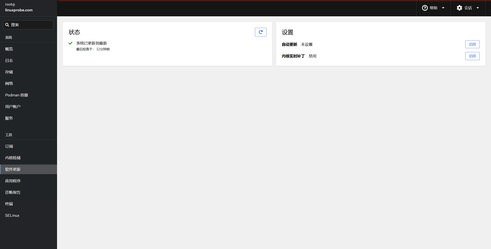
更新软件界面

11．应用程序

后期采用 Cockpit 或红帽订阅服务安装的软件都会显示在这个功能模块中，如图 8-34 所示。
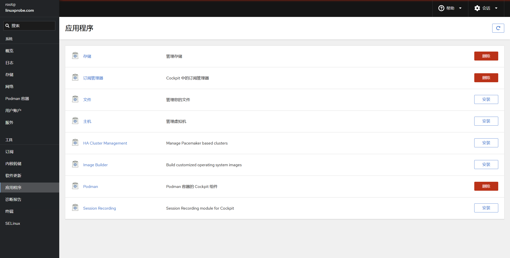
 软件仓库界面

12．系统诊断

“系统诊断”模块的功能是帮助用户收集及分析系统的信息，找到系统出现问题的原因， 界面如图 8-35 所示。单击“运行报告”按钮后大约两分钟，会出现如图 8-36 所示的界面。好吧，摊牌了，这个功能其实很鸡肋，就是将 sosreport 命令做成了一个网页上的按钮。

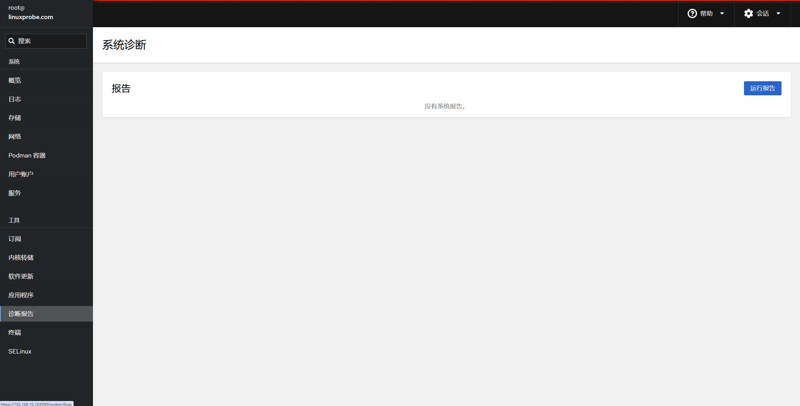
报告分析界面

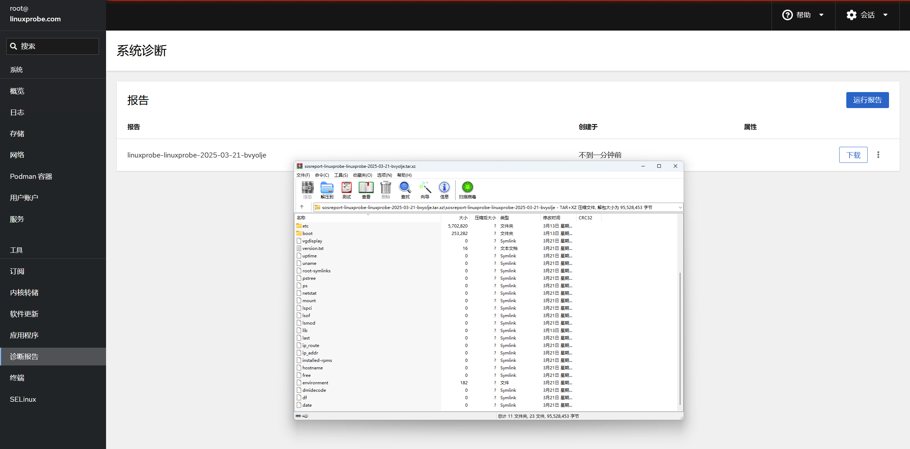
报告生成完毕

13．终端

“终端”功能模块的界面如图 8-37 所示。Cockpit 服务提供了Shell 终端的在线控制平台， 可方便用户通过网页上的终端功能管理服务器。这个功能深受运维人员喜爱。

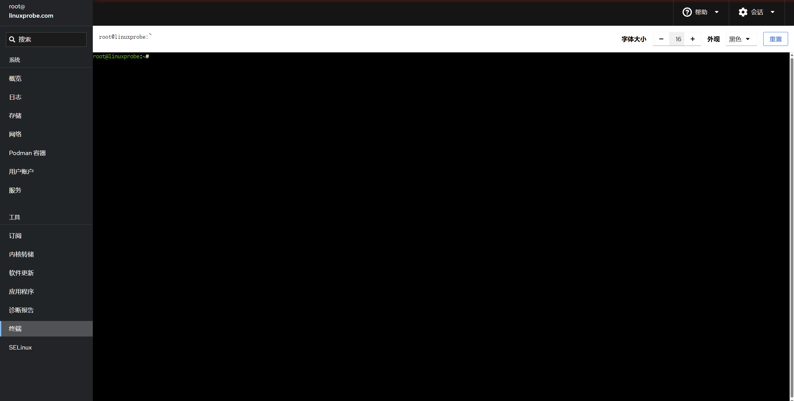
终端管理界面

14．SELinux策略

图 8-38 所示为 SELinux 策略的控制按钮和警告信息界面，第 10 章将详细介绍 SELinux安全子系统，这里暂时略过。

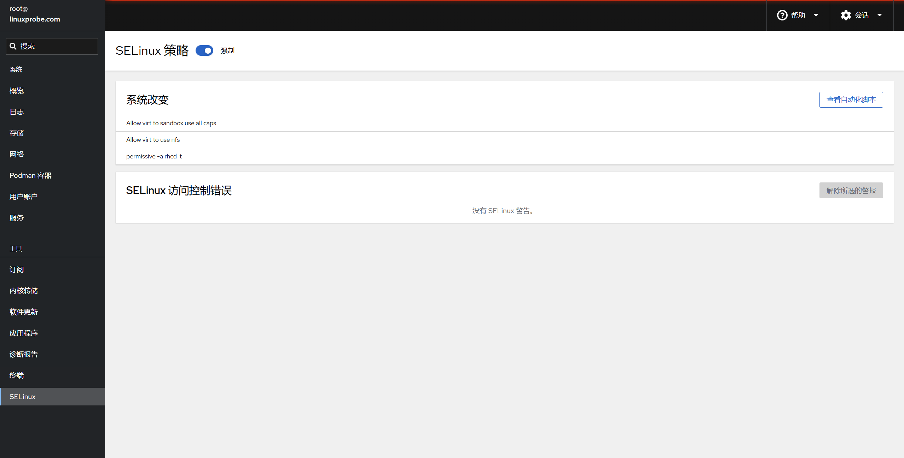
 SElinux管理界面

至此，相信各位读者已经充分掌握了防火墙的管理能力。防火墙管理工具有很多种，我们任选其一即可。在配置后续的服务前，大家要记得检查网络和防火墙的状态，以免出现服务明明配置正确，但无法从外部访问的情况，最终影响实验效果。

好了，休息一下，准备下一章的学习！