# 防火墙管理工具
众所周知，相较于企业内网，外部的公网环境更加恶劣，罪恶丛生。在公网与企业内网之间充当保护屏障的防火墙（见图 8-1），虽然有软件或硬件之分，但主要功能都是依据策略对穿越防火墙自身的流量进行过滤。就像家里安装的防盗门一样，目的是保护亲人和财产安全。防火墙策略可以基于流量的源目地址、端口号、协议、应用等信息来定制，然后防火墙使用预先定制的策略规则监控出入的流量，若流量与某一条策略规则相匹配，则执行相应的处理；若流量与所有策略规则都不匹配，则防火墙在通常情况下会将其丢弃。这样就能确保只有合法的流量在企业内网和外部公网之间流动了。


防火墙作为公网与内网之间的保护屏障


从 RHEL 10 系统开始，firewalld 防火墙正式取代了 iptables 防火墙。对于接触Linux 系统较早或学习过 RHEL 系统的读者来说，当他们发现曾经掌握的 iptables 知识在新系统中不再适用，需要全新学习 firewalld 时，难免会有抵触心理。实际上，iptables 与firewalld 都不是真正的防火墙，它们都只是用来定义防火墙策略的防火墙管理工具而已；或者说，它们只是一种服务。iptables 服务会把配置好的防火墙策略交由内核层面的 netfilter 网络过滤器来处理，而 firewalld 服务则是把配置好的防火墙策略交由内核层面的 nftables 包过滤框架来处理。换句话说，当前在 Linux 系统中其实存在多个防火墙管理工具，旨在方便运维人员灵活管理 Linux 系统中的防火墙策略，我们只需要配妥其中的一个就足够了。

虽然这些工具各有优劣，但它们在防火墙策略的配置思路上是一致的。大家甚至可以不用完全掌握本章介绍的内容，只要在这多个防火墙管理工具中任选一款并将其学透，就足以满足日常工作需求了。

# Iptables
在早期的 Linux 系统中，默认使用 iptables 防火墙管理服务来配置防火墙。尽管新型的 firewalld 防火墙管理服务已经被投入使用多年，但是大量的企业依然出于各种原因而在生产环境中继续使用 iptables。考虑到 iptables 在当前生产环境中还具有顽强的生命力，以及为了使大家在求职面试过程中被问到 iptables 的相关知识时能胸有成竹，刘遄老师觉得还是有必要在本书中好好地讲解一下这项技术。更何况前文也提到，各种防火墙管理工具的配置思路是一致的，在掌握了 iptables 的配置方法后，也能够为学习其他防火墙管理工具提供有益的借鉴和参考。

iptables 防火墙会按照从上到下的顺序来读取配置的策略规则，在找到匹配项后会立即结束匹配工作并去执行匹配项中定义的行为（即允许或拒绝，也称为“放行或阻止”）。如果在读取完所有的策略规则之后没有匹配项，就去执行默认策略。通常，防火墙策略规则有两种设置：通（即允许）和堵（即拒绝）。当防火墙的默认策略为拒绝时（堵），就要设置允许规则（通），否则谁都进不来；如果防火墙的默认策略为允许（通），就要设置拒绝规则（堵），否则谁都能进来，防火墙也就失去了防范的作用。

iptables 服务把用于处理或过滤流量的策略条目称之为规则，多条规则可以组成一个规则链，而规则链则依据数据包处理位置的不同进行分类，具体如下：

在进行路由选择前处理数据包（PREROUTING）；

处理流入的数据包（INPUT）；

处理流出的数据包（OUTPUT）；

处理转发的数据包（FORWARD）；

在进行路由选择后处理数据包（POSTROUTING）。

一般来说，从内网向外网发送的流量通常是可控且良性的，因此使用最多的就是 INPUT规则链，该规则链可以增大黑客人员从外网入侵内网的难度。

举例来说，在你居住的社区内，物业管理公司有两条规则：禁止小商小贩进入社区； 各种车辆在进入社区时都要登记。显而易见，这两条规定应该是用于社区的正门（流量必 须经过的地方），而不是每家每户的防盗门上。根据前面提到的防火墙策略的匹配顺序，可能会存在多种情况。例如，来访人员是小商小贩，则会直接被物业公司的保安拒之门外， 也就无须再对车辆进行登记。如果来访人员乘坐一辆汽车进入社区正门，则“禁止小商小 贩进入社区”的第一条规则就没有被匹配到，因此按照顺序匹配第二条规则，即需要对车 辆进行登记。如果是社区居民要进入正门，则这两条规定都不会匹配到，因此会执行默认 的允许策略。

但是，仅有策略规则还不能保证社区的安全，保安还应该知道该采用什么样的动作来处理这些匹配的流量，比如“允许”“拒绝”“登记”“不理它”。这些动作对应到 iptables 服务的术语中分别是 ACCEPT（允许流量通过）、REJECT（拒绝流量通过）、LOG（记录日志信息）、DROP（拒绝流量通过）。“允许流量通过”和“记录日志信息”都比较好理解，这里需要着重讲解的是 REJECT 和 DROP 的不同点。就 DROP 来说，它是直接将流量丢弃而且不响应；REJECT 则会在拒绝流量后再回复一条“信息已经收到，但是被扔掉了”信息，从而让流量发送方清晰地看到数据被拒绝的响应信息。

下面举一个例子，让各位读者更直观地理解这两个拒绝动作的不同之处。比如有一天你正在家里看电视，突然听到有人敲门，透过防盗门的猫眼一看是推销商品的，便会在不需要的情况下开门并拒绝他们（REJECT）。但如果看到的是债主带了十几个小弟来讨债，此时不仅要拒绝开门，还要默不作声，伪装成自己不在家的样子（DROP）。

当把 Linux 系统中的防火墙策略设置为 REJECT 动作后，流量发送方会看到“端口不可达”的响应：
```shell
root@linuxprobe:~# ping -c 4 192.168.10.10
PING 192.168.10.10 (192.168.10.10) 56(84) bytes of data.
From 192.168.10.10 icmp_seq=1 Destination Host Unreachable
From 192.168.10.10 icmp_seq=2 Destination Host Unreachable
From 192.168.10.10 icmp_seq=3 Destination Host Unreachable
From 192.168.10.10 icmp_seq=4 Destination Host Unreachable

--- 192.168.10.10 ping statistics ---
4 packets transmitted, 0 received, +4 errors, 100% packet loss, time 3099ms
pipe 4
```
而把 Linux 系统中的防火墙策略修改成 DROP 动作后，流量发送方会看到“响应超时” 的提醒。但是流量发送方无法判断流量是被拒绝，还是接收方主机当前不在线：
```shell
root@linuxprobe:~# ping -c 4 192.168.10.10
PING 192.168.10.10 (192.168.10.10) 56(84) bytes of data.

--- 192.168.10.10 ping statistics ---
4 packets transmitted, 0 received, 100% packet loss, time 3000ms
```
根据 OSI 七层模型的定义，iptables 属于工作在第二、三、四层的服务，所以能够根据流量的源地址、目的地址、传输协议、服务类型等信息进行匹配；一旦匹配成功，iptables 就会根据策略规则所预设的动作来处理这些流量。另外，再次提醒一下，防火墙策略规则的匹配顺序是从上到下的，因此要把较为严格、优先级较高的策略规则放到前面，以免发生错误。表 8-1 总结归纳了 iptables 命令的常用参数以及作用。再次强调，无须死记硬背这些参数，需要时来翻回来查阅即可。

由于本书是基于红帽 RHEL 10 系统编写的，该系统当前已不再适配 iptables 防火墙管理工具，在对 iptables 命令进行实操时，可以找老版本的 RHEL 系统进行操作。

**iptables 命令的常用参数以及作用**

|    参数     |                       作用                        |
| :---------: | :-----------------------------------------------: |
|     -P      |                   设置默认策略                    |
|     -F      |                    清空规则链                     |
|     -L      |                    查看规则链                     |
|     -A      |             在规则链的末尾添加新规则              |
|   -I num    |             在规则链的头部添加新规则              |
|   -D num    |                   删除指定规则                    |
|     -s      | 匹配来源地址（IP/MASK），加叹号（!）表示排除该 IP |
|     -d      |                   匹配目的地址                    |
|     -i      |         网卡名称	匹配从指定网卡流入的数据         |
|     -o      |         网卡名称	匹配从指定网卡流出的数据         |
|     -p      |            匹配协议，如 TCP、UDP、ICMP            |
| --dport num |                  匹配目的端口号                   |
| --sport num |                  匹配来源端口号                   |

# firewalld
RHEL 10 系统中默认的防火墙管理工具是 firewalld，它拥有基于 CLI（命令行界面） 和基于 GUI（图形用户界面）的两种管理方式。

相较于传统的防火墙管理配置工具，firewalld 支持动态更新技术并加入了区域（zone）的概念。简单来说，区域即 firewalld 预先准备的几套防火墙策略集合（策略模板），用户能够根据生产场景的不同而选择合适的策略集合，从而实现防火墙策略之间的快速切换。例如， 我们有一台笔记本电脑，每天都要在办公室、咖啡厅和家里使用。按常理来讲，这三者的安全性按照由高到低的顺序来排列，应该是家庭、公司办公室、咖啡厅。当前，我们希望为这台笔记本电脑制定如下防火墙策略规则：在家中允许访问所有服务；在办公室内仅允许访问文件共享服务； 在咖啡厅仅允许上网浏览。以往，我们需要频繁地手动设置防火墙策略规则，而现在只需要预设好区域集合，然后轻点鼠标就可以自动切换了，从而极大地提升了防火墙策略的应用效率。firewalld 中常见的区域名称（默认为public）以及相应的策略规则如表 8-2 所示。

**firewalld 中常用的区域名称及策略规则**

|   区域   |                                                       默认规则策略                                                       |
| :------: | :----------------------------------------------------------------------------------------------------------------------: |
| trusted  |                                                     允许所有的数据包                                                     |
|   home   | 拒绝流入的流量，除非与流出的流量相关；如果流量与 ssh、mdns、ipp-client、 amba-client、dhcpv6-client 服务相关，则允许流量 |
| internal |                                                     等同于 home 区域                                                     |
|   work   |          拒绝流入的流量，除非与流出的流量相关；如果流量与 ssh 、ipp-client、 dhcpv6-client 服务相关，则允许流量          |
|  public  |                拒绝流入的流量，除非与流出的流量相关；如果流量与 ssh、dhcpv6-client 服务 相关，则允许流量                 |
| external |                        拒绝流入的流量，除非与流出的流量相关；如果流量与 ssh 服务相关，则允许流量                         |
|   dmz    |                        拒绝流入的流量，除非与流出的流量相关；如果流量与 ssh 服务相关，则允许流量                         |
|  block   |                                           拒绝流入的流量，除非与流出的流量相关                                           |
|   drop   |                                           拒绝流入的流量，除非与流出的流量相关                                           |

## 终端管理工具
第 2 章在讲解 Linux 命令时曾提到，命令行终端是一种极富效率的工作方式， firewall-cmd 是 firewalld 防火墙配置管理工具的 CLI（命令行界面）版本。它的参数一般都是以“长格式”来提供的。大家不要一听到长格式就头大，因为 RHEL 10 系统支持部分命令的参数补齐，其中就包含这条命令（很酷吧）。也就是说，现在除了能用 Tab 键自动补齐命令或文件名等内容之外，还可以用 Tab 键来补齐表 8-3 中所示的长格式参数。这太棒了！

**firewall-cmd 命令中使用的参数以及作用**

|             参数              | 作用                                                 |
| :---------------------------: | :--------------------------------------------------- |
|          --get-zones          | 显示所有可用的区域                                   |
|        --get-services         | 显示所有预先定义的服务                               |
|      --get-active-zones       | 显示当前正在使用的区域及其对应的网卡名称             |
|      --get-default-zone       | 查询默认的区域名称                                   |
| --set-default-zone=<区域名称> | 设置默认的区域，并使其永久生效                       |
|         --add-source=         | 将源自指定 IP 或子网的流量导向指定的区域             |
|       --remove-source=        | 取消将源自指定 IP 或子网的流量导向某个区域           |
|  --add-interface=<网卡名称>   | 将源自指定网卡的所有流量导向指定的区域               |
| --change-interface=<网卡名称> | 将指定网卡与指定区域进行关联                         |
|        --list-services        | 列出当前区域允许的服务                               |
|         --list-ports          | 列出当前区域允许的端口                               |
|          --list-all           | 显示当前区域的所有配置参数、资源、端口及服务信息     |
|       --list-all-zones        | 显示所有区域的配置参数、资源、端口及服务信息         |
|    --add-service=<服务名>     | 允许默认区域的指定服务流量                           |
|   --remove-service=<服务名>   | 禁止默认区域的指定服务流量                           |
|   --add-port=<端口号或协议>   | 允许默认区域的指定端口流量                           |
| --remove-port=<端口号或协议>  | 禁止默认区域的指定端口流量                           |
|   --query-service=<服务名>    | 查询指定服务是否被允许                               |
|  --query-port=<端口号或协议>  | 查询指定端口是否被允许                               |
|   --add-rich-rule='<规则>'    | 添加一条复杂的规则                                   |
|  --remove-rich-rule='<规则>'  | 删除一条复杂的规则                                   |
|           --reload            | 重新加载配置，让永久生效的规则立即生效，覆盖当前配置 |
|          --panic-on           | 开启应急模式，拒绝所有流量                           |
|          --panic-off          | 关闭应急模式，恢复正常流量处理                       |
|          --permanent          | 将规则设置为永久生效（重启后依然有效）               |

与 Linux 系统中其他的防火墙策略配置工具一样，使用 firewalld 配置的防火墙策略默认为运行时（Runtime）模式，又称为当前生效模式，而且会随着系统的重启而失效。如果想让配置策略一直存在，就需要使用永久（Permanent）模式了，方法就是在用 firewall-cmd 命令正常设置防火墙策略时添加--permanent 参数，这样配置的防火墙策略就永久生效了。

但是，永久生效模式有一个“不近人情”的特点，就是使用它设置的策略只有在系统重启之后才能自动生效。如果想让配置的策略立即生效，需要手动执行 firewall-cmd --reload 命令。

Tips ：
Runtime：当前立即生效，重启后失效。
Permanent：当前不生效，重启后生效。
接下来的实验都很简单，但是提醒大家一定要仔细查看使用的是 Runtime 模式还是Permanent 模式。如果不关注这个细节，就算正确配置了防火墙策略，也可能无法达到预期的效果。
实验 1：查看firewalld 服务当前所使用的区域。
这是一步非常重要的操作。在配置防火墙策略前，必须查看当前生效的是哪个区域，否则配置的防火墙策略将不会立即生效。
```shell
root@linuxprobe:~# firewall-cmd --get-default-zone
public
```
实验 2：查询指定网卡在firewalld 服务中绑定的区域。
在生产环境中，服务器大多不止有一块网卡。一般来说，充当网关的服务器有两块网卡， 一块对公网，另外一块对内网，这两块网卡在审查流量时所用的策略肯定也是不一致的。因此，可以根据网卡针对的流量来源，为网卡绑定不同的区域，实现对防火墙策略的灵活管控。
```shell
root@linuxprobe:~# firewall-cmd --get-zone-of-interface=ens160
public
```
实验 3：把网卡默认区域修改为external，并在系统重启后生效。
使用 change-interface 参数指定的网卡名称（切记要以实际为准，不确定的话用ifconfig 命令进行查询）。设置成功后再用 get-zone-of-interface 参数查询网卡更改后的区域。
```shell
root@linuxprobe:~# firewall-cmd --permanent --zone=external --change-interface=ens160
The interface is under control of NetworkManager, setting zone to 'external'.
success
root@linuxprobe:~# firewall-cmd --permanent --get-zone-of-interface=ens160
external
```
实验 4：把firewalld 服务的默认区域设置为public。
默认区域也叫全局配置，指的是对所有网卡都生效的配置，优先级较低。在下面的代码中可以看到，当前默认区域为 public，而 ens160 网卡的区域为 external，此时便是以网卡的区域名称为准。
通俗来说，默认区域就是一种通用的策略。例如，食堂为所有人准备了一次性餐具，而环保主义者则会自己携带碗筷。如果你自带了碗筷，就可以用自己的；反之就用食堂统一提供的。
```shell
root@linuxprobe:~# firewall-cmd --set-default-zone=public
Warning: ZONE_ALREADY_SET: public
success
root@linuxprobe:~# firewall-cmd --get-default-zone 
public
root@linuxprobe:~# firewall-cmd --get-zone-of-interface=ens160
external
```
实验 5：启动和关闭firewalld 防火墙服务的应急模式。
如果想在 1s 的时间内阻断一切网络连接，有什么好办法呢？大家下意识地会说：“拔掉网线！”这是一个物理级别的高招。但是，如果人在北京，服务器在异地呢？应急模式在这个时候就派上用场了。使用--panic-on 参数会立即切断一切网络连接，而使用--panic-off 则会恢复网络连接。切记，应急模式会切断一切网络连接，因此在远程管理服务器时，在按下回车键前一定要三思。
```shell
root@linuxprobe:~# firewall-cmd --panic-on
success
root@linuxprobe:~# firewall-cmd --panic-off
success
```
实验 6：查询是否放行SSH 和HTTPS 的流量。
在工作中可以不使用--zone 参数指定区域名称，firewall-cmd 命令会自动依据默认区域进行查询，从而减少用户的输入量。但是，如果默认区域与网卡所绑定的不一致时，就会发生冲突，因此规范写法的 zone 参数是一定要加的。
```shell
root@linuxprobe:~# firewall-cmd --query-service=ssh
yes
root@linuxprobe:~# firewall-cmd --query-service=https
no
```
实验 7：把HTTPS 的流量设置为永久放行，并立即生效。
默认情况下对防火墙策略进行的修改都属于 Runtime 模式，即当前生效而重启后失效， 因此在工作和考试中尽量避免使用。而在使用--permanent 参数时，则是当前不会立即看到效果，而在重启或重新加载后方可生效。于是，在添加了放行HTTPS 流量的策略后，查询当前模式策略，发现依然是不放行HTTPS 的流量：
```shell
root@linuxprobe:~# firewall-cmd --permanent --add-service=https
success
root@linuxprobe:~# firewall-cmd --query-service=https
no
```
不想重启服务器的话，就用--reload 参数吧：
```shell
root@linuxprobe:~# firewall-cmd --reload
success
root@linuxprobe:~# firewall-cmd --query-service=https
yes
```
实验 8：把HTTP 的流量设置为永久拒绝，并立即生效。
由于在默认情况下HTTP 的流量没有被放行，所以会有Warning:NOT_ENABLED: http 这样的提示信息，因此对实际操作没有影响。
```shell
root@linuxprobe:~# firewall-cmd --permanent --remove-service=http
Warning: NOT_ENABLED: http
success
root@linuxprobe:~# firewall-cmd --reload 
success
```
实验 9：把访问 8080 和 8081 端口的流量策略设置为允许，但仅限当前生效。
由于是仅限当前生效，因此不需要使用 permanent 参数，设置成功后添加 list-ports
参数可查询到系统中所有针对端口号的防火墙策略。
```shell
root@linuxprobe:~# firewall-cmd --add-port=8080-8081/tcp
success
root@linuxprobe:~# firewall-cmd --list-ports
8080-8081/tcp
```
实验 10：把原本访问本机 888 端口的流量转发到 22 端口，且要求当前和长期均有效。
第 9 章介绍的 SSH 远程控制协议是基于 TCP/22 端口传输控制命令的，如果想让用户通过其他端口号也能访问 ssh 服务，就可以试试端口转发技术了。通过这项技术，新的端口在收到用户请求后会自动将其转发到原本服务的端口上，使得用户能够通过新的端口访问到原本的服务。
来举个例子帮助大家理解。假设小强是电子厂的工人，他喜欢上了三号流水线上的工人小花，但不好意思表白，于是写了一封情书并交给门卫张大爷，希望由张大爷转交给小花。这样一来，情书（信息）的传输由从小强到小花，变成了从小强到张大爷再到小花，情书（信息）依然能顺利送达。
使用firewall-cmd 命令实现端口转发的格式有点长，这里为大家总结好了：
firewall-cmd --permanent --zone=<区域> --add-forward-port=port=<源端口号>:proto=<协议>:toport=<目标端口号>:toaddr=<目标IP地址>
上述命令中的目的 IP 地址一般是服务器本地的 IP 地址：
```shell
root@linuxprobe:~# firewall-cmd --permanent --add-forward-port=port=888:proto=tcp:toport=22:toaddr=192.168.10.10
success
root@linuxprobe:~# firewall-cmd --reload
success
```
在客户端使用 ssh 命令尝试访问 192.168.10.10 主机的 888 端口，访问成功：
```shell
[root@client A ~]# ssh -p 888 192.168.10.10
The authenticity of host '[192.168.10.10]:888 ([192.168.10.10]:888)' can't be established.
ED25519 key fingerprint is SHA256:0R7Kuk/yCTlJ+E4G9y9iX/A/hAklHkALm5ZUgnJ01cc.
This key is not known by any other names.
Are you sure you want to continue connecting (yes/no/[fingerprint])? yes
Warning: Permanently added '[192.168.10.10]:888' (ED25519) to the list of known hosts.
root@192.168.10.10's password: 此处输入远程root管理员的密码
Last login: Thu Mar 20 11:36:54 2025 from 192.168.10.20
```
实验 11：设置富规则。
富规则也叫复杂规则，表示更细致、更详细的防火墙策略配置，它可以针对系统服务、端口号、源地址和目的地址等诸多信息进行更有针对性的策略配置。它的优先级在所有的防火墙策略中也是最高的。比如，我们在 firewalld 服务中配置一条富规则，使其拒绝192.168.10.0/24 网段的所有用户访问本地的ssh 服务（22 端口）：
```shell
root@linuxprobe:~# firewall-cmd --permanent --add-rich-rule="rule family="ipv4" source address="192.168.10.0/24" service name="ssh" reject"
success
root@linuxprobe:~# firewall-cmd --reload
success
```
在客户端使用 ssh 命令尝试访问 192.168.10.10 主机的 ssh 服务（22 端口）：
```shell
[root@client A ~]# ssh 192.168.10.10
ssh: connect to host 192.168.10.10 port 22: Connection refused
```
Tips ：
“一个男人”和“一个高个子、大眼睛、脸右侧有个酒窝的男人”相比，很明显后者的描述更加精准，减少了错误匹配的概率，应该优先匹配。

## 图形管理工具
在各种版本的 Linux 系统中，几乎没有能让刘遄老师欣慰并推荐的图形化工具，但是firewall-config 做到了。它是 firewalld 防火墙配置管理工具的 GUI（图形用户界面） 版本，几乎能够实现所有以命令行执行的操作。毫不夸张地说，即使读者没有扎实的 Linux 命令基础，也完全可以通过它来妥善配置 RHEL 10 中的防火墙策略。但在默认情况下系统并没有提供 firewall-config 命令，我们需要自行用 dnf 命令进行安装，所以需要先配置软件仓库。

首先将虚拟机的“CD/DVD（SATA）”光盘选项设置为“使用 ISO 映像文件”，然后选择已经下载好的系统镜像，如图 8-2 所示。
随书配套的软件资源请在这里下载：https://www.linuxprobe.com/tools
Red Hat Enterprise Linux (RHEL) 10 —— 红帽操作系统（必需）：
由全球领先的开源软件及企业级服务提供商红帽公司出品，是一款相当稳定、出色的 Linux 操作系统。

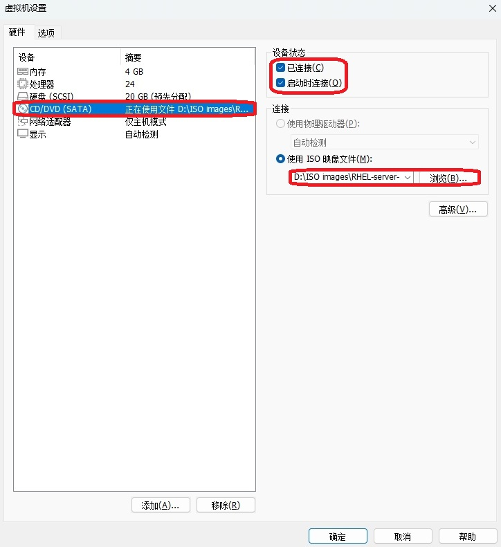
将虚拟机的光盘设备指向ISO镜像


Tips ：
下载后的系统镜像是以.iso 结尾的文件，选中即可，无须解压。

然后，把光盘设备中的系统镜像挂载到/media/cdrom 目录：
```shell
root@linuxprobe:~# mkdir -p /media/cdrom
root@linuxprobe:~# mount /dev/cdrom /media/cdrom
mount: /media/cdrom: WARNING: source write-protected, mounted read-only.
```
为了能够让软件仓库一直为用户提供服务，更加严谨的做法是将系统镜像文件的挂载信息写入/etc/fstab 文件中，以保证万无一失：
```shell
root@linuxprobe:~# vim /etc/fstab
#
# /etc/fstab
# Created by anaconda on Wed Mar 12 19:35:26 2025
#
# Accessible filesystems, by reference, are maintained under '/dev/disk/'.
# See man pages fstab(5), findfs(8), mount(8) and/or blkid(8) for more info.
#
# After editing this file, run 'systemctl daemon-reload' to update systemd
# units generated from this file.
#
UUID=408f4a3d-a4d3-4a44-bb23-6988cdbd10bf /                  xfs     defaults        0 0
UUID=4cf8ecae-bcb6-4b1e-8001-968b33643a8a /boot              xfs     defaults        0 0
UUID=1FB8-9199          /boot/efi               vfat    umask=0077,shortname=winnt	 0 2
UUID=d936c726-45a7-4ca2-8932-c54f84a3d787 none               swap    defaults        0 0
/dev/cdrom 								  /media/cdrom		iso9660	 defaults 		 0 0
```
最后，使用 Vim 文本编辑器创建软件仓库的配置文件。与之前版本的系统不同，RHEL 10 需要配置两个软件仓库（即[BaseOS]与[AppStream]），且缺一不可。下述命令中用到的具体参数的含义可参见 4.1.4 节。
```shell
root@linuxprobe:~# vim /etc/yum.repos.d/rhel10.repo
[BaseOS]
name=BaseOS
baseurl=file:///media/cdrom/BaseOS
enabled=1
gpgcheck=0
[AppStream]
name=AppStream
baseurl=file:///media/cdrom/AppStream
enabled=1
gpgcheck=0
```
在正确配置软件仓库文件后，就可以开始用 yum 或dnf 命令安装软件了。这两个命令在实际操作中除了名字不同外，执行方法完全一致，大家可随时用 yum 来替代 dnf 命令。下面安装firewalld 图形用户界面工具：
```
root@linuxprobe:~# dnf install firewall-config
Updating Subscription Management repositories.
BaseOS                                          2.7 MB/s | 2.7 kB     00:00    
AppStream                                       2.7 MB/s | 2.8 kB     00:00    
Dependencies resolved.
================================================================================
 Package              Arch        Version                  Repository      Size
================================================================================
Installing:
 firewall-config      noarch      2.2.1-1.el10             AppStream       90 k
Installing dependencies:
 dbus-x11             x86_64      1:1.14.10-4.el10         AppStream       26 k

Transaction Summary
================================================================================
Install  2 Packages

Total size: 116 k
Installed size: 1.0 M
Is this ok [y/N]: y
Downloading Packages:
Running transaction check
Transaction check succeeded.
Running transaction test
Transaction test succeeded.
Running transaction
  Preparing        :                                                        1/1 
  Installing       : dbus-x11-1:1.14.10-4.el10.x86_64                       1/2 
  Installing       : firewall-config-2.2.1-1.el10.noarch                    2/2 
  Running scriptlet: firewall-config-2.2.1-1.el10.noarch                    2/2 
Installed products updated.

Installed:
  dbus-x11-1:1.14.10-4.el10.x86_64      firewall-config-2.2.1-1.el10.noarch     

Complete!
```
安装成功后，firewall-config 工具的图形界面如图 8-3 所示，其功能具体如下。
1：选择运行时（Runtime）或永久（Permanent）模式的配置。
2：可选的策略集合区域列表。
3：常用的系统服务列表。
4：主机地址的黑白名单。
5：当前正在使用的区域。
6：管理当前被选中区域中的服务。
7：管理当前被选中区域中的端口。
8：设置允许被访问的协议。
9：设置允许被访问的端口。
10：开启或关闭 SNAT（源网络地址转换）技术。
11：设置端口转发策略。
12：控制请求icmp 服务的流量。
13：管理防火墙的富规则。
14：被选中区域的服务，若勾选了相应服务前面的复选框，则表示放行与之相关的流量。
15：firewall-config 工具的运行状态。

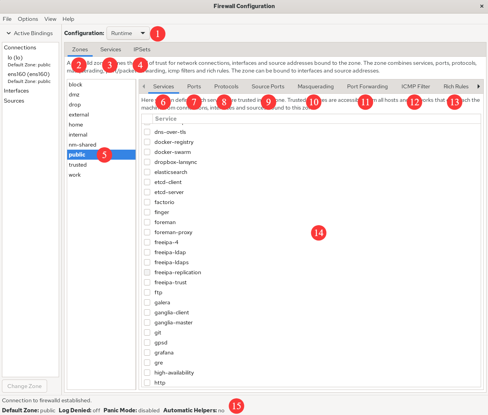
firewall-config的图形界面

除了图 8-3 中列出的功能，还有用于将网卡与区域绑定的 Interfaces 选项，以及用于将 IP 地址与区域绑定的 Sources 选项。另外再啰嗦一句，在使用 firewall-config 工具配置完防火墙策略之后，无须进行二次确认，因为只要有修改内容，它就自动进行保存。

下面进行动手实践环节。

先将当前区域内请求http 服务的流量设置为放行，但仅限当前生效，具体配置如图 8-4 所示。

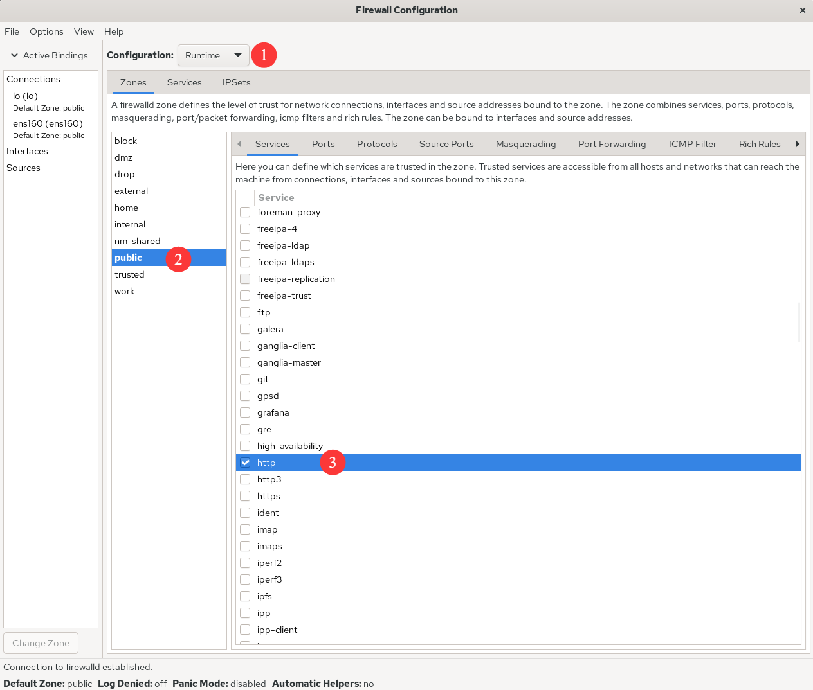
允许放行请求http服务的流量

尝试添加一条防火墙策略规则，使其放行访问 8080～8088 端口（TCP）的流量，并将其设置为永久生效，以达到系统重启后防火墙策略依然生效的目的。在按照图 8-5 所示的界面配置完毕之后，还需要在 Options 菜单中单击 Reload Firewalld 命令，让配置的防火墙策略立即生效（见图 8-6）。这与在命令行中使用--reload 参数的效果一样。

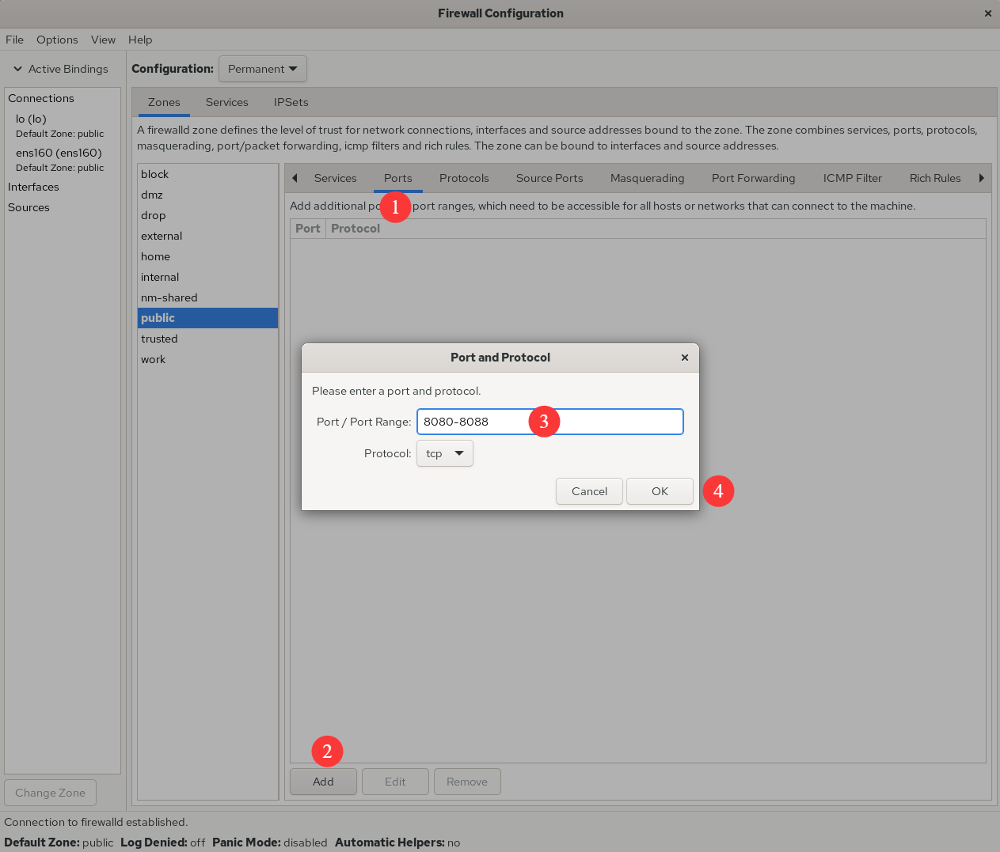
放行访问8080～8088端口的流量

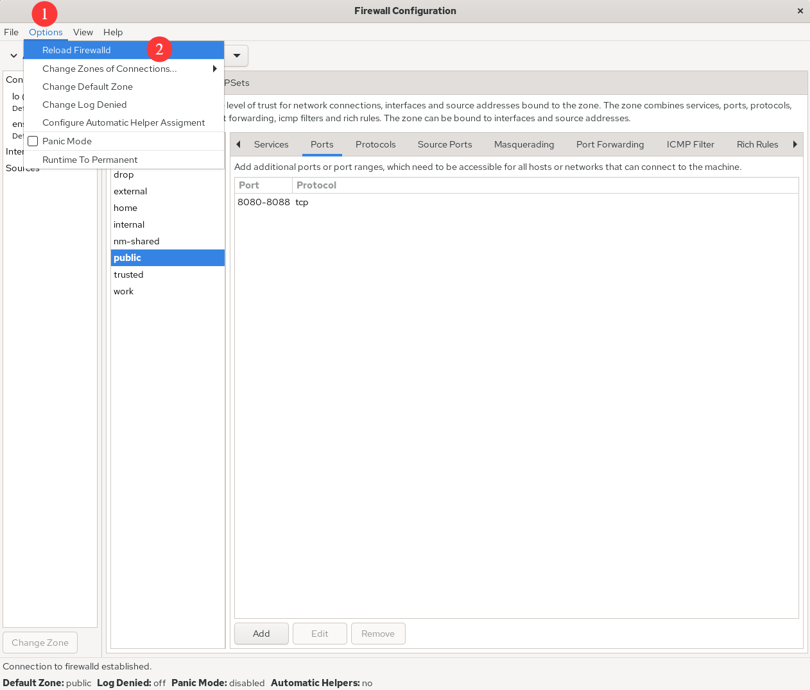
让配置的防火墙策略规则立即生效

前面在讲解 firewall-config 工具的功能时，曾经提到了 SNAT（Source Network Address Translation，源网络地址转换）技术。SNAT 是一种为了解决 IP 地址匮乏而设计的技术，它能够使得多个内网中的用户通过同一个外网 IP 接入互联网。该技术的应用非常广泛， 我们每天都在使用，只不过没有察觉到罢了。比如，当通过家中的网关设备（无线路由器） 访问本书配套站点 www.linuxprobe.com 时，就用到了 SNAT 技术。

大家可以看一下在网络中不使用 SNAT 技术（见图 8-7）和使用 SNAT 技术（见图 8-8） 时的情况。在图 8-7 所示的局域网中有多台 PC，如果网关服务器没有应用 SNAT 技术，则互联网中的网站服务器在收到PC 的请求数据包，并回送响应数据包时，将无法在网络中找到这个私有网络的 IP 地址，所以 PC 也就收不到响应数据包了。在图 8-8 所示的局域网中，由于网关服务器应用了 SNAT 技术，所以互联网中的网站服务器会将响应数据包发给网关服务器， 再由后者转发给局域网中的 PC。

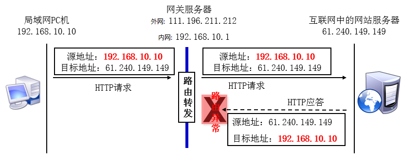
没有使用SNAT技术的网络

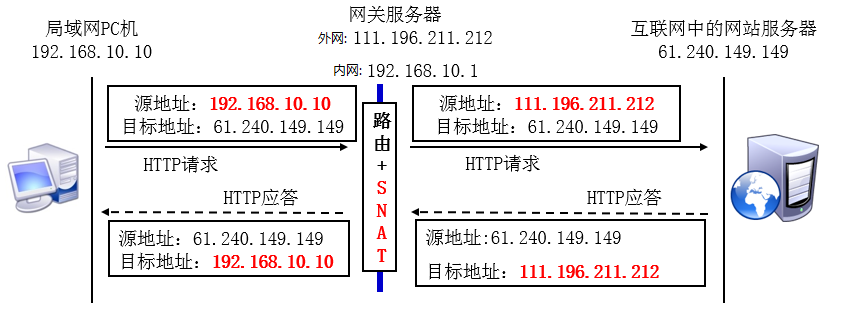
使用SNAT技术处理过的网络

使用iptables 命令实现SNAT 技术是一件很麻烦的事情，但是在 firewall-config 中却是小菜一碟。用户只需按照图 8-9 进行配置，并选中 Masquerade zone 复选框，就自动开启了SNAT 技术。

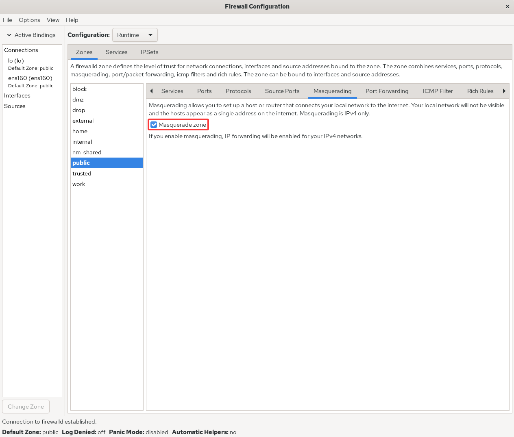
开启防火墙的SNAT技术

为了让大家直观查看不同工具在实现相同功能时的区别，针对前面使用 firewall-cmd 配置的防火墙策略规则，这里使用 firewall-config 工具进行了重新演示：将本机 888 端口的流量转发到 22 端口，且要求当前和长期均有效，具体如图 8-10 和图 8-11 所示。

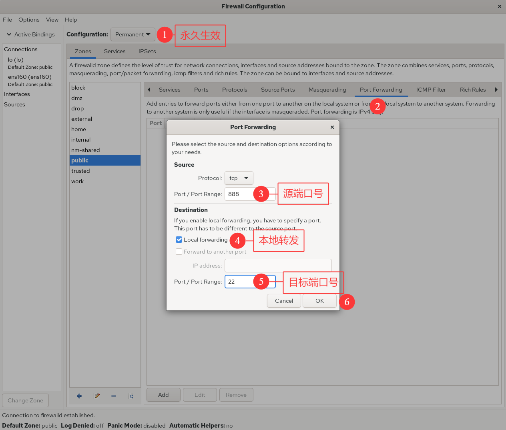
 配置本地的端口转发

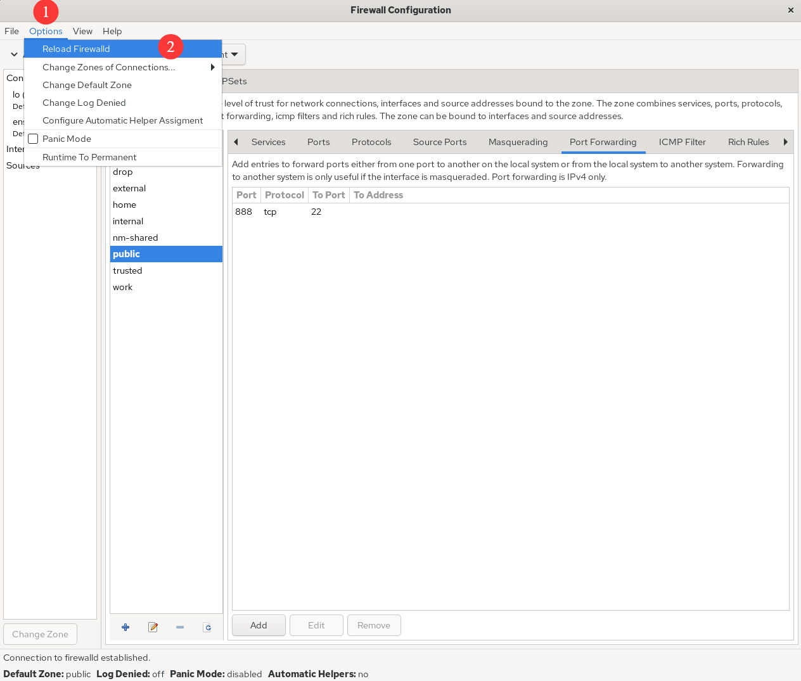
让防火墙策略规则立即生效

用命令配置富规则可真辛苦，幸好我们现在有了图形用户界面工具。设置当192.168.10.20 主机访问本机的 1234 端口号时，防火墙会自动执行的动作，如图 8-12 所示。其中 Element 选项能够根据服务名称、端口号、协议等信息进行匹配；Source 与 Destination 选项后的 inverted 复选框代表反选功能，将其选中则代表对已填写信息进行反选，即选中填写信息以外的主机地址；Log 复选框在选中后，日志不仅会被记录到日志文件中，而且还可以在设置日志的等级（Level）后，再将日志记录到日志文件中，以方便后续的筛查。

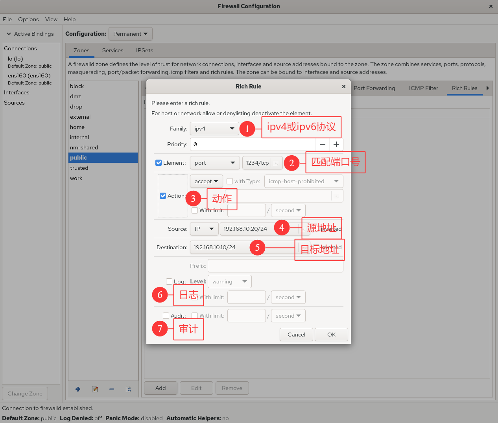
配置防火墙富规则策略

如果生产环境中的服务器有多块网卡在同时提供服务（这种情况很常见），则对内网和对外网提供服务的网卡要选择的防火墙策略区域是不一样的。也就是说，可以把网卡与防火墙策略区域进行绑定（见图 8-13 和图 8-14），这样就能够使用不同的防火墙区域策略，对源自不同网卡的流量进行有针对性的监控，效果会更好。


把网卡与防火墙策略区域进行绑定

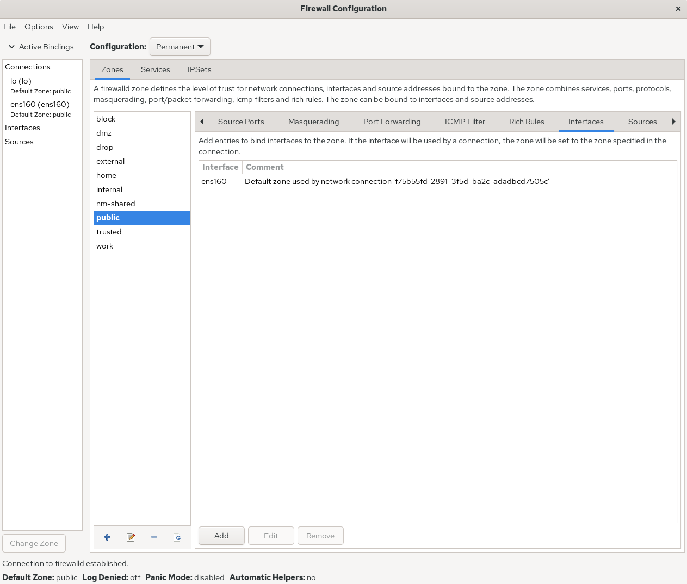
网卡与策略区域绑定完成

最后再提一句，firewall-config 工具真的非常实用，很多原本复杂的长命令被图形化按钮替代，设置规则也简单明了，足以应对日常工作。所以再次向大家强调配置防火墙策略的原则—只要能实现所需的功能，用什么工具请随君便。

# 服务的访问控制列表
TCP Wrapper 是RHEL 5/6 系统中默认启用的一款服务访问控制程序，它能够根据来访主机的地址与本机的目标服务程序做出允许或拒绝的操作。在 RHEL 10 版本中，它已经被firewalld 正式替代。换句话说，Linux 系统中其实有两个层面的防火墙，第一个是前面讲到的基于TCP/IP 的流量过滤工具，而 TCP Wrapper 服务则是能允许或禁止 Linux 系统提供服务的防火墙，可以在更高层面保护Linux 系统的安全运行。

TCP Wrapper 服务的防火墙策略由两个控制列表文件所控制，用户可以编辑允许控制列表文件来放行对服务的请求流量，也可以编辑拒绝控制列表文件来阻止对服务的请求流量。控制列表文件修改后会立即生效，系统将先检查允许控制列表文件（/etc/hosts.allow），如果匹配到相应的允许策略则放行流量；如果没有匹配，则会进一步匹配拒绝控制列表文件（/etc/hosts.deny），若找到匹配项则拒绝该流量。如果这两个文件都没有匹配到，则默认放行流量。

由于RHEL 10 版本已经不再支持TCP Wrapper 服务程序，因此我们接下来选择在一台老版本的服务器上进行实验。TCP Wrapper 服务的控制列表文件配置起来并不复杂，常用的客户端地址匹配模式如表 8-4 所示。

**TCP Wrappers 服务的控制列表文件中常用的客户端地址匹配模式**

| 客户端地址匹配模式 |            示例            |        满足示例的客户端列表         |
| :----------------: | :------------------------: | :---------------------------------: |
|      单一主机      |       192.168.10.10        |   IP 地址为 192.168.10.10 的主机    |
|      指定网段      |        192.168.10.         |   IP 段为 192.168.10.0/24 的主机    |
|      指定网段      | 192.168.10.0/255.255.255.0 |   IP 段为 192.168.10.0/24 的主机    |
|   指定 DNS 后缀    |      .linuxprobe.com       | 所有DNS后缀为.linuxprobe.com的主机  |
|    指定主机名称    |     www.linuxprobe.com     | 主机名称为www.linuxprobe.com 的主机 |
|   指定所有客户端   |            ALL             |        所有主机全部包括在内         |

在配置 TCP Wrapper 服务时需要遵循两个原则：

编写拒绝策略规则时，填写的是服务名称，而非协议名称；
建议先编写拒绝策略规则，再编写允许策略规则，以便直观地看到相应的效果。
下面编写拒绝策略规则文件，禁止访问本机 sshd 服务的所有流量（无须修改/etc/hosts.deny 文件中原有的注释信息）：
```shell
root@linuxprobe:~# vim /etc/hosts.deny
#
# hosts.deny This file contains access rules which are used to
# deny connections to network services that either use
# the tcp_wrappers library or that have been
# started through a tcp_wrappers-enabled xinetd.
#
# The rules in this file can also be set up in
# /etc/hosts.allow with a 'deny' option instead.
#
# See 'man 5 hosts_options' and 'man 5 hosts_access'
# for information on rule syntax.
# See 'man tcpd' for information on tcp_wrappers
sshd:*
root@linuxprobe:~# ssh 192.168.10.10
ssh_exchange_identification: read: Connection reset by peer
```
接下来，在允许策略规则文件中添加一条规则，使其放行源自 192.168.10.0/24 网段， 且访问本机sshd 服务的所有流量。可以看到，服务器立刻就放行了访问sshd 服务的流量，效果非常直观：
```shell
root@linuxprobe:~# vim /etc/hosts.allow
#
# hosts.allow This file contains access rules which are used to
# allow or deny connections to network services that
# either use the tcp_wrappers library or that have been
# started through a tcp_wrappers-enabled xinetd.
#
# See 'man 5 hosts_options' and 'man 5 hosts_access'
# for information on rule syntax.
# See 'man tcpd' for information on tcp_wrappers
sshd:192.168.10.

root@linuxprobe:~# ssh 192.168.10.10
The authenticity of host '192.168.10.10 (192.168.10.10)' can't be established.
ECDSA key fingerprint is 70:3b:5d:37:96:7b:2e:a5:28:0d:7e:dc:47:6a:fe:5c.
Are you sure you want to continue connecting (yes/no)? yes
Warning: Permanently added '192.168.10.10' (ECDSA) to the list of known hosts.
root@192.168.10.10's password: 此处输入root管理员密码
Last login: Wed May 4 07:56:29 2025
root@linuxprobe:~# 
```
# Cockpit 驾驶舱管理工具
首先，Cockpit 是一个英文单词，即“（飞机、船或赛车的）驾驶舱、驾驶座”（见图 8-15），它用名字传达出了功能丰富的特性。其次，Cockpit 是一个基于 Web 的图形化服务管理工具，对用户相当友好，即便是新手也可以轻松上手。而且它天然具备很好的跨平台性，因此被广泛应用于服务器、容器、虚拟机等多种管理场景。最后，红帽公司对 Cockpit 也十分看重，直接将它默认安装到了 RHEL 10 和 CentOS Stream 系统中，当然由此衍生的 Fedora 也标配了 Cockpit。


驾驶舱示意图

Cockpit 在默认情况下就已经安装到系统中。下面执行 dnf 命令对此进行确认：

root@linuxprobe:~# dnf install cockpit
Updating Subscription Management repositories.
BaseOS                                          2.7 MB/s | 2.7 kB     00:00    
AppStream                                       2.7 MB/s | 2.8 kB     00:00    
Package cockpit-323-1.el10.x86_64 is already installed.
Dependencies resolved.
Nothing to do.
Complete!

但是Cockpit 服务程序没有自动运行，需要将它开启并加入开机启动项中：

root@linuxprobe:~# systemctl start cockpit
root@linuxprobe:~# systemctl enable cockpit.socket

随后，我们打开本地物理机的“网络和 Internet”→“高级网络设置”界面，找到 VMnet1 网卡，单击“编辑”按钮。配置一个与虚拟机系统相同的 IP 网段的地址，步骤如图 8-16 和图8-17 所示，这样物理机和虚拟机系统的网络就能通信啦：


进入高级网络设置界面


配置网卡IP地址信息

打开物理机的浏览器，在地址栏中输入“虚拟机 IP 地址:9090”即可访问 Cockpit。由于访问 Cockpit 的流量会使用 HTTPS 进行加密，而证书又是在本地签发的，因此需要信任证书后才能继续访问，如图 8-18 所示。

另外，如果你还没有按照第 4 章的方法配置好 Linux 系统的网卡IP 地址，不用担心，第9 章会讲图形化的配置方法，可以稍后再实操。


选择继续前往

进入 Cockpit 的登录界面后，输入 root 管理员的账户与密码，单击“登录”按钮，如图8-19 所示。


输入root管理员的账号与系统密码


如图 8-20 所示，如果出现了“权限被拒绝”的情况千万别着急，因为 RHEL 10 系统为了安全起见，默认不允许 root 用户进行远程登录，还记得第 1 章中手动允许 root 管理员使用SSH 协议吗（见图 1-40）？此处也需要手动放行一下才能访问，删除下面文件中 root 用户的名称：

root@linuxprobe:~# vim /etc/cockpit/disallowed-users
List of users which are not allowed to login to Cockpit
root


权限被拒绝

无须重启服务，再次单击“登录”按钮即可。

进入Cockpit 的 Web 界面，发现里面可谓“别有洞天”。Cockpit 总共分为 14 个功能模块： 概览、日志、存储、网络、Podman 容器、用户账户、服务、订阅、内核转储、软件更新、应用程序、诊断报告、终端、SELinux。下面逐一进行讲解。

1．概述

进入Cockpit 界面后默认显示的便是“概览”模块界面，在该界面中能够看到系统架构、版本、主机名与时间等信息，单击“查看指标和历史记录”按钮还能实时看到 CPU、内存、硬盘、网络的动态使用情况。该界面有点类似于 Web 版的“Windows 系统任务管理器”，属实好用，如图 8-21 所示。


系统状态界面

2．日志

这个模块能够提供系统的全部日志，但是可能有读者会好奇，为什么内容这么少呢？原因出在图 8-22 中的两个选项中：时间和优先级。通过这两个选项，用户可以更快地找到所需信息，而不是像/var/log/message 文件那样一股脑儿地都抛到屏幕上。


日志信息界面

3．存储

这个功能模块是同学们最喜欢的一个模块，原因不是这个模块显示了磁盘的 IO 负载情况，而是能够让用户通过该模块的界面，用鼠标创建出 RAID、LVM、VDO 和 iSCSI 等存储设备，如图 8-23 所示。是的，你没有看错，RAID 和 LVM 都可以用鼠标进行创建了，是不是很开心呢？


硬盘存储界面

4．网络

既然名为“网络”模块，那么动态查看网卡的输出和接收值肯定是这个模块的标配功能了。如图 8-24 所示，我们不仅可以在这里进行网卡的绑定（Bonding）和聚合（Team），还能够创建桥接网卡及添加 VLAN。图 8-24 的最下方会单独列出与网卡相关的日志信息。


网卡网络界面

5．Podman容器

Podman 容器在 RHEL 10 系统中默认已安装，只不过还未启动，我们只需单击“启动podman”按钮即可运行服务。此外，创建和管理镜像与容器也不需要再敲命令行了，直接在图形化界面中即可操作，如图 8-25 和图 8-26 所示。


Podman容器服务界面


管理镜像和容器界面

6．用户账户

大家千万别小看“用户账户”模块，虽然它的功能界面有些简陋（见图 8-27），只有一个用于创建账户的按钮，但只要单击进入某个账户的管理界面，马上会发现“别有洞天”，如图 8-28 所示。这个界面中的功能非常丰富，我们在这里可以对账户进行重命名，设置账户的权限，还能够锁定、修改密码以及创建 SSH 密钥信息。


账户安全界面


账户管理界面

7．服务

在“服务”功能模块的界面中（见图 8-29），能够查看系统中已有的服务列表和运行状态。单击某一服务，进入该服务的管理界面后（见图 8-30），可以对具体的服务进行开启、关闭操作。在“服务”功能模块中设置了服务并将其加入开机启动项后，在系统重启后也依然会为用户提供服务。


服务程序界面


服务管理界面

8．订阅

“订阅”功能模块的界面如图 8-31 所示。这里依然是一则红帽公司的“小广告”—如果想成为尊贵的红帽服务用户，要付费购买订阅服务。个人用户无须购买，而且这对我们的后续实验没有任何影响。


订阅服务界面

9．内核崩溃转储

内核崩溃转储（Kernel Dump）是在系统崩溃、死锁或死机时用来收集内核参数的一个服务。举例来说，如果有一天系统崩溃了，这时 KDUMP 服务就会开始工作，将系统的运行状态和内核数据收集到一个名为 dump core 的文件中，以便后续让运维人员分析并找出问题所在。由于我们在安装系统时没有启动该服务，所以可以等到后续使用时再在该模块界面中启用该服务（见图 8-32）。


内核排错界面

10．软件更新

“软件更新”功能模块的界面如图 8-33 所示。但是，这里提到的“软件更新”并不是我们用来更新其他常规软件的一个界面，而是用来对红帽用户订阅的服务进行更新的界面。在购买了红帽订阅服务后，用户便可以在这里下载到相应服务程序的最新版本和稳定版本。


更新软件界面

11．应用程序

后期采用 Cockpit 或红帽订阅服务安装的软件都会显示在这个功能模块中，如图 8-34 所示。

 软件仓库界面

12．系统诊断

“系统诊断”模块的功能是帮助用户收集及分析系统的信息，找到系统出现问题的原因， 界面如图 8-35 所示。单击“运行报告”按钮后大约两分钟，会出现如图 8-36 所示的界面。好吧，摊牌了，这个功能其实很鸡肋，就是将 sosreport 命令做成了一个网页上的按钮。


报告分析界面


报告生成完毕

13．终端

“终端”功能模块的界面如图 8-37 所示。Cockpit 服务提供了Shell 终端的在线控制平台， 可方便用户通过网页上的终端功能管理服务器。这个功能深受运维人员喜爱。


终端管理界面

14．SELinux策略

图 8-38 所示为 SELinux 策略的控制按钮和警告信息界面，第 10 章将详细介绍 SELinux安全子系统，这里暂时略过。


 SElinux管理界面

至此，相信各位读者已经充分掌握了防火墙的管理能力。防火墙管理工具有很多种，我们任选其一即可。在配置后续的服务前，大家要记得检查网络和防火墙的状态，以免出现服务明明配置正确，但无法从外部访问的情况，最终影响实验效果。

好了，休息一下，准备下一章的学习！