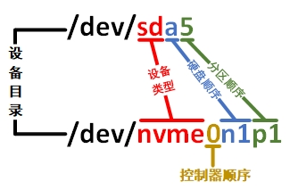
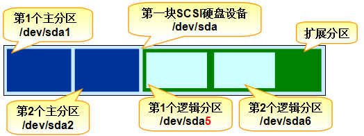

# 物理设备的命名规则
在 Linux 系统中一切都是文件，硬件设备也不例外。既然是文件，就必须有文件名称。系统内核中的 udev 设备管理器会自动规范硬件名称，目的是让用户通过设备文件的名字能够猜出设备的大致属性和分区信息等，这对于陌生的设备来说特别方便。此外，udev 设备管理器的服务会一直以守护进程的形式运行并侦听内核发出的信号来管理/dev 目录下的设备文件。Linux 系统中常见的硬件设备及其文件名称如表 6-2 所示。

**常见的硬件设备及其文件名称**

|    硬件设备    |      文件名称       |
| :------------: | :-----------------: |
|    IDE 设备    |    /dev/hd[a-d]     |
|   NVMe 设备    |   /dev/nvme[0-n]    |
| SCSI/SATA/U 盘 |    /dev/sd[a-z]     |
|  Virtio 设备   |    /dev/vd[a-z]     |
|      软驱      |    /dev/fd[0-1]     |
|     打印机     |    /dev/lp[0-15]    |
|      光驱      |     /dev/cdrom      |
|      鼠标      |     /dev/mouse      |
|     磁带机     | /dev/st0 或/dev/ht0 |

由于现在的 IDE 设备已经很少见了，所以一般的磁盘设备都是以/dev/sd 开头。而一台主机上可能有多块磁盘，因此系统采用 a～z 来代表 26 块不同的磁盘（默认从 a 开始分配），此外，磁盘的分区编号也有讲究：

主分区或扩展分区的编号从 1 开始，到 4 结束；

逻辑分区从编号 5 开始。

设备名称的错误解读。
许多培训讲师与 Linux 技术图书常宣称，/dev/sda 代表连接在主板第一个插槽上的存储设备，学员或读者在实操中发现该命名与插槽顺序相符，便对此深信不疑。但事实上，

/dev/sda 中的字母 a 并非由物理插槽位置决定，而是取决于系统内核识别存储设备的先后顺序。多数情况下，主板设备接入顺序与内核识别顺序一致，才导致这一误解。以 iSCSI 网络存储设备为例，即便主板第二个插槽空置，系统仍可能识别出/dev/sdb 设备，正是因为内核根据自身扫描逻辑而非物理插槽赋予其名称。

分区名称的认知偏差。
很多 Linux 培训讲师会向学员传授“分区编号等同于分区数量”的观点，例如将 sda3解释为设备上的第 3 个分区，且学员在实验中常观察到类似的规律。然而，这一理论存在根本性错误，因为分区的数字编码不一定是强制顺延下来的，用户完全可通过手动配置来指定编号。因此，sda3 仅代表编号为 3 的分区，无法作为判断 sda 设备已存在 3 个分区的依据。

在填了这两个“坑”之后，再来分析一下/dev/sda5 这个设备文件名称包含哪些信息， 如图 6-2 所示。

设备文件名称

首先，/dev 目录中保存的应当是硬件设备文件；其次，sd 表示的是存储设备；然后， a 表示系统中同类接口中第一个被识别到的设备；最后，5 表示这个设备是一个逻辑分区。一言以蔽之，/dev/sda5 表示的是“这是系统中第一块被识别到的硬件设备中分区编号为 5 的逻辑分区的设备文件”。

此外，现在越来越多的服务器使用了 NVMe 传输协议，这种能够充分利用固态磁盘性能的技术，比传统串行的 SATA 和 SCSI 接口的数据吞吐效率快了很多，很有可能本书的下一版本就以 NVMe 磁盘为实验对象啦。SATA/SCSI 与 NVMe 磁盘名称的对照如图 6-3 所示。

NVMe硬盘名称对照示意

考虑到很多读者没有 Linux 基础，不太容易理解前面所说的主分区、扩展分区和逻辑分区的概念，因此接下来简单科普一下磁盘相关的知识。

正是因为计算机有了磁盘设备，我们才能够在玩游戏的过程中或游戏通关之后随时存档， 而不用每次从头开始。磁盘设备是由大量的扇区组成的，每个扇区的容量为 512 字节。其中第一个扇区最重要，它里面保存着主引导记录与分区表信息。就第一个扇区来讲，主引导记录需要占用 446 字节，分区表占用 64 字节，结束符占用 2 字节；其中分区表中每记录一个分区信息就需要 16 字节，这样一来最多只有 4 个分区信息可以写到第一个扇区中，这 4 个分区就是 4 个主分区。第一个扇区中的数据信息如图 6-4 所示。

第一个扇区中的数据信息

现在，问题来了：每块磁盘最多只能创建出 4 个分区？这明显不合情理也不够用。

为了解决分区数量不够的问题，可以将第一个扇区的分区表中 16 字节（原本要写入主分区信息）的空间作为扩展分区，指向另外一个分区。扩展分区实际上并不是一个真正 的分区，而是一个指向其他分区的指针。这样，用户通常会选择使用 3 个主分区和 1 个扩展分区的方法，然后在扩展分区中创建多个逻辑分区，从而满足多分区的需求。只要理解 为什么主分区不能超过 4 个就足够了。主分区、扩展分区、逻辑分区可以像图 6-5 那样来规划。

Tips ：
严格来讲，扩展分区不是一个有实际意义的分区，而仅仅是一个指向其他分区的指针， 这种指针结构将形成一个单向链表。因此扩展分区自身不能存储数据，用户需要在其指向的对应分区（称为逻辑分区）上进行操作。

硬盘分区的规划

请大家试着解读一下/dev/hdc8 代表什么？

答案：这是第 3 块 IDE 设备（现在比较少见）中编号为 8 的逻辑分区。

对了！如果大家参加红帽 RHCE 考试或购买了一台云主机，还会看到类似于/dev/vda、/dev/vdb 这样的设备。这种以 vd 开头的设备叫作 Virtio 设备，简单来说就是一种虚拟化设备。像 KVM、Xen 这种虚拟机监控程序（Hypervisor）就是默认使用这种设备进行数据交互， 等大家步入工作岗位后可能会见到更多。