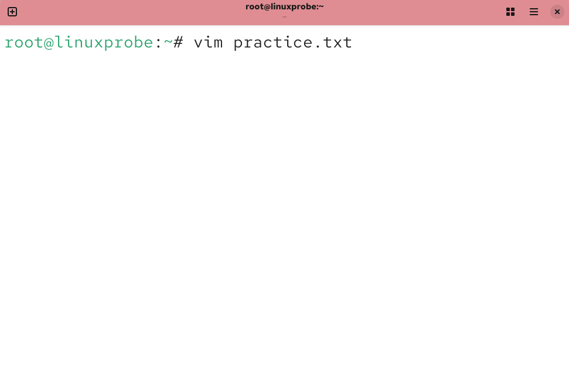
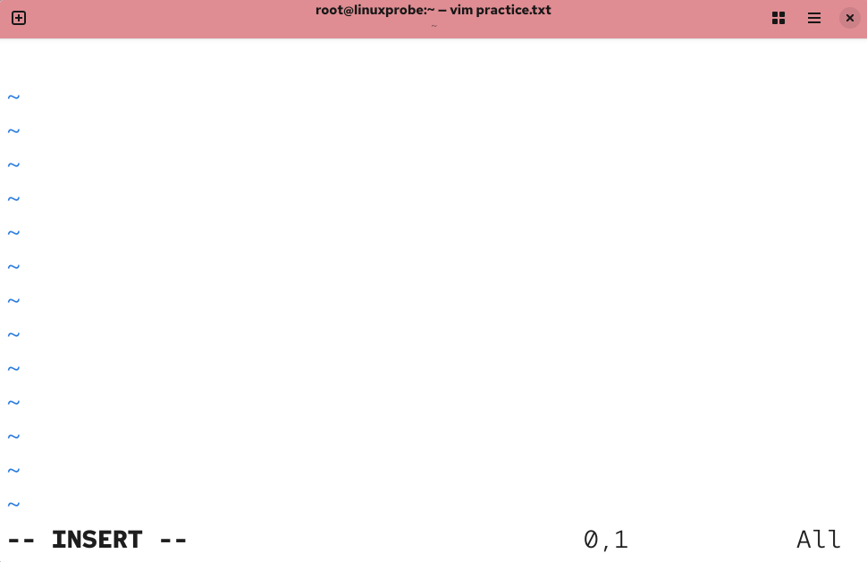
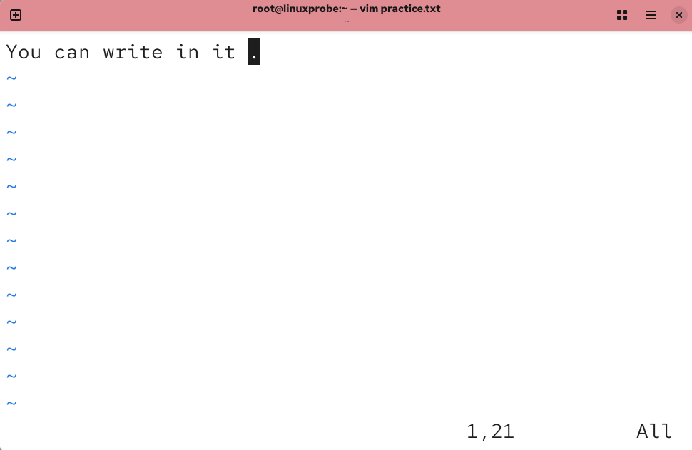
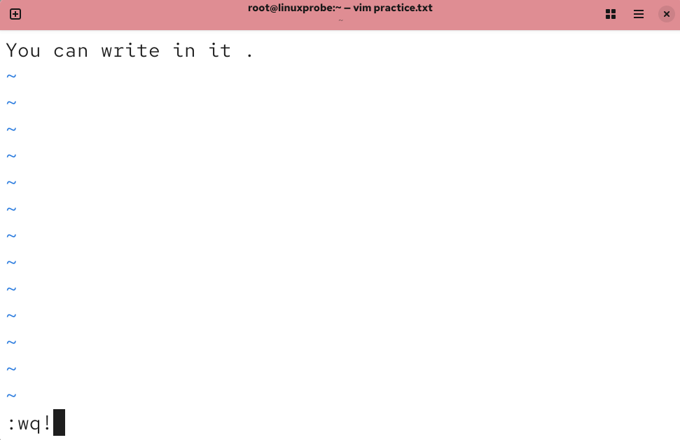
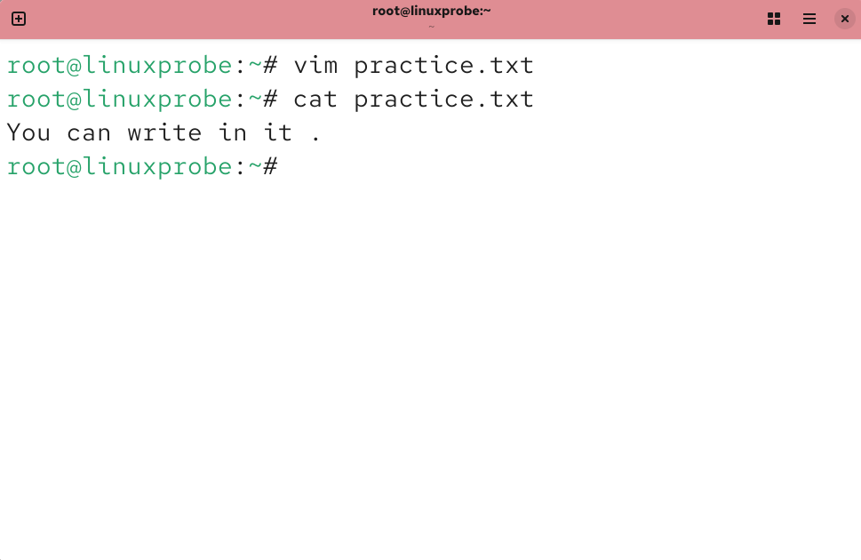
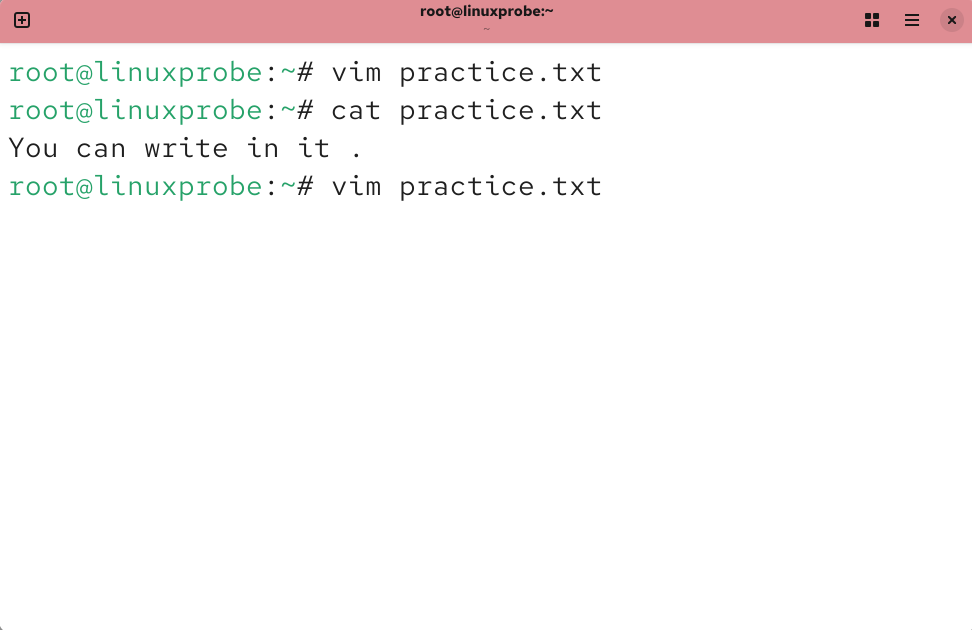
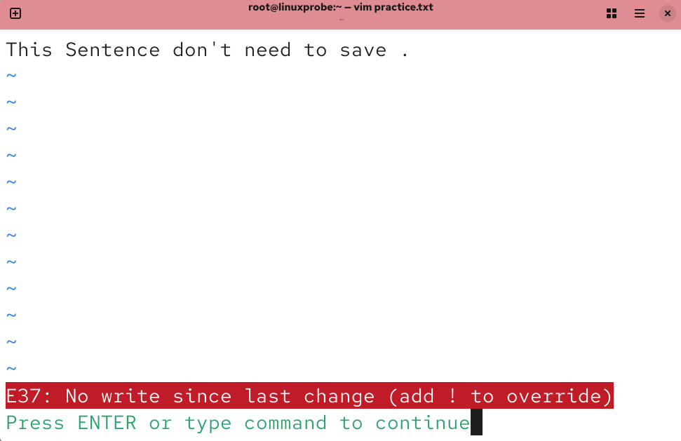
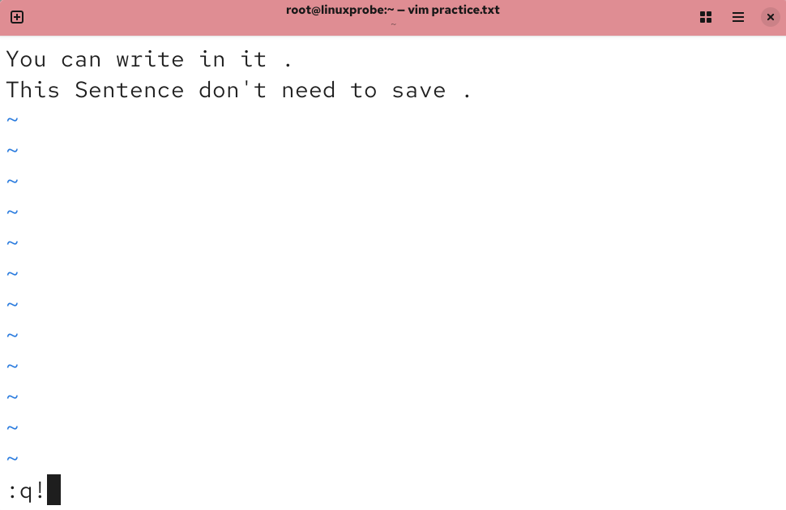
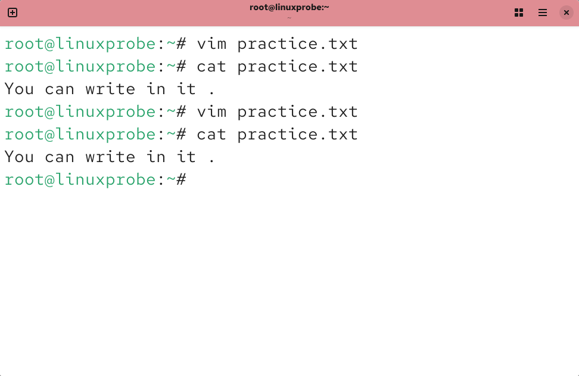

# Vim 文本编辑器
Vim 之所以能得到广大厂商与用户的认可，原因在于 Vim 编辑器中设置了 3 种模式— 命令模式、输入模式和末行模式，每种模式分别支持多种不同的命令快捷键，这大大提高了工作效率，而且用户在习惯后也会觉得非常顺手。要想高效地操作文本，就必须先搞清这 3 种模式的操作区别以及模式之间的切换方法（见图 4-2）。

命令模式：控制光标移动，可对文本进行复制、粘贴、删除和查找等工作。
输入模式：正常的文本录入。
末行模式：保存或退出文档，以及设置编辑环境。


Vim 编辑器模式的切换方法

每次运行 Vim 编辑器时，默认进入命令模式，此时需要先切换到输入模式，再进行文档编写工作。在编写完文档后，需要先返回命令模式，然后进入末行模式，执行文档的保存或退出操作。在 Vim 中，无法直接从输入模式切换到末行模式。Vim 编辑器中内置了成百上千种命令，为了帮助读者更快地掌握 Vim 编辑器，表 4-1 总结了命令模式中最常用的一些命令。

**命令模式中最常用的一些命令**
| 命令  |                        作用                        |
| :---: | :------------------------------------------------: |
|  dd   |             删除（剪切）光标所在的整行             |
|  5dd  |          删除（剪切）从光标处开始的 5 行           |
|  yy   |                 复制光标所在的整行                 |
|  5yy  |              复制从光标处开始的 5 行               |
|   n   |          显示搜索命令定位到的下一个字符串          |
|   N   |          显示搜索命令定位到的上一个字符串          |
|   u   |                  撤销上一步的操作                  |
|   p   | 将之前删除（dd）或复制（yy）过的数据粘贴到光标后面 |

末行模式主要用于保存或退出文件，以及设置 Vim 编辑器的工作环境，此外，还能让用户执行外部的 Linux 命令或跳转到所编写文档的特定行数。要想切换到末行模式，在命令模式中输入一个冒号就可以了。末行模式中常用的命令如表 4-2 所示。

**末行模式中最常用的命令**
|      命令      |                  作用                   |
| :------------: | :-------------------------------------: |
|       :w       |                  保存                   |
|       :q       |                  退出                   |
|      :q!       |    强制退出（放弃对文档的修改内容）     |
|      :wq!      |              强制保存退出               |
|    :set nu     |                显示行号                 |
|   :set nonu    |               不显示行号                |
|     :命令      |               执行该命令                |
|     :整数      |               跳转到该行                |
|  \:s/one/two  | 将当前光标所在行的第一个 one 替换成 two |
| \:s /one/two/g |  将当前光标所在行的所有 one 替换成 two  |
| :%s /one/two/g |      将全文中的所有 one 替换为 two      |
|    ?字符串     |      在文本中从下至上搜索该字符串       |
|    /字符串     |      在文本中从上至下搜索该字符串       |

## 编写简单文档
目前为止，大家已经具备了在 Linux 系统中编写文档的理论基础，接下来我们一起动手编写一个简单的脚本文档。刘遄老师会尽力把所有操作步骤和按键过程都标注出来，如果忘记了某些快捷键命令的作用，可以返回前文进行复习。

编写脚本文档的第一步就是给文档取个名字，这里将其命名为 practice.txt。如果该文档存在，则是打开它；如果不存在，则是创建一个临时的输入文件，如图 4-4 所示。

尝试编写文本文档

打开 practice.txt 文档后，默认进入的是 Vim 编辑器的命令模式。此时只能执行命令模式下的命令，而不能随意输入文本内容，我们需要切换到输入模式才能编写文档。

在图 4-2 中提到，可以分别使用 a、i、o 这 3 个键从命令模式切换到输入模式。其中， a 键是从光标后面一位插入文本，i 键则是从光标当前位置插入文本，而 o 键则是在光标的下面再创建一个空行。此时可敲击i 键进入到编辑器的输入模式，如图 4-5 所示。

切换至编辑器的输入模式

进入到输入模式后，可以随意输入文本内容，Vim 编辑器不会把你输入的文本内容当作命令而执行，如图 4-6 所示。

在编辑器中输入文本内容

编写完之后，要想保存并退出，必须先敲击键盘的 Esc 键从输入模式返回命令模式，如图 4-7所示。然后再输入“:wq!”切换到末行模式，才能完成保存退出操作，如图 4-8 所示。

切换至编辑器的命令模式


切换至编辑器的末行模式

Tips ：
请各位同学仔细观察图 4-6 到图 4-8 中左下角的提示信息，在不同模式下有不同的提示字样。

当在末行模式中输入“:wq!”命令时，就意味着强制保存并退出文档。然后便可以用cat 命令查看保存后的文档内容了，如图 4-9 所示。


查看文档的内容

是不是很简单？！继续编辑这个文档。因为要在原有文本内容的下面追加内容，所以在命令模式中敲击 o 键进入输入模式更会高效，操作如图 4-10 到图 4-12 所示。

再次通过 Vim 编辑器编写文档


进入 Vim 编辑器的输入模式


追加写入一行文本内容

因为此时已经修改了文本内容，所以 Vim 编辑器在尝试直接退出文档而不保存的时候就会拒绝我们的操作了。此时只有强制退出才能结束本次输入操作，如图 4-13 到图 4-15 所示。


退出文本编辑器


因文件已被修改而拒绝退出操作


强制退出文本编辑器

现在大家也算是具备了一些 Vim 编辑器的实战经验了，应该感觉到没有想象中那么难吧。现在查看文本的内容，发现追加输入的内容并没有被保存下来，如图 4-16 所示。


查看最终编写的文本内容

大家在学完了理论知识之后又自己动手编写了一个文本，现在是否感觉成就感满满呢？接下来将会由浅入深地为读者安排 3 个小任务。为了彻底掌握 Vim 编辑器的使用，大家一定要逐个完成，不许偷懒。如果在完成这 3 个任务期间忘记了相关命令，可返回前文进一步复习掌握。

Tips ：
下面的实验如果做不成功也很正常，请大家把重心放到 Vim 编辑器上面，能成功修改配置文件就已经很棒啦！

## 配置主机名称
为了便于在局域网中查找特定的主机或区分主机，除了需要有 IP 地址外，还需要为主机配置一个主机名称，主机之间可以通过这个类似于域名的名称来相互访问。在 Linux 系统中， 主机名称大多保存在/etc/hostname 文件中，接下来将/etc/hostname 配置文件的内容修改为 linuxprobe.com，步骤如下。

第 1 步：使用 Vim 编辑器打开并修改/etc/hostname 文件中的主机名称。

第 2 步：删除原始主机名称，然后添加 linuxprobe.com。注意，使用 Vim 编辑器修改主机名称文件后，要在末行模式下执行“:wq!”命令才能保存并退出文档。

第 3 步：使用hostname 命令检查是否修改成功
```shell
root@linuxprobe:~# vim /etc/hostname
linuxprobe.com
```

hostname 命令用于查看当前的主机名称。但有时修改不会立即生效，因此，如果发现修改完成后仍显示原来的主机名称，可重启虚拟机后再查看：

```shell
root@linuxprobe:~# hostname
linuxprobe.com
```

## 配置网卡信息
网卡IP 地址的配置是否正确是两台主机是否能够相互通信的前提。在 Linux 系统中，一切都是文件，因此配置网络服务的工作实质就是在编辑网卡配置文件。这个小任务不仅可以帮助你练习使用 Vim 编辑器，而且也为后面学习 Linux 中的各种服务配置奠定了坚实基础。当你认真学习完本书后，一定会特别有成就感，因为本书前面的基础部分非常扎实，而后面内容则具有几乎一致的网卡IP 地址和运行环境，从而确保你全身心地投入各类服务程序的学习上，而不必操心系统环境的问题。

如果你具备一定的运维经验或者熟悉早期的 Linux 系统，则在学习本书时会遇到一些不容易接受的差异变化。在 RHEL 5、RHEL 6 中，网卡配置文件的前缀为 eth，第 1 块网卡为eth0，第 2 块网卡为 eth1；以此类推。在 RHEL 7 中，网卡配置文件的前缀则是 ifcfg， 再加上网卡名称共同组成了网卡配置文件的名字，例如 ifcfg-eno16777736。而在 RHEL 8、RHEL 9、RHEL 10 中，网卡名称改成了类似于 ens160 的样子，不过好在除了文件名发生变化外，网卡参数没有其他大的区别。

现在有一个名称为 ens160 的网卡设备，将其配置为开机自启动，并且 IP 地址、子网、网关等信息由人工指定，其步骤如下所示。

第 1 步：首先切换到/etc/NetworkManager/system-connections 目录，这里存放着所有的网卡配置文件。

第 2 步：使用 Vim 编辑器修改网卡文件 ens160.nmconnection，逐项写入下面的配置参数并保存退出（中文是给大家的注释，不要写进去哦）。由于每台设备的硬件及架构是不一样的，因此请使用 ifconfig 命令自行确认各自网卡的默认名称。

[connection]
网卡ID ：id=ens160

设备类型 ：type=ethernet

网卡名称 ：interface-name=ens160

开机自启动： autoconnect=true

[ipv4]

IP地址与子网掩码 ：address1=192.168.10.10/24

地址分配模式 ：method=manual

网关地址 ：gateway=192.168.10.10

DNS地址 ：dns=192.168.10.10

第 3 步：重启网络服务并测试网络是否连通。

开始实战！

进入网卡配置文件所在的目录，然后编辑网卡配置文件，在其中填入下面的信息：
```shell
root@linuxprobe:~# cd /etc/NetworkManager/system-connections
root@linuxprobe:/etc/NetworkManager/system-connections# vim ens160.nmconnection
[connection]
id=ens160
type=ethernet
interface-name=ens160
autoconnect=true
[ipv4]
address1=192.168.10.10/24
method=manual
gateway=192.168.10.10
dns=192.168.10.10
```
执行重启网卡设备的命令，然后通过 ping 命令测试网络能否连通。由于在 Linux 系统中 ping 命令不会自动终止，因此需要手动按下 Ctrl+C 组合键来强行结束进程。
```shell
root@linuxprobe:/etc/NetworkManager/system-connections# nmcli connection up ens160
Connection successfully activated (D-Bus active path: /org/freedesktop/NetworkManager/ActiveConnection/8)
root@linuxprobe:/etc/NetworkManager/system-connections# nmcli connection reload
root@linuxprobe:/etc/NetworkManager/system-connections# ping 192.168.10.10
PING 192.168.10.10 (192.168.10.10) 56(84) bytes of data.
64 bytes from 192.168.10.10: icmp_seq=1 ttl=64 time=0.079 ms
64 bytes from 192.168.10.10: icmp_seq=2 ttl=64 time=0.050 ms
64 bytes from 192.168.10.10: icmp_seq=3 ttl=64 time=0.083 ms
64 bytes from 192.168.10.10: icmp_seq=4 ttl=64 time=0.038 ms
^C
--- 192.168.10.10 ping statistics ---
4 packets transmitted, 4 received, 0% packet loss, time 3092ms
rtt min/avg/max/mdev = 0.038/0.062/0.083/0.019 ms
root@linuxprobe:/etc/NetworkManager/system-connections#
```
是不是感觉很有意思？！当然，如果这个实验失败了也不用气馁，后面会有相应的章节专门讲解，请大家把关注点继续放回到 Vim 编辑器上就好。

## 配置软件仓库
本书前面讲到，软件仓库是一种能进一步简化 RPM 管理软件的难度以及自动分析所需软件包及其依赖关系的技术。可以把 YUM 或 DNF 想象成一个硕大的软件仓库，里面保存着几乎所有的常用工具，而且只需要说出所需的软件包名称，系统就会自动为你搞定一切。

既然要使用软件仓库，就要先把它搭建起来，然后将其配置规则确定好才行。鉴于第 6 章才会讲解 Linux 的存储结构和设备挂载操作，所以当前还是将重心放到 Vim 编辑器的学习上。如果遇到看不懂的参数也不要紧，后面章节会单独讲解。

YUM 与 DNF 软件仓库的配置文件是通用的，也就是说填写好配置文件信息后，这两个软件仓库的命令都能够正常使用。建议在 RHEL 10 中使用 dnf 作为软件的安装命令，因为它具备更高的效率，而且支持多线程同时安装软件。

搭建并配置软件仓库的大致步骤如下。

第 1 步：进入/etc/yum.repos.d 目录，这里存放着所有的仓库配置文件。

第 2 步：使用 Vim 编辑器创建一个名为 rhel10.repo 的新配置文件（文件名称可随意， 但后缀必须为.repo），逐项写入下面的配置参数并保存退出。

仓库名称：具有唯一性的标识名称，不应与其他软件仓库发生冲突。

描述信息（name）：可以是一些介绍性的词汇，用于标识出软件仓库的用处。

仓库位置（baseurl）：软件包的获取方式，可以使用 FTP 或 HTTP 下载，也可以是本地的文件（需要在后面添加file 参数）。

是否启用（enabled）：设置此源是否可用；1 为可用，0 为禁用。

是否校验（gpgcheck）：设置此源是否校验文件；1 为校验，0 为不校验。

公钥位置（gpgkey）：若上面的参数开启了校验功能，则此处为公钥文件位置。若没有开启，则省略不写。

第 3 步：按配置参数中所填写的仓库位置挂载光盘，并把光盘挂载信息写入/etc/fstab文件。

第 4 步：使用dnf install httpd -y 命令检查软件仓库是否已经可用。开始实战！

进入/etc/yum.repos.d 目录后创建软件仓库的配置文件：
```shell
root@linuxprobe:~# cd /etc/yum.repos.d
root@linuxprobe:/etc/yum.repos.d# vim rhel10.repo
[BaseOS]
name=BaseOS
baseurl=file:///media/cdrom/BaseOS
enabled=1
gpgcheck=0
[AppStream]
name=AppStream
baseurl=file:///media/cdrom/AppStream
enabled=1
gpgcheck=0
```
创建挂载点后进行挂载操作，并设置成开机自动挂载（详见第 6 章）：
```shell
root@linuxprobe:/etc/yum.repos.d# mkdir -p /media/cdrom 
root@linuxprobe:/etc/yum.repos.d# mount /dev/cdrom /media/cdrom
mount: /media/cdrom: WARNING: device write-protected, mounted read-only.
root@linuxprobe:/etc/yum.repos.d# vim /etc/fstab
………………省略部分输出信息………………
/dev/cdrom /media/cdrom iso9660 defaults 0 0
```
尝试使用软件仓库的 dnf 命令来安装 Web 服务，软件包名称为 httpd，安装后出现“Complete!”则代表配置正确：
```shell
root@linuxprobe:/etc/yum.repos.d# dnf install httpd -y
Updating Subscription Management repositories.
BaseOS                                                18 MB/s | 1.7 MB     00:00    
AppStream                                             80 MB/s | 6.3 MB     00:00    
Dependencies resolved.
………………省略部分输出信息………………
Installed:
  apr-1.7.0-11.el9.x86_64                     apr-util-1.6.1-20.el9.x86_64          
  apr-util-bdb-1.6.1-20.el9.x86_64            apr-util-openssl-1.6.1-20.el9.x86_64  
  httpd-2.4.53-11.el9_2.4.x86_64              httpd-core-2.4.53-11.el9_2.4.x86_64   
  httpd-filesystem-2.4.53-11.el9_2.4.noarch   httpd-tools-2.4.53-11.el9_2.4.x86_64  
  mod_http2-1.15.19-4.el9_2.4.x86_64          mod_lua-2.4.53-11.el9_2.4.x86_64      
  redhat-logos-httpd-90.4-1.el9.noarch       

Complete!
```