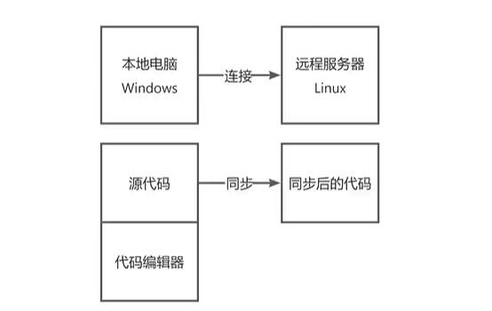
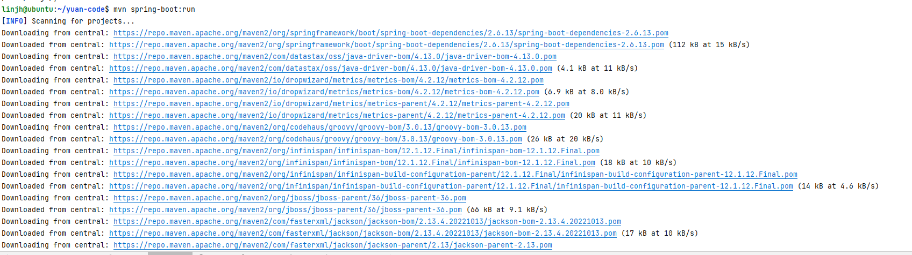
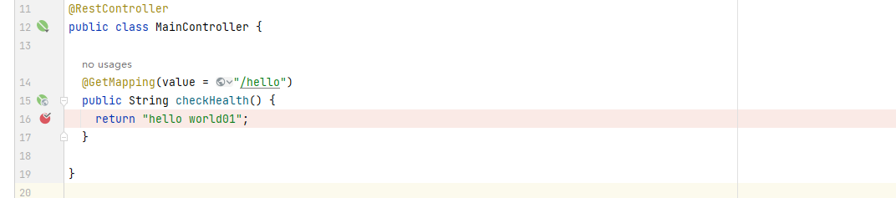
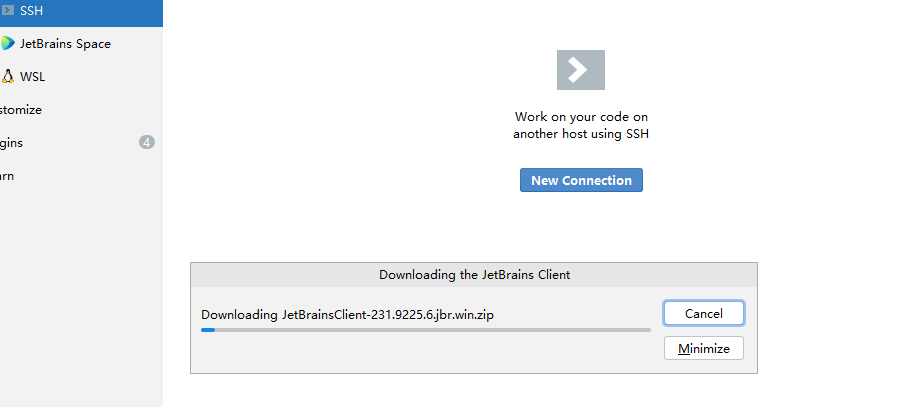

# 远程部署
## 1、介绍
远程部署方式的远程开发指的是：在本地自己的电脑上写代码，然后通过文件同步的方式，把代码同步到我们的远程Linux服务器，也就是我们的虚拟机上；最后如果启动项目时，再用本地的电脑去连接远程的Linux服务器，通过远程执行命令的方式来编译代码、运行代码。这种方式更多的像是提高了我们从本地同步代码到服务器上的一个效率，它不算是真正意义上的远程开发。

让我们把远程开发分为6个阶段：编写代码、文件同步、代码运行、编译构建、部署、调试。
## 2、远程部署方式

**创建一个干净的springboot项目**

本地启动，并访问：http://localhost:8080/hello

现在我们要实现的就是能否在windows上访问Linux虚拟机上的接口

**配置文件同步**

点击idea开发工具最上方的Tools——》Deployment——》Configuration来创建一个远程部署的配置

点击添加，选择SFTP协议

然后点击apply，点击ok

然后再右下角，点开Remote Host就可以看到远程服务器上的文件列表了
下面开始配置文件同步，实现代码自动同步到Linux服务器上：
点击Tools——》Delopment——》Configuration，进入配置，点击Mappings

现在我们就完成了路径的一个映射

**校验代码同步是否生效**

进入linux系统中，进入到/home/linjh/yuan-code，查看文件夹下的文件列表，目前是没有任何文件

回到windows，在项目的根目录处点击右键，找到Deployment——》Sync with deployed to ubuntu...

系统就会为我们列举现在没有同步到服务器上的文件

然后关闭窗口，回到Linux服务器上，再次查看/home/linjh/yuan-code下的文件列表，会发现多了很多的文件

**设置代码自动同步**

测试一下，在windows系统中，在项目src同级目录随便创建一个文件aaa.txt

然后回到Linux服务器，再次查看/home/linjh/yuan-code下的文件列表，会发现aaa.txt文件已经自动同步了

但是我们在windows电脑上删除这个文件时，编译器会提示你是否要同步删除远程文件，如果每次都去询问一下是很麻烦的。所以可以在Tools——》Deployment——》Options中设置

勾选：删除本地文件时是否也要同步删除远程

Options中主要用于更改文件同步的一些配置。到此文件同步设置就算完成了

**用Windows电脑去远程操控虚拟机运行项目**

进入终端Terminal，选择右侧下拉箭头

进入服务器代码目录

执行mvn spring-boot:run通过run命令在远程服务器上调试运行了，此命令会下载maven依赖，并运行Java项目

由于刚才只是通过run在远程服务器调试运行，那我们怎么正式通过windows电脑来操作远程服务器完成项目的部署上线呢？
我们首先要构建项目，还是在终端目录中输入mvn clean package,稍等片刻，当我们能够看到build success这样的输出，就表示现在代码已经打包构建完毕了，我们能够在相应的目录下看到生成的jar包

执行java -jar /home/linjh/yuan-code/target/yuan-code-0.0.1-SNAPSHOT.jar运行项目jar包，真正项目中后面还可以指定运行的环境--spring.profiles.active-prod

截止到现在我们完成了程序的远程同步、运行、编译构建和部署

**如何调试在Linux虚拟机上的远程程序

在日常工作中，如何调试Linux虚拟机上的远程程序，比如打个断电，查看一下变量的信息等等。其实远程调试非常简单，但是比较关键的一点，这里一定要强调一下：大家最后不要在线上的程序去调试去打断点，可能会影响这个线上用户的运行，这是一个很危险的操作。
如何开启远程调试呢？其实非常简单，首先点击右上角编译配置

然后这里我们新增一套运行的配置。添加——》输入remote....——》Remote JVM Debug

输入debug调试服务名称，输入远程服务器ip，选择jdk版本，idea会自动为我们生成jvm参数，点击apply，然后OK

复制上面生成的JVM参数，然后在idea终端启动jar包。java -agentlib:jdwp-transport-dt_socket,server=y,suspend=n,addres=5005 -jar /home/linjh/yuan-code/target/yuan-code-0.0.1-SNAPSHOT.jar

然后点击右上角的debug按钮，启动debug模式，打断点，然后访问接口测试是否进入debug模式

至此远程debug调试已经完成。现在我们就可以把我们的Linux虚拟机当成我们自己的电脑一样去进行开发了。以上就是第一种远程开发的讲解。

## 3、纯远程开发（推荐）
**实现原理**

区别于刚才演示的远程部署方式，我们现在使用的纯远程开发的方式，他的实现原理是这样的：

我们直接把所有的源代码编译运行，甚至是代码编译器本身全部都放到了服务器上，以服务器为主。而我们的本地电脑呢，仅仅是运行了一个操作远程服务器的界面，就有点类似于我们的云游戏一样，自己的电脑不存代码，不负责任何代码的运行，把脏活累活都交给咱们的服务器干。那么这种远程开发方式比较适用于我们自己的电脑性能不高，服务器的性能很强以及开发环境需要多人协作或者大家需要统一同一套开发环境的场景，有些大厂会有一些开发机，开发者连接到开发机进行统一的开发协作。此方式依赖于Idea工具

**实现步骤**

进入到idea的入口页面，点击Remote Development，我们点击下面的SSH，来新建一个远程项目；点击新建项目

新建连接

输入host、端口号、用户名、密码，点击测试链接

显示连接成功，点击Ok进行添加。

下拉选择添加好的远程服务器

然后点击检查连接并继续。选择远程项目目录，然后点击下载IDE并连接

输入远程服务器的密码

下面开发工具就是在为我们在远程服务器上安装jetbrains客户端，第一次比较慢。这个客户端跟我们现在大家看到的这个已经安装好的Windows电脑上的开发工具还是不太一样

勾选，并点击继续，安装完成，进入远程客户端界面，我们可以直接点击项目运行文件

